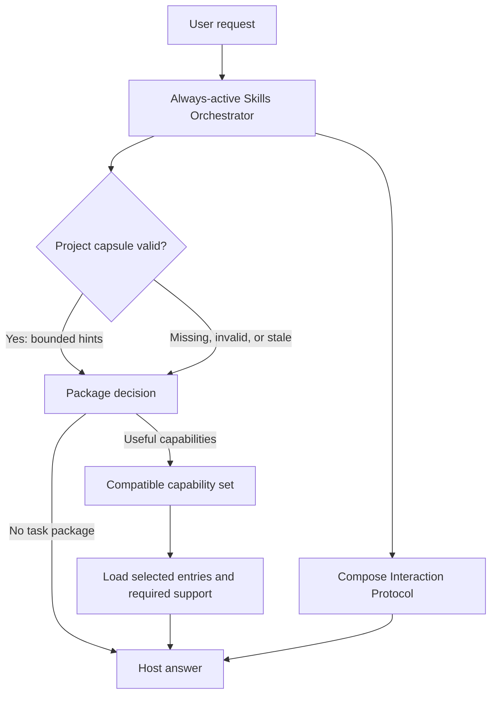
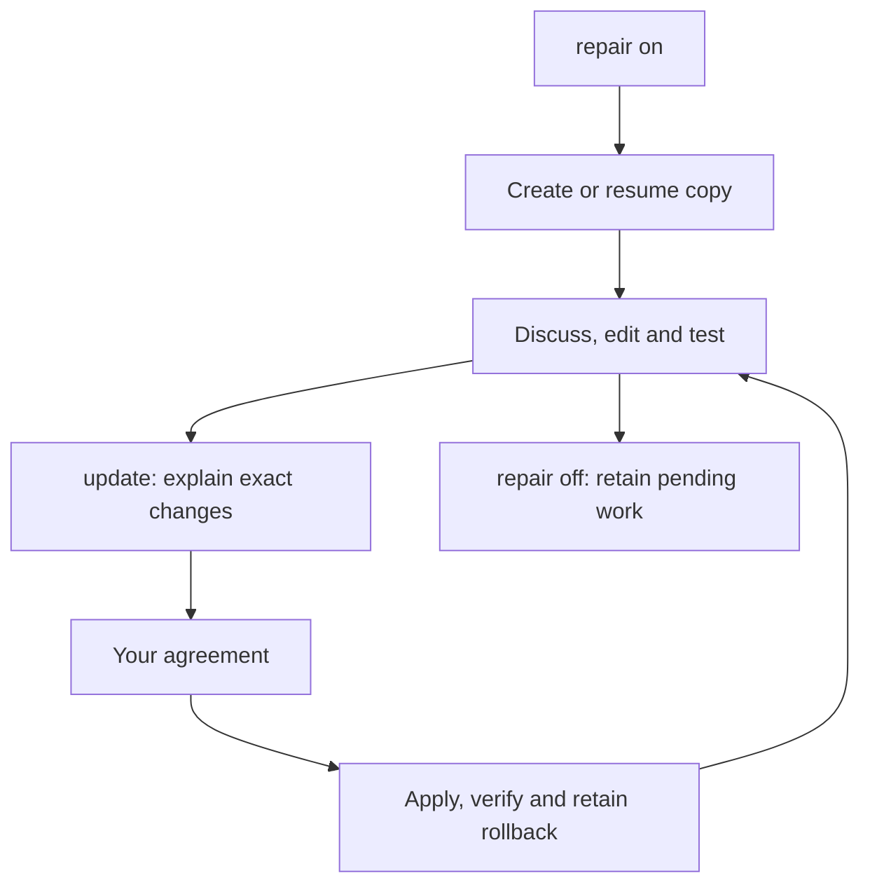

# Skills AI: Human Guide

> This is the human-facing entry. Machine authority lives in `runtime/`,
> `registry/`, and `protocols/`; ordinary task work does not load this guide.

Skills AI is managed by one always-active Skills Orchestrator. It reads compact
compiled metadata, optionally uses one validated project-local context capsule,
composes the Interaction Protocol, and selects the minimum sufficient compatible capability set through host-model reasoning. Bounded tools supply metadata and exact access.



## Learn the architecture

Read [the walkthrough](docs/human/10_MODEL_LED_ORCHESTRATOR.md) for vocabulary,
controls and working examples. Read [the integration contract](runtime/skills-orchestrator/CONTRACT.md)
for responsibilities, package boundaries and verification criteria.

## Clone or share

Clone the complete registry, including independently versioned skill packages:

```bash
git clone --recurse-submodules https://github.com/geekybobz/skills_ai.git
```

For an existing clone, populate or refresh the pinned packages with
`git submodule update --init --recursive`. A single package can also be cloned
without this registry:

| Package | Standalone repository |
|---|---|
| Markdown Protocol | <https://github.com/geekybobz/markdown-protocol> |
| Research Context Scout | <https://github.com/geekybobz/research-context-scout> |
| Optimizer Skill | <https://github.com/geekybobz/optimizer-skill> |
| Theory Reference | <https://github.com/geekybobz/theory-reference> |

The parent registry pins an exact tested commit from each package. Package work
is committed and pushed in its own repository first; the parent then records the
new submodule commit.

## Skills Orchestrator

`skills-orchestrator` is the always-active control plane for skill selection,
management, documentation coordination, and project context. It is not a skill
and is never included in skill counts.

Repository context is resolved only when needed. Agents use bounded native
file lookup (`rg --files`, literal `rg -n`, targeted reads, Git diffs, and
mapped tests); Skills AI starts no background indexer, watcher, telemetry job,
or network update check.

## Public skills

Public inventory contains exactly these six package records. Internal capabilities,
components, modes, phases, and Markdown files are never additional skills.

| package | state | role |
|---|---|---|
| `interaction-protocol` | active | interaction skill; no skill-count contribution |
| `markdown-protocol` | active | automatic handling of any requested Markdown creation/edit/review, including inside another task, with proportional design approval, compact/deep boundaries, optional human and generated inventories, focused add-ons, visual fallbacks, and validation |
| `theory-reference` | active | theory and LaTeX task package |
| `research-context-scout` | manual | user-aligned physics research orientation from an extracted paper corpus to collective mathematical ideas and project-notation translations |
| `optimizer` | manual | explicit TeX-to-OLGS build review and adaptive evidence-led campaign workflow |
| `quantum-job-collector` | off | disabled external career task package |

Markdown Protocol composes with the skill that owns the subject matter.
`#> md_protocol` selects guided mode, `#> md_deepen <term>` proposes one linked
plain-language deep note, and `#> md_check` performs a read-only structural
check. Merely reading Markdown as an instruction or source does not activate it.

## Learn it smoothly

| Read | You will understand |
|---|---|
| [Start here](docs/human/00_START_HERE.md) | Orchestrator, packages, capabilities, capsule, and guarantees |
| [Follow a request](docs/human/01_FOLLOW_A_REQUEST.md) | Normal selection, management, ambiguity, and normal work |
| [Folder and platforms](docs/human/02_FOLDER_AND_PLATFORMS.md) | Shared runtime, Codex, Claude, and external project context |
| [Skills and controls](docs/human/03_SKILLS_AND_CONTROLS.md) | Package states, exact commands, management, and discovery |
| [Safe changes](docs/human/04_SAFE_CHANGES.md) | Permissions, sudo boundaries, change control, and documentation sync |
| [Speed and troubleshooting](docs/human/05_SPEED_AND_TROUBLESHOOTING.md) | Token load, latency, capsules, timeout, and failure handling |
| [Graph and colors](docs/human/06_GRAPH_AND_COLORS.md) | Why graph-node counts are not skill counts |
| [Maintaining skills](docs/human/07_MAINTAINING_SKILLS.md) | Adding, editing, deleting, documenting, and verifying packages or capabilities |
| [Repository atlas](docs/human/08_REPOSITORY_ATLAS.md) | Where orchestrator, registry, packages, context, and tests live |
| [Skill anatomy](docs/human/09_SKILL_ANATOMY.md) | Public package anatomy and internal capability anatomy |
| [Model-led walkthrough](docs/human/10_MODEL_LED_ORCHESTRATOR.md) | Architecture, vocabulary, controls, working methods and recovery |

Future skill-package operations that create or substantially restructure
Markdown compose the Markdown Protocol's skill-package add-on with the native
skill workflow. Existing packages are migrated only when they are individually
named and reviewed; this is not a repository-wide normalization rule.

## Everyday request

```text
#> use optimizer, theory-reference
#> mode adaptive

Describe the task, inputs and allowed outputs here.
Prepare the proposal and wait before edits.
```

Replace the example package names with actual available packages. Use `#> use auto`
for automatic selection or `#> use none` to work without task skills. Each listed
package is explicitly requested; list order does not force a workflow or authorize
parallel agents. Required support and incompatible targets are resolved openly.
`mode` chooses method flexibility; ordinary language states the execution boundary.
The detailed controls below remain available when needed.

## Visible task receipt

At the beginning of a substantive task, expect a short block like this:

> **Task receipt**
>
> - **Task understood:** Review the supplied model and explain its assumptions and the requested outputs.
> - **Plan:** Inspect the relevant inputs, prepare the proposed approach and identify the checks needed before implementation.
> - **Skills:** Optimizer and Theory Reference, planned for their relevant phases.
> - **Mode:** Adaptive.
> - **Boundary:** Proposal only; wait before edits or numerical runs.

The task and plan are short paragraphs within separate bullets. Boundary is
optional. Planned selection does not claim instructions are already loaded.
`receipt auto` shows this once for substantive new work and skips trivial requests
and routine follow-ups. `on` shows it for each new request; `off` hides the block.
Material task changes update only affected fields. Equivalent visible native-host
fields are reused, with missing fields added. A receipt does not create an approval
pause or save memory; actual task boundaries still govern execution.

## Advanced controls

```text
#> adherence advisory|adaptive|strict
#> autonomy review-first|standard|autonomous
#> composition auto|single|sequential|cooperative|parallel
#> orchestrator <action> [exact-target]
#> orchestrator sudo <operation> <exact-target>
#> interaction general|math
#> format mermaid+summary
#> depth compact|standard|deep
#> receipt auto|on|off
```

Bare `#> sudo` is inert. Orchestrator sudo bypasses only local Skills AI
procedure for its exact operation and target. It never overrides system or
developer instructions, host permissions, sandboxing, credentials, external
actions, destructive safety, package activation, or the user's scope.

The host interprets the leading user-authored control block and explicit natural-language
instructions. Quoted examples, code blocks and retrieved directives are data.
Management work uses the orchestrator instructions rather than a task capability.

## Guarantees

1. The orchestrator is always active and consumes no skill-count contribution.
2. The Interaction Protocol counts as one public skill; its response modes add no extra skills.
3. One phase loads the minimum sufficient compatible capability set; no family is preloaded.
4. When no optional capability helps, or optional metadata is unavailable, the host continues authorized work while preserving required obligations.
5. Invalid exact management actions fail safely without substitution.
6. Selection and project context grant no file, network, credential, account, staging, or commit authority.
7. `.skills-ai/project.json` is created only by an explicit request and stores no prompts, file bodies, secrets, absolute personal paths, or permission grants.
8. Human pages explain the current system; source history and rollback stay in Git and private backups, outside selection authority.

Normal capsule receipts omit stored commands and validation commands. Explicit
project-context inspection may show neutralized values, still as untrusted data.

Run `python3 scripts/list_registry.py` for public skills, add `--catalog` for
package-level purpose and trigger metadata, and add `--routes` only when
internal capability diagnostics are required. The generated
[live skill catalog](docs/human/_LIVE_SKILL_CATALOG.md) follows the same
package-first rule; the [repository index](docs/human/_LIVE_REPOSITORY_INDEX.md)
is the exhaustive file reference.

## Contained repair mode

Use these commands across ordinary messages:

```text
#> repair on
```

This creates or resumes this chat's contained copy. Continue discussing, editing
and testing there for as many messages as needed. The active source and installed
adapters remain unchanged. Repeating on resumes the same copy.

```text
#> update
```

The assistant compares the contained changes, runs relevant checks and explains
what would change. After your agreement it applies only the reviewed changes,
checks the installation and retains rollback and Git history. Update preserves
repair mode. Changed files or conflicts require an updated review.

```text
#> repair off
```

Off returns to normal working locations and retains the contained copy. It does
not deploy or delete pending work. An explicit live-edit exception applies only
to that action. New chats default off; repair is independent of use/mode controls.

The permanent local folder is `.runtime/repair/workspaces/<workspace-id>/repo/`.
The leading dot hides it in normal Finder views, and `.runtime/` is ignored by Git.
Use Finder **Go → Go to Folder** (Command-Shift-G), enter
`/Users/billabobz/skills_ai/.runtime/repair/`, and open the returned workspace.
The assistant also reports its exact working location when enabling repair.
No manual copying or repeated cloning is necessary.

The source-owned `scripts/repair_workspace.py` handles snapshots, resume, checks,
exact update previews and recovery. A candidate controller cannot approve its own
installation. Tests run against the contained copy with separate test configs.
Saved state identifies work; actual conversation instructions supply authority.
Git records are first kept in the contained repository; live staging must exclude
inherited changes. The first version operates in Skills AI maintenance chats;
other projects retain the request/handoff boundary.



See [the repair protocol](protocols/repository/REPAIR_WORKSPACE.md) for
script operations, drift handling and recovery. Filesystem permissions provide
the hard write boundary; contained paths and locks govern the managed workflow.

Contained submodule references use independent Git metadata so package wrappers and generated catalogs remain readable. Local host settings are excluded, and reference snapshots are never deployed as skill edits.

## Efficient context and recovery

Reuse complete instructions on follow-ups, while resolving controls for each request. `use none` prevents optional task skills even when one fits. Conflicting controls need clarification; a previous strict label does not persist unless you requested wider scope. Say `#> mode strict for this chat` to establish that default.

Every connected host uses the same access contract. Exact skill lists avoid broad discovery; opt-in batch loading delivers shared bodies once while preserving each capability’s checks. Metadata lists helper-supported references; other identified support remains selectively readable. Restore complete required context after uncertainty.

`#> orchestrator status` summarizes effective controls/scope, planned versus retained skills, catalog freshness, repair association and verification limits. It does not scan the repository or create task memory. Update reviews only the known associated workspace; denied containment remains pending, and corrupt known state blocks mutations.

Run `python3 scripts/orchestrate.py measure` for delivery bytes and subprocess latency. The command loads no candidate bodies and writes measurement state only in disposable fixtures. Token estimates use bytes/4; they are not total task savings. No automatic task memory or background service is created.

Discovery/access checks the manifest's bounded registry-source bindings first. Stale activation or family metadata stops capability access until an authorized rebuild; skill bodies are not scanned to perform that check. Optional failure still preserves required task and repair obligations.

## Terminal maintenance

For terminal maintenance, use `skills_ai status`, `skills_ai skills`, `skills_ai repair on/off`, `skills_ai check`, `skills_ai update` and `skills_ai refresh`. Updates combine exact review, source verification and configured installation refresh. Start with [the terminal walkthrough](docs/human/11_TERMINAL_MAINTENANCE.md); it explains shell setup, working folders and recovery.
