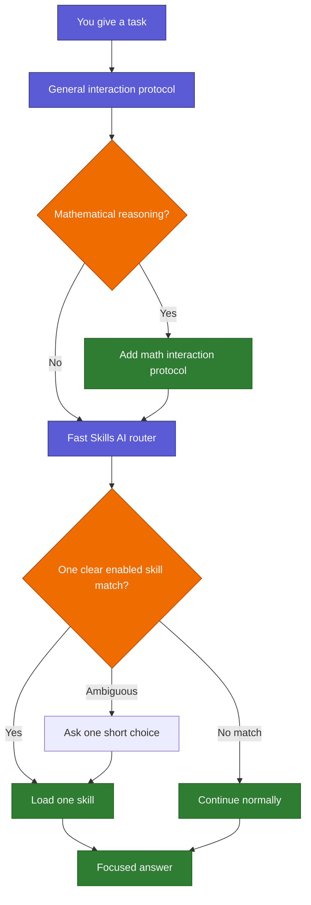

# Skills AI: Human Guide

> This is the human-facing entry point. Codex and Claude should not read it
> during normal routing or task work. Machine authority lives in `runtime/`,
> `registry/`, and the maintenance protocols.

Skills AI is a local switchboard shared by Codex and Claude. It applies a small
general interaction protocol, adds an equation-led math protocol only for
genuine mathematical reasoning, selects at most one relevant enabled task
skill, and otherwise lets the model continue normally. It does not need a
network service and it does not grant permission to edit files, use credentials,
or perform account actions.



## Learn it smoothly

| Read | You will understand |
|---|---|
| [Start here](docs/human/00_START_HERE.md) | What Skills AI is, its promises, and the main vocabulary |
| [Follow a request](docs/human/01_FOLLOW_A_REQUEST.md) | Routing, the strict design gate, fallback, and examples |
| [Folder and platforms](docs/human/02_FOLDER_AND_PLATFORMS.md) | What each folder does and what Codex and Claude share |
| [Skills and controls](docs/human/03_SKILLS_AND_CONTROLS.md) | Active, manual, off, hidden, and deprecated states |
| [Safe changes](docs/human/04_SAFE_CHANGES.md) | Permissions, protocols, external requests, and documentation updates |
| [Speed and troubleshooting](docs/human/05_SPEED_AND_TROUBLESHOOTING.md) | Token load, latency, timeouts, and cleanup |
| [Graph and colors](docs/human/06_GRAPH_AND_COLORS.md) | The Obsidian layer model and validation commands |
| [Maintaining skills](docs/human/07_MAINTAINING_SKILLS.md) | How additions, edits, moves, deletions, scans, suggestions, and Git checks work |
| [Repository atlas](docs/human/08_REPOSITORY_ATLAS.md) | What every folder and file category means, from a simple map to the live file index |
| [Skill anatomy](docs/human/09_SKILL_ANATOMY.md) | How single-file, packaged, submodule, protocol, and external skills are structured |
| [Interaction protocol graph](interaction-protocol/README.md) | General and math flows, controls, runtime, API, tests, and migration links |

## Six things to remember

1. General response guidance is small and does not consume the task-skill slot.
2. Math is an equation-led response overlay, not a competing task skill.
3. One clear match loads one task skill; no match continues normally; only a
   material equal match asks one short last-resort choice.
4. Codex and Claude share the Python router, manifest, interaction protocol, and skill sources.
5. Routing and response style are guidance, not authority to make changes.
6. Skills AI maintenance requests bypass ordinary task-skill matching and use
   the Git-aware consistency protocol.

Useful per-request controls are `/skill auto|normal|<exact-id>`,
`/interaction general|math`, `/format mermaid+summary`,
`/depth brief|standard|detailed`, and `/receipt auto|on|off`. Fit 0–3 measures
only route suitability. Prompt-free ambiguity metadata may be kept locally
under ignored `.runtime/` state so recurring route pairs can be improved without
storing your prompt or answer.

Depth is carried into both the Codex compact context and Claude's injected
context; it is not merely parsed inside the router.

To see the live registry without loading skill bodies, run:

```bash
python3 scripts/list_registry.py
```

For exhaustive human references generated from the same canonical sources, use
the [live repository index](docs/human/_LIVE_REPOSITORY_INDEX.md) and
[live skill catalog](docs/human/_LIVE_SKILL_CATALOG.md). Start with the atlas and
skill-anatomy chapters first; the generated pages are the deeper factual layer.

This guide explains the system but never overrides the live registry, runtime
protocol, risk map, or change-control rules.
