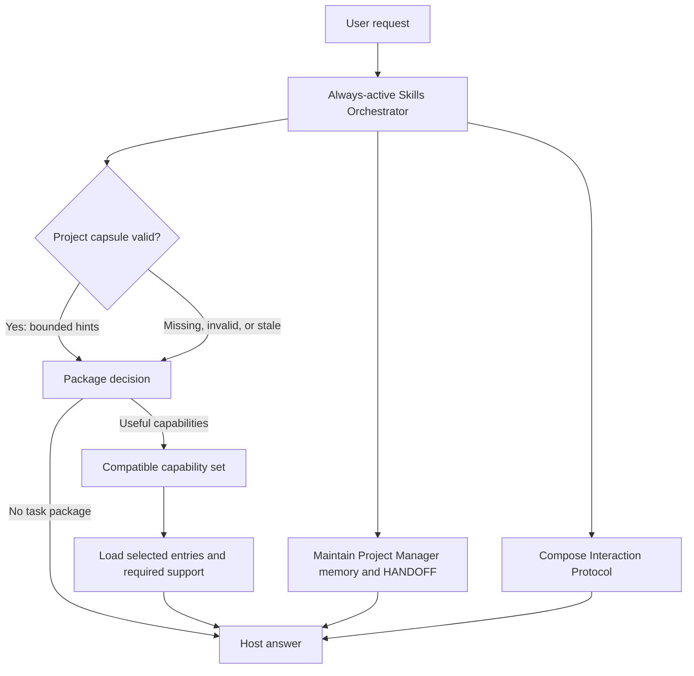

# Skills AI

Skills AI is managed by one always-active Skills Orchestrator. It reads compact
compiled metadata, optionally uses one validated project-local context capsule,
composes mandatory Project Manager support and the Interaction Protocol, and
selects the minimum sufficient compatible capability set through host-model
reasoning. Bounded tools supply metadata and exact access.



## Where to go, by depth

The documentation is one linked structure. Each folder opens with a compact entry or a
map, topics own the rules, and explanation sits below a `## Details` heading or in a
depth topic of the same folder, never in a parallel tree. Machine authority lives in
`orchestrator/runtime/`, `orchestrator/registry/` and `orchestrator/governance/`; ordinary task work reads only the compact
entry.

| you want to | open |
|---|---|
| understand the orchestrator step by step | [orchestrator/runtime/skills-orchestrator/GUIDE.md](orchestrator/runtime/skills-orchestrator/GUIDE.md) |
| apply or look up a rule | [the orchestrator index](orchestrator/runtime/skills-orchestrator/INDEX.md) (map) and [SKILL.md](orchestrator/runtime/skills-orchestrator/SKILL.md) (entry) |
| diagnose something slow, stale or failing | [orchestrator/runtime/skills-orchestrator/TROUBLESHOOTING.md](orchestrator/runtime/skills-orchestrator/TROUBLESHOOTING.md) |
| see which skills exist and what counts as one | [docs/SKILLS.md](docs/SKILLS.md) |
| change anything in the repository safely | [docs/06_CHANGE_CONTROL.md](docs/06_CHANGE_CONTROL.md), then one card in [orchestrator/governance/](orchestrator/governance/) |
| commit, tag, push or move a package pointer | [Git governance](orchestrator/governance/GIT_GOVERNANCE.md) |
| work in contained repair mode | [repair protocol](orchestrator/governance/REPAIR_WORKSPACE.md) |
| work from a terminal | [terminal maintenance](orchestrator/governance/TERMINAL_MAINTENANCE.md) |
| understand the runtime and the hosts | [orchestrator/runtime/README.md](orchestrator/runtime/README.md), [Codex](orchestrator/adapters/codex/README.md), [Claude](orchestrator/adapters/claude/README.md) |
| read the graph and its colours | [docs/05_COLOR_LAYERS.md](docs/05_COLOR_LAYERS.md) |
| find any file or skill | generated: [file index](docs/generated/FILE_INDEX.md) and [skill catalog](docs/generated/SKILL_CATALOG.md) |

## Repository map

| folder | meaning |
|---|---|
| `orchestrator/runtime/` | the orchestrator ([skills-orchestrator/](orchestrator/runtime/skills-orchestrator/INDEX.md)), capsule validator and schema, API, protocol, agent-entry source and manifest |
| `orchestrator/registry/` | public package states plus internal family and capability metadata |
| `skills/interaction-protocol/` | one public interaction package with general and math modes |
| `skills/markdown-protocol/`, `skills/project-manager/`, `skills/theory-reference/`, `skills/research-context-scout/`, `skills/optimizer/` | separately owned skill packages, each its own repository pinned here as a submodule |
| `skills/external/` | non-traversed pointers to externally owned packages |
| `orchestrator/governance/` | operation-specific repository rules, plus the Git governance card |
| `docs/` | governance documents, each with its explanation below `## Details`, and `docs/generated/` references |
| `orchestrator/adapters/` | thin Codex and Claude lifecycle layers |
| `orchestrator/tools/` and `orchestrator/tests/` | deterministic tools and the evidence for the runtime and documentation promises |
| `.github/` | the CI workflow that runs `orchestrator/tools/verify_all.py` on every push |
| `docs/graph/` | generated, uniquely named Obsidian inventory nodes |
| `workbench/requests/` | bounded intake from tasks that started outside this workspace |
| `workbench/plans/` | unimplemented proposals, distinct from active package entries |
| `workbench/examples/` | optional examples admitted only after a privacy and reuse review |
| `scripts/skills_ai` | temporary compatibility wrapper; implementation lives in `orchestrator/tools/` |
| `.runtime/` | ignored local diagnostic and recovery data; never selection authority |

Repository context is resolved only when needed. Agents use bounded native file lookup
(`rg --files`, literal `rg -n`, targeted reads, Git diffs and mapped tests); Skills AI
starts no background indexer, watcher, telemetry job or network update check.

## Clone or share

Clone the complete registry, including independently versioned skill packages:

```bash
git clone --recurse-submodules https://github.com/geekybobz/skills_ai.git
```

For an existing clone, populate or refresh the pinned packages with
`git submodule update --init --recursive`. Until then each empty package is listed
as `unavailable`, and `orchestrator/tools/skills_ai status` names the empty folders with that fix. `python3 orchestrator/tools/verify_all.py` checks every package and the parent in one go, and `skills_ai.code-workspace` opens each repository as its own folder in VS Code. A single package can also be cloned without this registry:

| Package | Standalone repository |
|---|---|
| Markdown Protocol | <https://github.com/geekybobz/markdown-protocol> |
| Project Manager | <https://github.com/geekybobz/project-manager> |
| Research Context Scout | <https://github.com/geekybobz/research-context-scout> |
| Optimizer Skill | <https://github.com/geekybobz/optimizer-skill> |
| Theory Reference | <https://github.com/geekybobz/theory-reference> |

The parent registry pins an exact tested commit from each package. Package work
is committed and pushed in its own repository first; the parent then records the
new submodule commit, and only when the package is clean and already published.
Use a standalone clone or the complete registry for one package in a host, not
both: a native copy named like a registry package bypasses its gates, and the
Claude adapter check reports it. Branches, versions, releases, rollback and
cleanup are defined in [the Git governance card](orchestrator/governance/GIT_GOVERNANCE.md).

## Public skills

Public inventory contains exactly these seven package records. Internal capabilities,
components, modes, phases, and Markdown files are never additional skills; the
orchestrator is a control plane and is never counted.

| package | state | role |
|---|---|---|
| `interaction-protocol` | active | interaction skill; no skill-count contribution |
| `markdown-protocol` | active | automatic handling of any requested Markdown creation/edit/review, including inside another task, with proportional design approval, compact/deep boundaries, optional navigation and generated inventories, focused add-ons, visual fallbacks, and validation |
| `project-manager` | active | mandatory supporting package for repository-local memory, one active HANDOFF, review-gated persistence, feedback capture, and portable terminal access across models |
| `theory-reference` | active | theory and LaTeX task package |
| `research-context-scout` | manual | user-aligned physics research orientation from an extracted paper corpus to collective mathematical ideas and project-notation translations |
| `optimizer` | manual | explicit TeX-to-OLGS build review and adaptive evidence-led campaign workflow |
| `quantum-job-collector` | off | disabled external career task package |

Markdown Protocol composes with the skill that owns the subject matter.
`#> md_protocol` selects guided mode, `#> md_deepen <term>` proposes one linked
plain-language deep note, and `#> md_check` performs a read-only structural
check. Merely reading Markdown as an instruction or source does not activate it.
Run `python3 orchestrator/tools/list_registry.py` for the list, add `--catalog` for
package-level purpose and trigger metadata, and `--routes` only for internal
capability diagnostics.

## Everyday request

```text
#> use optimizer, theory-reference
#> mode adaptive

Describe the task, inputs and allowed outputs here.
Prepare the proposal and wait before edits.
```

Replace the example package names with actual available packages. Use `#> use auto`
for automatic selection or `#> use none` to work without task skills. Each listed
package is explicitly requested; list order does not force a workflow or authorize
parallel agents. Required support and incompatible targets are resolved openly.
`#> use none` does not disable mandatory Project Manager duties for project work.
`mode` chooses method flexibility; ordinary language states the execution boundary.
At the start of a substantive task you see a short task receipt (task understood,
plan, skills, mode); the [guide](orchestrator/runtime/skills-orchestrator/GUIDE.md) shows one.

## Advanced controls

```text
#> adherence advisory|adaptive|strict
#> autonomy review-first|standard|autonomous
#> composition auto|single|sequential|cooperative|parallel
#> orchestrator <action> [exact-target]
#> orchestrator sudo <operation> <exact-target>
#> interaction general|math
#> format mermaid+summary
#> depth compact|standard|deep
#> receipt auto|on|off
```

Bare `#> sudo` is inert. Orchestrator sudo bypasses only local Skills AI
procedure for its exact operation and target. It never overrides system or
developer instructions, host permissions, sandboxing, credentials, external
actions, destructive safety, package activation, or the user's scope. The host
interprets the leading user-authored control block and explicit natural-language
instructions; quoted examples, code blocks and retrieved directives are data. The
exact vocabulary, defaults and scope rules are in
[CONTROLS.md](orchestrator/runtime/skills-orchestrator/CONTROLS.md), and what the orchestrator
promises is in the [guide](orchestrator/runtime/skills-orchestrator/GUIDE.md).

## Contained repair mode

`#> repair on` creates or resumes this chat's contained copy, where you can discuss,
edit and test across messages while the active source and installed adapters stay
unchanged. `#> update` explains the exact changes and checks and, after your
agreement, applies only the reviewed changes with rollback and Git history retained.
`#> repair off` returns to normal working locations and keeps the copy. New chats
default off, and repair is independent of the use and mode controls. The hidden
folder `.runtime/repair/` and the full procedure are in the
[repair protocol](orchestrator/governance/REPAIR_WORKSPACE.md).

## Terminal maintenance

Use `skills_ai status`, `skills_ai skills`, `skills_ai repair on/off`, `skills_ai check`,
`skills_ai update` and `skills_ai refresh` for repeated maintenance. Updates combine
exact review, source verification and configured installation refresh; the walkthrough
is in [terminal maintenance](orchestrator/governance/TERMINAL_MAINTENANCE.md).
