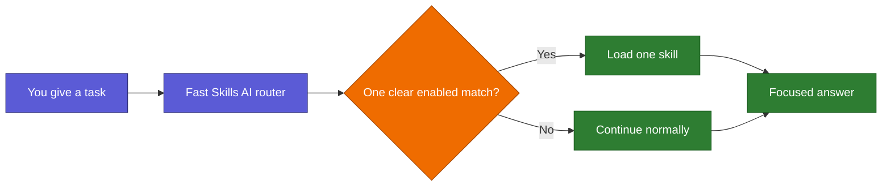

# Skills AI: Human Guide

> This is the human-facing entry point. Codex and Claude should not read it
> during normal routing or task work. Machine authority lives in `runtime/`,
> `registry/`, and the maintenance protocols.

Skills AI is a local switchboard shared by Codex and Claude. It inspects a task,
selects at most one relevant enabled skill, and otherwise lets the model continue
normally. It does not need a network service and it does not give a selected
skill permission to edit files, use credentials, or perform account actions.



## Learn it smoothly

| Read | You will understand |
|---|---|
| [Start here](docs/human/00_START_HERE.md) | What Skills AI is, its promises, and the main vocabulary |
| [Follow a request](docs/human/01_FOLLOW_A_REQUEST.md) | Routing, the strict design gate, fallback, and examples |
| [Folder and platforms](docs/human/02_FOLDER_AND_PLATFORMS.md) | What each folder does and what Codex and Claude share |
| [Skills and controls](docs/human/03_SKILLS_AND_CONTROLS.md) | Active, manual, off, hidden, and deprecated states |
| [Safe changes](docs/human/04_SAFE_CHANGES.md) | Permissions, protocols, external requests, and documentation updates |
| [Speed and troubleshooting](docs/human/05_SPEED_AND_TROUBLESHOOTING.md) | Token load, latency, timeouts, and cleanup |
| [Graph and colors](docs/human/06_GRAPH_AND_COLORS.md) | The Obsidian layer model and validation commands |

## Five things to remember

1. A normal request loads no whole skill family.
2. One clear match loads one skill; no match or ambiguity continues normally.
3. Disabled skills are not routable.
4. Codex and Claude share the Python router, manifest, profile, and skill sources.
5. Skill selection is guidance, not authority to make changes.

To see the live registry without loading skill bodies, run:

```bash
python3 scripts/list_registry.py
```

This guide explains the system but never overrides the live registry, runtime
protocol, risk map, or change-control rules.
