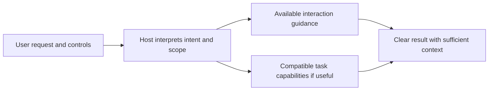

# Interaction Protocol Integration

Back to [[00_SKILLS_HUB]]. Package: [[interaction-protocol/README|Interaction Protocol]].
Registry: [[registry/interaction]]. Runtime: [[runtime/PROTOCOL]].

## Responsibility

Interaction Protocol is one public skill package with general and mathematical
presentation capabilities. It shapes the response independently of task-package
selection. It does not choose task skills, own a task slot or grant authority.
The host coordinates the minimum sufficient compatible capability set.

## Controls and availability

`#> interaction general` requests general presentation. `#> interaction math`
explicitly requests mathematical presentation. The host checks the current
package, family and component states before loading the complete protocol.
Active components may be selected when useful, manual components require actual
user invocation, and disabled components remain unavailable. Response settings
never grant permission to edit files or run domain work.

`#> use none` skips optional task packages while retaining orchestration,
explicit interaction preferences and higher-priority obligations. A phase may
use several compatible task capabilities with one output owner.

## Maintenance and verification

The package contract, registry metadata, shared access checks and mapped human
pages describe one interface. Regenerate repository projections after approved
source changes. Local tests verify metadata and exact loading; native model
adherence and host lifecycle acceptance require separate evidence. See
[[docs/CLAUDE_VERIFICATION_PROMPT]] and [[runtime/skills-orchestrator/BUILD]].
