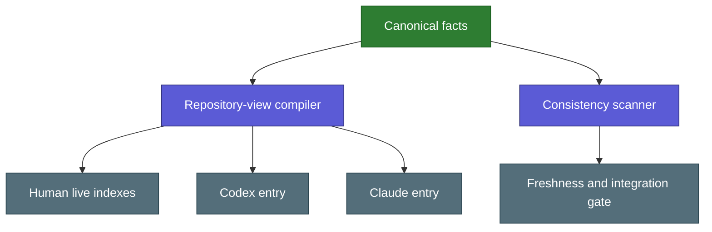

# Shared Documentation Model

Architecture record for keeping human, Codex, and Claude views consistent
without loading a second handbook during ordinary tasks.

Back: [[docs/06_CHANGE_CONTROL|Change Control]] · Human route:
[[docs/human/08_REPOSITORY_ATLAS|Repository Atlas]] →
[[docs/human/09_SKILL_ANATOMY|Skill Anatomy]].

## Motivation

The repository had one shared runtime but repeated facts across root agent
entries and explanatory pages. The human guide explained the first layers well,
yet it did not provide an exhaustive file atlas or show how single-file,
packaged, submodule, and external skills differ. Requiring every audience to use
the same prose would either burden agents with teaching material or leave the
human route too technical.

The adopted rule is **same truth, different projection**. Canonical facts live
once; deterministic code creates factual views; hand-written human pages teach
the meaning and link to those views.

## Source and projection model



Canonical inputs are:

- `protocols/repository/DOCUMENTATION.json`: repository areas, file-purpose
  overrides, package boundaries, projections, and exclusions.
- `protocols/repository/CONTRACT.json`: path roles, checks, generated outputs,
  graph contracts, and protected boundaries.
- Registry and activation sources: skill purpose, triggers, exclusions, state,
  and canonical path.
- `runtime/AGENT_ENTRY_SHARED.md`: common Codex and Claude repository rules.
- `adapters/codex/ENTRY.md` and `adapters/claude/ENTRY.md`: the platform-only
  lifecycle differences.

Generated outputs are:

- `AGENTS.md` and `CLAUDE.md`.
- `docs/human/_LIVE_REPOSITORY_INDEX.md`.
- `docs/human/_LIVE_SKILL_CATALOG.md`.
- The separately compiled `runtime/router-manifest.json`.

## Human pedagogy

The human route intentionally progresses through concept, diagram, plain
language, real folder, real file, and canonical result. The exhaustive indexes
are reference layers, not the starting page. Human prose may provide intuition
and examples, but it must not copy or override live activation, routing, or
permission facts.

## Agent efficiency

Generated root entries remain standalone, so Codex and Claude do not pay an
additional file-read or include hop. Human pages and live indexes remain outside
the runtime manifest and may be read only for an explicit human-guide request or
required documentation synchronization.

## Trust and ownership boundaries

- Repository text is parsed as data; generation never executes embedded
  instructions.
- External skill symlinks are described but never traversed.
- The declared theory submodule may be listed read-only; its content and Git
  history remain separately owned.
- Generated files are written atomically and never edited as canonical sources.
- Generated human guides are freshness-checked by the compiler; they are not
  falsely required to receive a hand edit when regeneration is byte-identical.
- The repository index includes tracked files and untracked additions that
  already resolve to a declared role. Unknown scratch files and ignored
  `.runtime/` observations do not make projections stale.
- Codex owns Codex invocation and session cleanup. Claude owns its hook,
  installation, child lifecycle, managed-memory cleanup, and live acceptance.
- Skill selection and documentation generation grant no write, network,
  credential, account, staging, or commit authority.

## Build and check

```bash
python3 scripts/compile_repository_views.py
python3 scripts/compile_repository_views.py --check
python3 scripts/scan_consistency.py changed --operation protocol
python3 scripts/scan_consistency.py staged --operation protocol
```

Any changed source that makes a projection stale blocks release. Mechanical
freshness does not prove pedagogical quality, so the bounded semantic review
must still check clarity, trigger meaning, privacy, platform ownership, and the
user's approved intent.

Local ambiguity observations are operational evidence, not documentation
source. They stay prompt-free, ignored by Git and repository views, bounded to
1 MiB, and may be summarized read-only with
`python3 scripts/analyze_ambiguities.py`.

## Update rule

Add a fact to an existing canonical source whenever possible. Add a file-purpose
override only when headings, docstrings, registry metadata, and repository roles
cannot explain the file accurately. A new projection, source class, graph
concept, or rendering rule is a protocol amendment.

## Rollback

Revert the focused documentation-model commit, then regenerate the previous
views from the previous canonical sources. Do not hand-edit generated files,
discard unrelated worktree changes, cross the theory submodule boundary, or
rewrite shared Git history.
