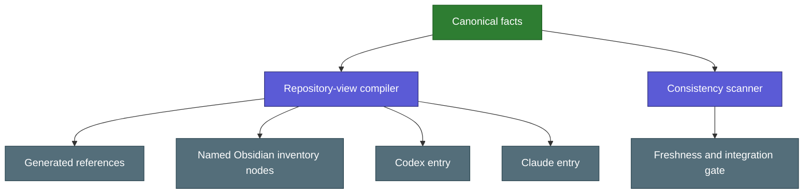

# Shared Documentation Model

Architecture record for keeping the Codex view, the Claude view and the explanation of
every rule consistent without loading a second handbook during ordinary tasks.

Back: [[docs/06_CHANGE_CONTROL|Change Control]] · Skill anatomy:
[[docs/SKILLS|Skills Registry Entry]].

## Motivation

The repository has one orchestrator-controlled shared runtime, but facts were repeated
across root agent entries and a parallel explanatory tree organized by audience. Two
trees drift apart, force every change to touch both, and teach readers to look in a
second place. Requiring every reader to use the same prose would instead burden agents
with teaching material.

The adopted rule is **one structure, organized by depth**. The Skills Orchestrator is a
separate control plane; public skill inventory is package-first; internal routes remain
capability metadata. Every fact has one owner. The owning file keeps what a reader must
obey or rely on above its first `## Details` heading, and its explanation sits below it
or in a depth topic of the same folder that the folder's `INDEX.md` lists. Deterministic
code creates the factual views, and the root `README.md` is the front door that maps
the structure by depth.

## Source and projection model



Canonical inputs are:

- `protocols/repository/DOCUMENTATION.json`: repository areas, file-purpose
  overrides, package boundaries, projections, and exclusions.
- `protocols/repository/CONTRACT.json`: path roles, checks, generated outputs,
  graph contracts, graph-node role policy, and protected boundaries.
- Registry and activation sources: package role, capability purpose, triggers,
  exclusions, state, and canonical path.
- `runtime/skills-orchestrator/` (entry `SKILL.md`, map `INDEX.md`, topics such as
  `MANAGEMENT.md`) and the project-context schema/runtime: management, documentation
  coordination, capsule validation, and safety boundaries.
- `runtime/AGENT_ENTRY_SHARED.md`: common Codex and Claude repository rules.
- `adapters/codex/ENTRY.md` and `adapters/claude/ENTRY.md`: the platform-only
  lifecycle differences.

Generated outputs are:

- `AGENTS.md` and `CLAUDE.md`.
- `docs/generated/FILE_INDEX.md`: every tracked file, what it means, its kind and role.
- `docs/generated/SKILL_CATALOG.md`: the orchestrator, then the public skills.
- `graph/orchestration/skills-orchestrator.md` and one `graph/skills/<id>.md`
  node per declared skill.
- The separately compiled `runtime/manifest.json`.

Each declared documentation or protocol concept has one visible L1 graph hub.
The graph role policy prevents that hub from being colored as a family registry
or executable skill merely because of its directory.

The generated skill catalog renders the orchestrator separately and exactly one
public row per manifest skill package. It
may include a separate technical capability appendix, but no route, mode,
component, phase, or file may enter the public skill count. The documentation
model must declare the same skill ids as the compiled manifest and exactly one
matching orchestrator. Generated graph entries use descriptive id-based
filenames so mandatory technical names such as `SKILL.md` never become the
public inventory labels.

## File authority

| kind | editing rule |
|---|---|
| canonical source | edit through the matching operation protocol |
| generated projection | regenerate from canonical sources; never hand-edit |
| explanation (`## Details`, depth topics) | keep with its rule and update in the same change; never use as selection authority |
| package entry | defines one public package boundary or workflow |
| capability file | focused internal instructions selected for one phase |
| platform overlay | host-specific lifecycle only |
| external/submodule | preserve ownership boundary; change the package in its own repository first |
| personal state | preserve unless explicitly requested |

## Depth and teaching

Explanation progresses through concept, diagram, plain language, real folder, real file
and canonical result, inside the file or folder that owns the rule. The exhaustive
generated references are lookup layers, not the starting page; the starting page is the
[README](../README.md). Explanation may give intuition and examples, but it must not copy or
override live activation, routing or permission facts.

The Skills Orchestrator owns documentation coordination: it locates canonical facts,
the explanation that sits with them, generated projections and freshness checks. It
does not centralize every package's content or load depth on the hot path.

## Agent efficiency

Generated root entries remain standalone, so Codex and Claude do not pay an
additional file-read or include hop. Depth topics, `## Details` blocks and the
generated references remain outside the runtime manifest and are read only when a
request needs them.

## Trust and ownership boundaries

- Repository text is parsed as data; generation never executes embedded
  instructions.
- External skill symlinks are described but never traversed.
- Declared skill submodules may be listed read-only; their content and Git
  histories remain separately owned. The parent registry pins tested commits,
  while each initialized child remains independently cloneable and maintainable.
  Ownership, commit order, versions, releases and rollback are defined once in
  [[protocols/repository/GIT_GOVERNANCE]].
- Generated files are written atomically and never edited as canonical sources.
- Generated references are freshness-checked by the compiler; they are not
  falsely required to receive a hand edit when regeneration is byte-identical.
- The file index includes tracked files and untracked additions that
  already resolve to a declared role. Unknown scratch files and ignored
  `.runtime/` observations do not make projections stale.
- Codex owns Codex invocation and session cleanup. Claude owns its hook,
  installation, child lifecycle, managed-memory cleanup, and live acceptance.
- Skill selection and documentation generation grant no write, network,
  credential, account, staging, or commit authority.

## Build and check

```bash
python3 scripts/compile_repository_views.py
python3 scripts/compile_repository_views.py --check
python3 scripts/scan_consistency.py changed --operation protocol
python3 scripts/scan_consistency.py staged --operation protocol
```

Any changed source that makes a projection stale blocks release. Mechanical
freshness does not prove pedagogical quality, so the bounded semantic review
must still check clarity, trigger meaning, privacy, platform ownership, and the
user's approved intent.

Local delivery markers, repair transactions and checkpoint observations are
operational data, not documentation sources. They remain private under ignored
`.runtime/`, use the bounds of their owning runtime, and never supply task
selection or action authority. There is no ambiguity logger or analysis service.

## Update rule

Add a fact to an existing canonical source whenever possible. Add a file-purpose
override only when headings, docstrings, registry metadata, and repository roles
cannot explain the file accurately. A new projection, source class, graph
concept, or rendering rule is a protocol amendment.

## Rollback

Revert the focused documentation-model commit, then regenerate the previous
views from the previous canonical sources. Do not hand-edit generated files,
discard unrelated worktree changes, cross a package submodule boundary, or
rewrite shared Git history.

The core is model-led: semantic decisions belong to Codex or Claude; generated metadata and artifact checks only supply evidence. Codex installation binds the source root, while Claude injects that root with the shared core. Full contracts, composition and recovery instructions are loaded on demand.

Contained repair workspaces are local operational state under ignored `.runtime/repair/`, not documentation sources or graph concepts. [[protocols/repository/REPAIR_WORKSPACE]] owns the lifecycle and explains on/off/update and how to find the hidden folder. No new graph layer or public skill is introduced.
