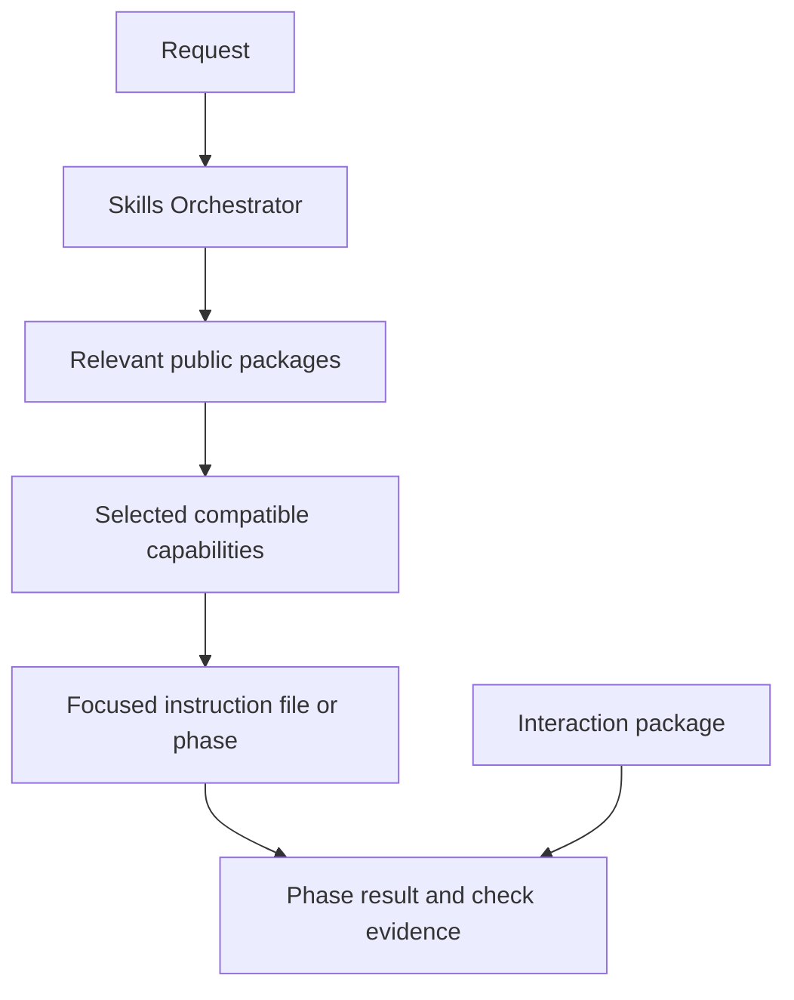
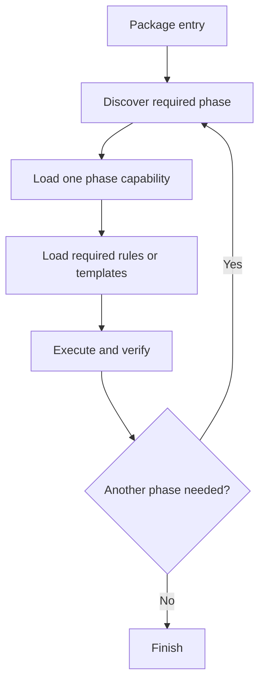

# Skills Registry Entry

Normal tasks start from the always-active Skills Orchestrator core, [[orchestrator/runtime/skills-orchestrator/SKILL]]; its map is [[orchestrator/runtime/skills-orchestrator/INDEX]]. The host model uses it to select the minimum sufficient compatible capability set, or continues with normal host tools. Read [[00_SKILLS_HUB]] only for bounded registry maintenance and audits.

Flow: host reasoning → compact discovery → exact selected entries and required support → authorized work and artifact-bound evidence. Tools provide metadata and identity/path checks; they never rank skills or select modes. Public inventory counts packages, not capability files.

Composition: [[03_COMBO_MAP]]. Risk: [[04_RISK_MAP]]. Repository changes: [[06_CHANGE_CONTROL]] and one operation card. Guide: [[orchestrator/runtime/skills-orchestrator/GUIDE]].

An explicit question about available skills uses the live manifest summary; do
not answer from remembered skill names. A task started outside this workspace
uses [[orchestrator/governance/EXTERNAL_CHANGE_REQUEST]] and may write only one new
packet under `workbench/requests/pending/` before a dedicated maintenance handoff.

## Details

### Activation states

| state | behavior |
|---|---|
| `active` | may be selected automatically or exactly |
| `manual` | exact explicit selection only |
| `off` | visible in status, never loaded |
| `hidden` | not loaded or shown in ordinary discovery |
| `deprecated` | unavailable for execution; visible in explicit lifecycle inspection |

An internal capability cannot bypass its package or family state. Selection chooses
among available capabilities; it grants no authority. The package list and its states
live in [[orchestrator/registry/activation]]; the generated `docs/generated/SKILL_CATALOG.md` shows
them with the orchestrator first and a separately labelled capability appendix.

```bash
python3 orchestrator/tools/list_registry.py
python3 orchestrator/tools/list_registry.py --catalog
python3 orchestrator/tools/list_registry.py --routes
```

The first command lists public skills, the second adds package-level purpose and
trigger metadata, and the third intentionally lists internal technical capability
routes. None loads instruction bodies. The skills hub ([[00_SKILLS_HUB]]) is a
maintenance page: it is read for registry audits, not as an entry, and ordinary
requests start from the orchestrator core and never load it.

### Public package and internal capability



The package is the public skill and inventory unit. A capability is an internal entry
used to select focused instructions. Files, phases, modes, components, family rows and
capability entries never increase the public skill count. The Skills Orchestrator sits
above this anatomy: it selects and manages skills but is not a package, capability or
inventory row.

| public package | anatomy |
|---|---|
| `interaction-protocol` | canonical JSON contract, hub, general/math modes independent of task selection |
| `markdown-protocol` | submodule package with compact operational entry, optional navigation index and generated inventory, proportional review workflow, selectively loaded references, on-demand checker, add-ons, and small learning examples |
| `project-manager` | submodule package with an always-on operational entry, portable `.ai-memory/` templates, one active HANDOFF, review-gated change plans, feedback capture, deterministic CLI, and package-local tests |
| `theory-reference` | submodule package with entry, shared router, phases, rules, templates, and scripts |
| `research-context-scout` | submodule package with entry, initial/deepen phases, an optional math-method lens, gate-sized rules for alignment, acquisition/extraction, evidence, relation mapping and collective synthesis, templates, and wrappers |
| `optimizer` | submodule package with a stable-route resolver, guarded TeX-to-OLGS build workflow, adaptive campaign and situation-analysis workflows, and read-only discovery helper |
| `quantum-job-collector` | externally owned pointer whose package state is currently off |

Every submodule package also carries what lets it verify and update on its own: its
tests, one declared version, a short `CHANGELOG.md`, a `.gitignore`, CI and a
standalone-use note in its README. The package's public identity is independent of
storage form: declared submodules keep their own Git histories and release paths while
the parent pins the tested combination ([[orchestrator/governance/GIT_GOVERNANCE]]).

### Operational and navigation entries

`SKILL.md` is the compact operational entry and router. A navigable multi-file package
may also expose `INDEX.md` as a navigation map of its layers, references and
maintenance routes; the index is neither a public skill nor an internal capability, and
ordinary task execution does not load it. The Skills Orchestrator's own folder has
this shape: `SKILL.md` is the delivered entry, `INDEX.md` is the map, each topic file
holds one subject, and `GUIDE.md` and `TROUBLESHOOTING.md` are optional depth. The
orchestrator is a control plane rather than a skill, so it is not counted in the
inventory.

Project Manager has the `supporting` role: it is mandatory for project and
repository work and is therefore independent of optional task-skill selection.
`#> use none` suppresses optional task packages, not project memory or HANDOFF
duties. Saved material remains advisory and never grants action authority.

For future skill creation, documentation or substantial Markdown restructuring, the
orchestrator composes the Markdown Protocol's skill-package add-on with the native skill
workflow. The add-on chooses among minimal, routed, navigable and tool-bearing
profiles, and existing packages move to this shape only when individually named and
reviewed. The Markdown package's named modes (`#> md_protocol`, `#> md_deepen <term>`,
`#> md_check`) remain operations within the same public skill; they are not additional
skills and do not broaden authority.

### Capability record

An internal task capability has a family, package id, activation state, purpose,
triggers, exclusions, canonical path and appropriate verification obligations. The
registry describes these facts without copying the instruction body. A selected path
is loaded only after package state and path validation. Locating that path requires no
background semantic index: the host selects an exact capability from discovery
metadata, and maintenance work otherwise uses bounded native filename and literal
searches followed by targeted reads. For example, optimizer's build-system and
optimization workflows belong to one public package, and an exact build-workflow
selection is `#> build-system <problem.tex>`.

### Multi-phase packages



The orchestrator contract may coordinate several capabilities, but the host verifies
and reroutes between phases instead of preloading them. Explicit checkpoint tools
inspect saved content bindings; the host decides recovery and phase transitions. A
checkpoint may record content-bound progress, never prompts or permission.

Research Context Scout is a concrete example: its initial phase opens only the rules
needed by the current gate, records user alignment before broad search, and blocks
synthesis until every incorporated paper is locally available and extracted. The gate
order and rule-loading table live in a separate `gates.md` that a first cycle never has
to open, and a machine-readable `load-graph.json` records which file belongs to which
gate for tooling and tests rather than for the model. Its collective report translates
source-supported ideas into project notation; individual paper cards remain evidence
rather than separate public capabilities or visible report sections.

### Promotion boundary

An idea containing only `workbench/plans/<name>/plan.md` is not a skill package. Creating a
new package normally introduces a governed `SKILL.md` and package record. Existing
composite and protocol packages may use another explicitly declared canonical entry,
such as a registry hub or protocol README. In every case, exactly one Activation row
defines the public package. Nested platform wrappers, shared entries, phases and
capability files remain package support, and their presence never creates additional
public skills.

The generated skill catalog contains one separate orchestrator record and exactly one
public row per Activation skill package. Its separate Internal Capabilities section may
list routes, triggers, paths and token estimates for technical inspection, but those
rows are not skills. A comma-separated use list explicitly selects named public
packages; the host resolves their exact entries and relevant phases, and the task
receipt reports planned selection without treating capability leaves as extra skills or
claiming unread files were loaded.
