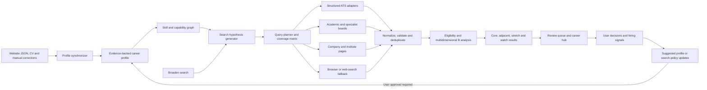
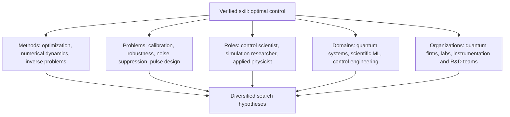
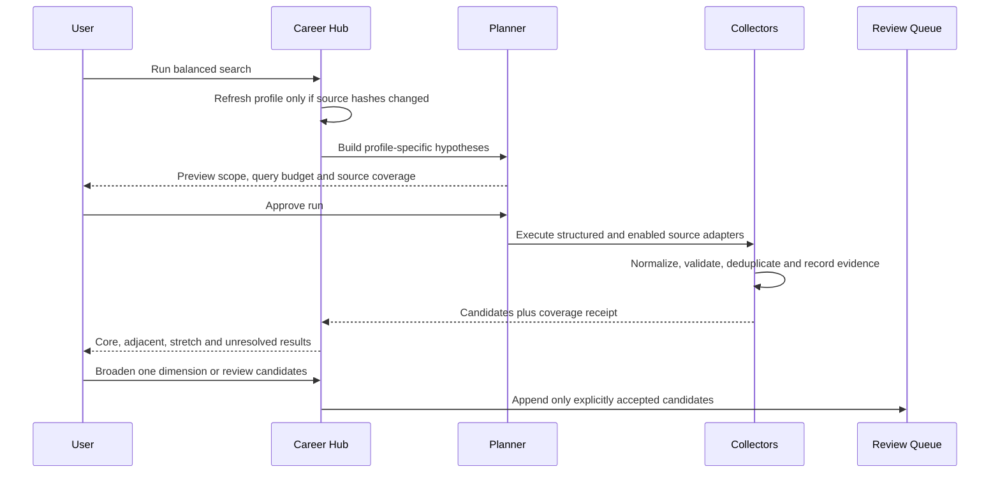

# Career Guidance Hub Redesign Plan

## Core Decision

Redesign the current collector as a **skill-driven career discovery engine**,
not merely a "quantum jobs" keyword search.

The central pipeline is:

> evidence about the user's abilities -> transferable skill map -> multiple
> search hypotheses -> broad, measurable source coverage -> explainable
> opportunities -> career and hiring insights

No system can guarantee that every position on the internet is found. The
system should instead report exactly what was searched, what succeeded, what
failed, and where coverage remains incomplete.

The career family and all collector components remain `off` until the
redesigned dry-run pipeline passes its evaluations and activation is separately
approved.

## Current Limitations

The existing system already has a useful foundation: tracked source results,
source evidence, unresolved-source records, a review queue, an API, and a web
interface.

The main limitations are:

- The profile is manually duplicated between Career Radar's `profile.json` and
  `QUANTUM_JOB_SEARCH_CONFIG.md`.
- The profile loader converts structured skills into one flat prompt string,
  losing evidence, provenance, and relationships between skills.
- Search terms and role categories are predominantly hard-coded around explicit
  quantum titles.
- One fit score and a fixed cutoff can hide unusual but strategically relevant
  positions.
- Deduplication primarily uses URLs, which can miss reposted or mirrored
  vacancies.
- The scheduled runner asks a general AI agent to manage most of the search,
  making runs expensive and difficult to reproduce.
- A historical source inspection recorded 105 records (not refreshed for this
  proposal): one
  `covered_matches`, 71 `covered_no_matches`, 21 `partial_parse`, eight
  `indirect_only`, and four `hard_inaccessible`. This does not prove a single
  cause, but it makes extraction quality, query breadth, and source reliability
  important redesign targets.

## Proposed Architecture

The skill remains a thin orchestrator. It chooses the workflow and invokes
deterministic tools. Profile synchronization, collection, normalization,
scoring, evidence handling, and analytics belong in tested scripts and Career
Radar services.

## Skill Expansion Model

Each verified skill expands along several independent routes:

For example, `GRAPE` should not produce only `GRAPE quantum jobs`. It can lead
to pulse optimization, calibration algorithms, Hamiltonian learning, numerical
control, quantum-systems modelling, scientific optimization, and
applications-scientist searches.

### Independent Search Routes

Search planning should deliberately include several routes so that one naming
convention does not control discovery:

1. **Skill-first:** methods, tools, algorithms, and scientific techniques.
2. **Problem-first:** calibration, robustness, noise, simulation, optimization,
   control, and modelling problems the user can solve.
3. **Role-first:** canonical titles, aliases, and organization-specific titles.
4. **Domain-first:** quantum platforms, adjacent scientific domains, and
   transferable technical areas.
5. **Organization-first:** companies, laboratories, institutes, startups,
   portfolio companies, and research groups.
6. **Ecosystem-first:** job boards, consortia, funding portfolios, conferences,
   fellowships, and community listings.
7. **Opportunity-first:** jobs, internships, postdocs, fellowships, visiting
   positions, and fixed-term research projects.

## Search Breadth

| Level | Scope | Result treatment |
|---|---|---|
| Core | Direct quantum-control, open-systems, and simulation roles | Ranked prominently |
| Adjacent | Quantum roles using transferable modelling, optimization, ML, or physics skills | Included by default with explanation |
| Exploratory | Wider scientific computing, control, simulation, and R&D roles | Added through `Broaden search` |
| Ecosystem | Fellowships, internships, postdocs, portfolio companies, and emerging teams | Separate opportunity stream |

The recommended default is **Core + Adjacent**. `Broaden search` adds one
controlled dimension at a time, such as Exploratory roles, geography,
seniority, organization type, opportunity type, or title aliases. Existing
results stay stable and newly introduced results are identified separately.

## Core Data Contracts

### ProfileClaim

Store a skill, capability, or preference with:

- canonical name and aliases;
- level and evidence type;
- source path or manual origin;
- `direct`, `relevant`, or `inferred` claim status;
- last verified timestamp;
- user-confirmed or generated status.

Generated adjacency must never be represented as demonstrated experience.

### SearchHypothesis

Store:

- originating profile claims;
- role family and title aliases;
- problem, method, and domain concepts;
- breadth level;
- query variants;
- target source classes;
- reason the hypothesis is relevant.

### SourceAttempt

Extend the existing source-result model with:

- run ID and hypothesis IDs;
- adapter and query used;
- timestamps and response status;
- listing, extraction, duplicate, and qualification counts;
- evidence path;
- retry policy and unresolved reason.

### Opportunity

Store:

- normalized vacancy fields;
- canonical and observed URLs;
- description hash and source evidence;
- posting, discovery, update, deadline, and closure dates;
- job, internship, postdoc, or fellowship type;
- extracted required and preferred capabilities;
- originating search hypotheses.

### MatchAssessment

Keep separate dimensions for:

- hard eligibility;
- direct skill match;
- transferable capability match;
- learning gap;
- user-interest alignment;
- strategic value;
- evidence quality;
- freshness and deadline urgency.

A combined score may be used for ordering, but individual dimensions and the
reasoning must remain visible. Only closed, malformed, blocked by explicit hard
constraints, or confirmed duplicate records should be silently excluded.

### MarketSignal and UserFeedback

Track recurring titles, skills, sectors, locations, qualification patterns,
and technology areas across enough postings to form a defensible trend. Record
saved, rejected-with-reason, applied, interviewed, and offer outcomes.

Feedback may produce a proposed profile or search-policy update. It must never
silently rewrite either one.

## Source Strategy

Use sources in increasing order of cost and uncertainty:

1. Public structured ATS endpoints such as Greenhouse and Lever.
2. Repeatable HTML adapters such as Teamtailor and known career platforms.
3. Specialist quantum, academic, fellowship, and scientific job boards.
4. Direct company, laboratory, university, and institute career pages.
5. Ecosystem sources such as consortiums and venture portfolios.
6. General web search for discovery and unresolved-source recovery.
7. Browser or JavaScript fallback only for sources that need it.
8. Paid or account-backed sources only through separately enabled components.

Every source must finish in a precise covered, partial, inaccessible, indirect,
or retryable state. A successful run is not defined only by jobs found; it also
requires a complete coverage receipt.

## End-to-End Run

The search-plan preview is important for expensive, browser-backed, paid, or
large-scope runs. A small structured dry run can use a previously approved
policy without asking repeatedly.

## Implementation Plan

### Phase 0: Contract and Baseline

1. Audit the live Career Radar schemas, source catalog, pending queue, database,
   API consumers, runner, and existing tests.
2. Record a read-only baseline: source counts, unresolved counts, duplicate
   behavior, runtime, token cost, and candidate quality.
3. Define schemas, breadth semantics, hard constraints, permissions, evidence
   retention, and measurable acceptance criteria.
4. Decide migration and rollback behavior before changing live data.

**Gate:** schemas and acceptance criteria reviewed; no collection changes yet.

### Phase 1: Profile Synchronization

1. Treat the website JSON as the canonical public evidence source where it is
   already structured.
2. Add deterministic importers for projects and experience.
3. Add optional CV and manual-override inputs without making generated website
   HTML a source of truth.
4. Use source hashes and timestamps to skip unchanged inputs.
5. Generate a versioned profile snapshot and a human-reviewable diff.
6. Require approval before inferred claims become confirmed claims.

**Gate:** repeated synchronization is idempotent and preserves manual data.

### Phase 2: Skill Graph and Search Hypotheses

1. Normalize skill aliases and connect each claim to methods, problems, roles,
   domains, and organization classes.
2. Label every graph edge as direct, curated, or model-inferred.
3. Generate Core, Adjacent, Exploratory, and Ecosystem hypotheses.
4. Add negative evidence and known gaps so expansion does not imply experience
   the user does not have.
5. Present the graph and hypotheses for review before collection.

**Gate:** fixture profiles generate diverse but defensible search plans.

### Phase 3: Query Planner and Coverage Matrix

1. Build queries across independent skill, problem, role, domain,
   organization, ecosystem, and opportunity routes.
2. Deduplicate semantically equivalent queries.
3. Apply per-source query capabilities and configurable budgets.
4. Record why every query exists and which hypotheses it covers.
5. Detect uncovered skill clusters or source classes before execution.

**Gate:** identical inputs and policy produce the same normalized plan.

### Phase 4: Deterministic Collection

1. Implement and test structured Greenhouse and Lever adapters first.
2. Add Teamtailor and other repeated career-platform adapters.
3. Add specialist and academic sources in bounded groups.
4. Execute independent adapters concurrently with source-specific limits.
5. Cache stable responses and support resuming an interrupted run.
6. Keep browser, paid, and scheduled modes disabled.

**Gate:** structured dry runs complete without AI-driven fetching or live data
writes.

### Phase 5: Evidence, Normalization, and Deduplication

1. Validate every source attempt and opportunity against schemas.
2. Store immutable evidence under a run ID while retaining a latest-state
   projection for the UI.
3. Canonicalize tracking URLs and preserve all observed URLs.
4. Deduplicate with canonical URL, company-title-location fingerprints,
   description hashes, and cautious semantic comparison.
5. Record duplicate decisions so they can be audited and reversed.
6. Preserve unresolved-source records and explicit retry strategies.

**Gate:** rerunning the same evidence produces no duplicate opportunities.

### Phase 6: Explainable Matching

1. Apply hard constraints separately from preference and fit ranking.
2. Produce multidimensional assessments with matched evidence, transferable
   strengths, missing requirements, uncertainty, and strategic value.
3. Group results into Core, Adjacent, Stretch, and Watch rather than deleting
   everything below one fit threshold.
4. Show `why this appeared` and `why it may not fit` for every candidate.
5. Calibrate rankings against a reviewed fixture set.

**Gate:** ranking changes are explainable and do not hide strategically useful
adjacent roles.

### Phase 7: Results and Controlled Broadening

1. Return grouped opportunities, search hypotheses, coverage statistics, empty
   searches, partial parses, and unresolved sources.
2. Preview what each broadening action changes.
3. Add one breadth dimension at a time and identify only the incremental
   results.
4. Preserve the previous run and search policy for comparison and rollback.
5. Append accepted results through one controlled queue-writer contract.

**Gate:** broadening is incremental, reproducible, and cannot silently weaken
hard constraints.

### Phase 8: Career Intelligence

1. Aggregate recurring skills, tools, title aliases, domains, seniority,
   sectors, locations, and qualification requirements.
2. Separate observed counts from AI interpretation.
3. Require minimum sample and source-diversity thresholds before calling an
   observation a hiring trend.
4. Show evidence behind each market signal.
5. Translate durable gaps into suggested learning or portfolio actions without
   claiming that every frequent keyword should become a priority.

**Gate:** every guidance claim is traceable to postings and an analysis window.

### Phase 9: Feedback and Application Outcomes

1. Capture shortlist, rejection reason, application, interview, and offer
   outcomes.
2. Distinguish poor fit, lack of interest, location, visa, seniority, duplicate,
   closed posting, and bad extraction.
3. Use feedback to propose changes to search weights, not silently apply them.
4. Compare application outcomes with original match assessments to calibrate
   the ranking model.

**Gate:** feedback is reversible, reviewable, and does not corrupt the factual
profile.

### Phase 10: Career Hub Interface

Build incrementally on the existing Career Radar app:

- **Profile:** claims, evidence, confidence, source freshness, and proposed
  updates.
- **Search Plan:** active hypotheses, breadth, query budget, source classes, and
  missing coverage.
- **Opportunities:** grouped results, explanations, deadlines, and review
  actions.
- **Coverage:** source states, unresolved causes, retries, and run history.
- **Market Signals:** hiring trends with counts, time windows, and evidence.
- **Skill Gaps:** recurring requirements and suggested next actions.
- **Applications:** saved, applied, interview, rejected, and offer outcomes.

**Gate:** each view has a complete empty, loading, partial, error, and stale-data
state before scheduled operation is considered.

### Phase 11: Staged Activation

Activate components separately and only after their gates pass:

1. Profile synchronization and search-plan preview.
2. Structured-source dry run.
3. Evidence and run-summary persistence.
4. User-approved pending-queue append.
5. Unresolved-source retry.
6. Browser fallback.
7. Paid or account-backed fallback.
8. Scheduled execution.

Do not activate the parent family until the intended default components are
safe together. Browser, paid, and scheduled components remain independently
controllable.

## Efficiency Rules

- Reprocess website data only when canonical source hashes change.
- Cache stable source responses with source-specific expiry policies.
- Run independent structured adapters concurrently.
- Resume incomplete runs instead of restarting all sources.
- Use AI for semantic expansion, extraction where deterministic parsing fails,
  and cautious fuzzy comparison; do not use it for deterministic fetching,
  validation, or queue writes.
- Store normalized query plans so searches are reproducible.
- Apply query budgets by source cost, expected value, and unresolved state.
- Send only required search concepts externally, not the complete private
  profile.
- Keep one validated pending-queue writer contract and resolve competing write
  paths before activation.
- Separate immutable run evidence from mutable latest-state projections.

## Safety and Control Boundaries

- Website synchronization reads canonical data and generates a reviewable
  profile diff; it does not edit the website.
- Private CV or notes remain local unless the user explicitly authorizes an
  external use.
- Skill selection never grants network, credential, account, browser, paid
  service, scheduling, or write authority.
- Collection and pending-queue append are separate operations.
- Profile facts, inferred capabilities, search preferences, and observed market
  signals remain separate data classes.
- Every model-generated inference carries provenance and can be rejected.
- No search run should claim exhaustive internet coverage; it should claim only
  measured coverage of its declared plan.

## Evaluation Plan

Use fixed fixtures and reviewed real examples to measure:

- profile synchronization accuracy and idempotence;
- hypothesis diversity without unsupported skill inflation;
- query-plan determinism and skill-cluster coverage;
- source adapter success, partial-parse, and inaccessible rates;
- extraction completeness and field accuracy;
- duplicate precision and false-merge rate;
- ranking quality across Core, Adjacent, Stretch, and Watch groups;
- percentage of opportunities with valid direct URLs and evidence;
- run cost, duration, cache reuse, and resumability;
- usefulness of broadening suggestions;
- calibration between match assessments and later application outcomes.

Forward tests should use fresh agents with raw profile and posting fixtures. They
must not receive the intended answer or redesign conclusions.

## First Deliverable

The first useful milestone is deliberately read-only:

> website profile sync -> visible skill graph -> search-plan preview -> user
> review

It contacts no job websites and writes no opportunities. Once the profile
claims and expansion logic are accepted, the next milestone runs structured
sources in dry-run mode and returns candidates plus a coverage receipt.

## Deliberately Deferred

- Activating the `career` family or `quantum-job-collector`.
- Editing the parked skill body.
- Modifying Career Radar application data or its database.
- Contacting job websites or external accounts.
- Browser automation, paid APIs, or scheduled execution.
- Automatic profile changes based on search or application feedback.
- CV tailoring, cover-letter generation, or automatic applications.
