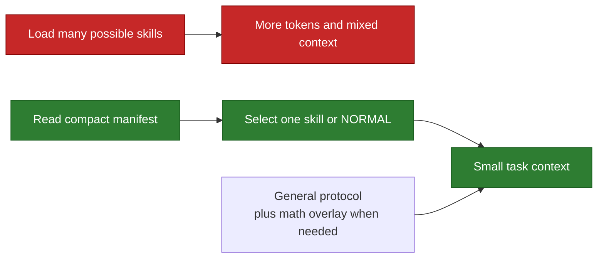

# Start Here

Back to the [human guide](../../README.md). Next: [follow a request](01_FOLLOW_A_REQUEST.md).

## The problem Skills AI solves

Large skill collections contain useful instructions, but loading all of them for
every task is slow, expensive, and distracting. Skills AI keeps a small registry
of names, triggers, activation states, and paths. The router uses that compact
information to select one skill without reading every skill body.

## The promises

- At most one active or manual skill is selected.
- The general protocol always stays separate from the selected task skill.
- Mathematical reasoning can add a math overlay without replacing that skill.
- No suitable skill means normal model reasoning, not a stopped task.
- Ambiguous matches return normal behavior instead of guessing.
- Off, hidden, and deprecated routes are not loaded.
- Prompt text and skill bodies are not written to diagnostics.
- A selected skill grants no write, network, credential, or account authority.
- Each router process reads one request, writes one result, and exits.

## What it is not

Skills AI is not a second model, a persistent web service, a memory of every
skill, or a permission system. It is a small local routing layer. Filesystem and
host permissions remain the real enforcement boundary.

## Small glossary

| Term | Meaning |
|---|---|
| Route | A compact record pointing to one skill |
| Manifest | Generated JSON containing the routable registry |
| Family | A group such as design, UI patterns, interaction, or theory |
| Interaction protocol | Small response guidance composed with task routing |
| `MATCH` | One skill was clearly selected |
| `NORMAL` | Continue the task without a local skill |
| Fail-open | Router trouble does not block the original task |
| Adapter | Thin Codex- or Claude-specific access to the shared router |

The human guide is explanatory only. For current behavior, the live manifest
and canonical maintenance documents remain authoritative.
