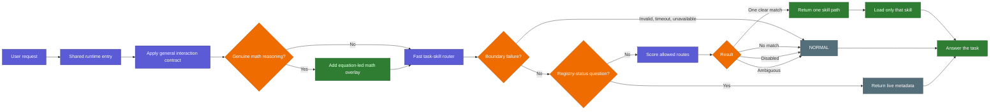
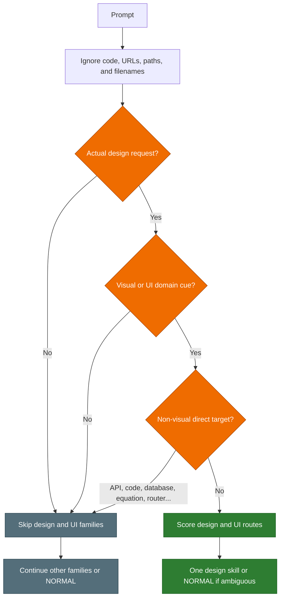

# Follow a Request

Back: [start here](00_START_HERE.md). Next: [folder and platforms](02_FOLDER_AND_PLATFORMS.md).

## Complete request flow

The router returns a compact receipt. It never returns the original prompt or a
whole family. After a `MATCH`, the caller validates the returned path and reads
only that selected skill.

The interaction protocol is independent of `MATCH`. General guidance keeps the
answer direct and adequately explained. The math overlay activates only for
mathematical actions and objects, explicit mathematical research reasoning, or
an explicit `/interaction math` control. Code, filenames, search terms,
settings, and rendering tasks cannot activate it merely by mentioning
“equation” or “formula”.

See the [Interaction Protocol hub](../../interaction-protocol/README.md) for the
same general and math branches as a connected Obsidian graph route.

## The strict design gate

Visual design and UI skills are intentionally harder to activate because words
such as “search,” “table,” “plot,” and “structure” occur in many non-design
tasks.

## Examples

| Request | Design/UI result | Why |
|---|---|---|
| “Search recent papers about quantum control” | Not activated | Search is a research action here |
| “Search for design-system examples” | Not activated | Design is the subject, not the requested action |
| “Create a plot of a sine function” | Not activated | No explicit design request |
| “Design a search interface with autocomplete” | `search-specialist` | Explicit design request plus UI domain |
| “Help me design a sidebar with breadcrumbs” | `navigation-specialist` | Explicit request plus navigation cues |
| “Design an API that returns a table” | Design families skipped | API is a non-visual direct target; another family may match |
| “Design a responsive mobile dashboard” | May return `NORMAL` | Several equally strong design routes can be ambiguous |

This gate changes only the visual design and UI-pattern families. Other enabled
families continue through their normal matching rules.
