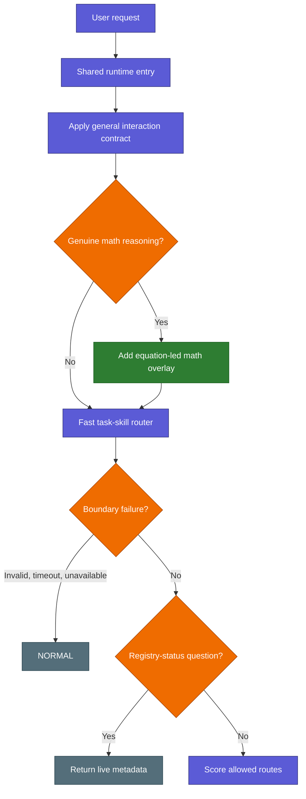
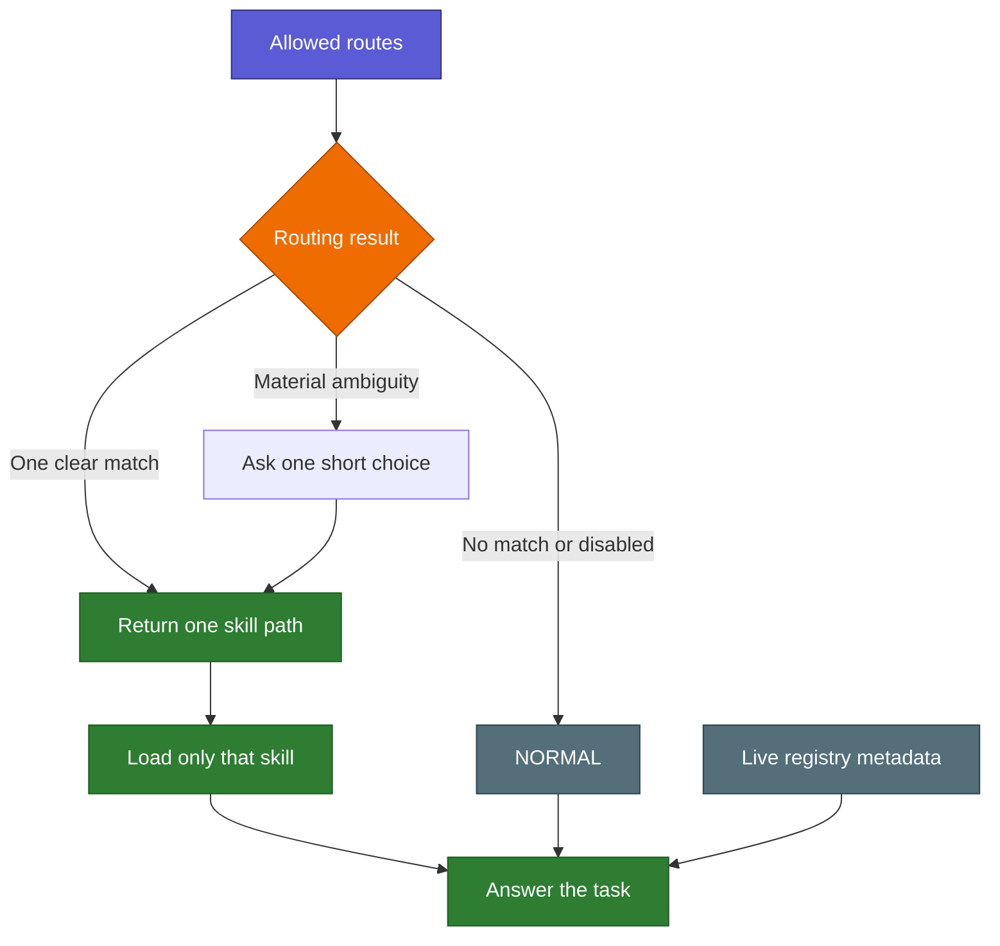
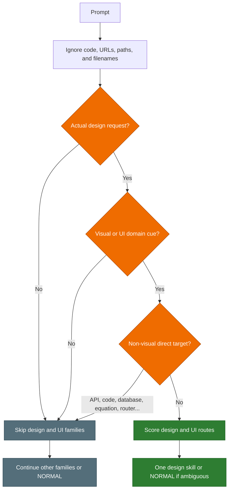

# Follow a Request

Back: [start here](00_START_HERE.md). Next: [folder and platforms](02_FOLDER_AND_PLATFORMS.md).

## Request entry and boundaries

## Skill decision and answer

The router returns a compact receipt with Fit 0–3, interaction style, output
shape, depth, format, and access. It never returns the original prompt or a
whole family. After a `MATCH`, the caller validates the returned path and reads
only that selected skill. At Fit 1 it returns candidate ids and purposes, not
paths or bodies; the host asks one numbered last-resort choice only when the
alternatives materially change the task.

Depth is rendered explicitly as `depth=brief|standard|detailed` in the shared
Codex context and the Claude hook context instead of remaining internal router
metadata.

A request to add, edit, move, delete, scan, or repair Skills AI itself returns
`NORMAL / SKILLS_AI_MAINTENANCE` before ordinary skill scoring. This prevents
maintenance words such as “node” from selecting the setup guide. Negated phrases
such as “no external install” are not treated as positive installation intent.

A leading `#> override <instruction>` returns `NORMAL / USER_OVERRIDE` before skill
scoring. It means “follow this exact request without local Skills AI ceremony,”
not “ignore the host, sandbox, permissions, credentials, or safety rules.” A
later, quoted, code-block, bare, or shell `sudo` mention has no special meaning.

A family registry may declare an exact task directive for one manual skill.
`#> scout` selects the initial Research Context Scout phase and `#> scout-again`
selects its delta-based deepening phase. The receipt carries only the command
and mode; paths and other arguments stay in the host request. Scout narrows the
receipt to `write-scoped:research-orientation.md` and a supervisor-brief shape;
everything else stays read-only. Invocation mode does not skip incomplete
state: answered intake with an empty research map completes initial Cycle B
before delta deepening. Canonical `#> skill research-context-scout <mode> ...`
requires `initial` or `deepen` and injects the same mode. Receipt, depth, format
or interaction controls may precede the Scout task directive. `#> skill normal`
still opts out, while malformed, quoted, embedded, later and near-matching text
fails safely.

The interaction protocol is independent of `MATCH`. General guidance keeps the
answer direct and adequately explained. The math overlay activates only for
mathematical actions and objects, explicit mathematical research reasoning, or
an explicit `#> interaction math` control. Code, filenames, search terms,
settings, and rendering tasks cannot activate it merely by mentioning
“equation” or “formula”. Current-request controls override session, project,
global, and automatic defaults.

See the [Interaction Protocol hub](../../interaction-protocol/README.md) for the
same general and math branches as a connected Obsidian graph route.

## The strict design gate

Visual design and UI skills are intentionally harder to activate because words
such as “search,” “table,” “plot,” and “structure” occur in many non-design
tasks.

## Examples

| Request | Design/UI result | Why |
|---|---|---|
| “Search recent papers about quantum control” | Not activated | Search is a research action here |
| “Search for design-system examples” | Not activated | Design is the subject, not the requested action |
| “Create a plot of a sine function” | Not activated | No explicit design request |
| “Design a search interface with autocomplete” | `search-specialist` | Explicit design request plus UI domain |
| “Help me design a sidebar with breadcrumbs” | `navigation-specialist` | Explicit request plus navigation cues |
| “Design an API that returns a table” | Design families skipped | API is a non-visual direct target; another family may match |
| “Design a responsive mobile dashboard” | May return `NORMAL` | Several equally strong design routes can be ambiguous |

This gate changes only the visual design and UI-pattern families. Other enabled
families continue through their normal matching rules.
