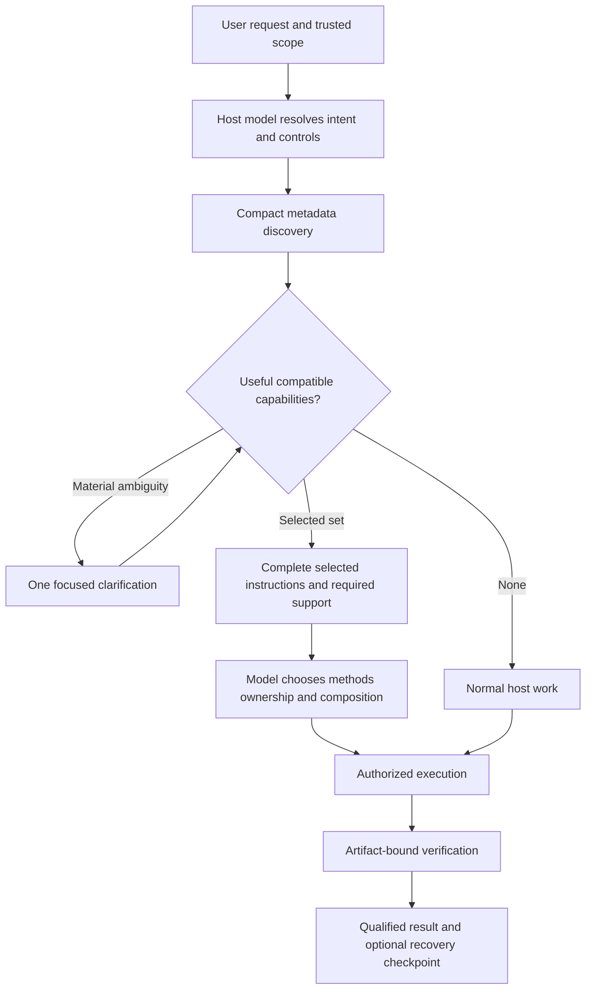
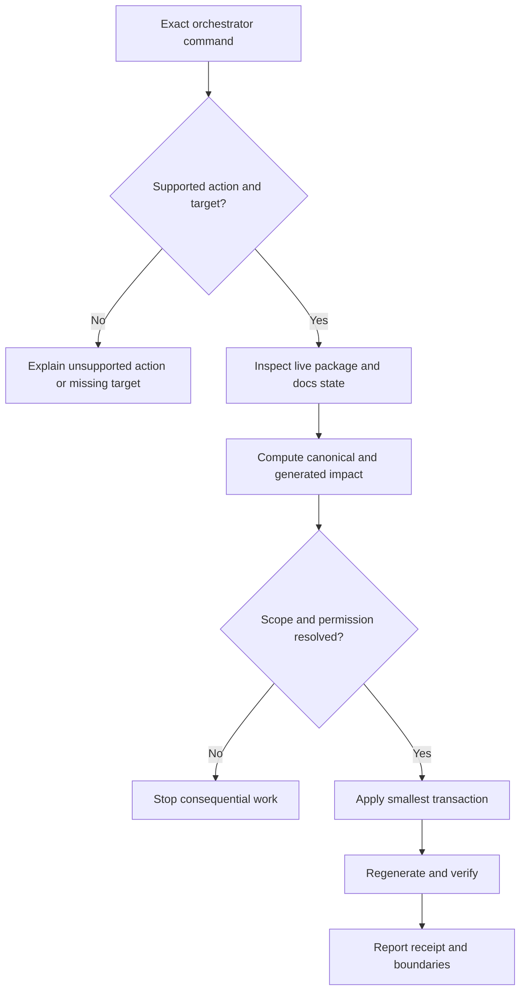

# Follow a Request

Back: [start here](00_START_HERE.md). Next: [folder and platforms](02_FOLDER_AND_PLATFORMS.md).

## Normal request

The orchestrator tools return metadata, not a decision. The original request stays with the host model. Discovery is bounded and a first page is not exhaustive. Selection never grants write or external-action permission. Complete obligations must remain available when support is summarized or context is recovered.

## Management request

Management uses no coordination capacity. Supported action groups are inventory and
diagnosis, project context, package/capability lifecycle, repair, migration, and
documentation. The orchestrator owns coordination, not unlimited authority.

`#> orchestrator sudo <operation> <exact-target>` bypasses only local
Skills AI procedure. Bare `#> sudo`, quoted examples, code blocks, and later
mentions are inert.

The host interprets the leading user-authored control block and current natural instructions. The shared core is available for ordinary coordination; detailed management and recovery modules are read only when needed. No router state machine chooses phase transitions.

## Package and capability controls

`#> use theory-reference` selects that public package. An unknown or
unavailable name is reported rather than silently substituted.

`#> interaction math` selects the interaction package's math mode
independently of task-skill selection. `#> use research-context-scout`,
`#> scout`, and `#> scout-again` all select the same manual public package; the
two aliases also fix its mode (`initial`, `deepen`). Scout first mirrors the understood context and search direction
for user alignment, then works from a bounded, successfully extracted local
paper corpus to produce collective mathematical ideas and project-notation
translations in a beginner-readable report. It records acquisition needs but
does not download papers automatically or substitute for the user's scientific
judgment. `#> optimizer [operation]`, `#> build-system <problem.tex>`,
and `#> optimize <system/project> <goal>` select the separate manual Optimizer
package. `build-system` plans a new OLGS system and pauses for review before
implementation; the other optimizer operations remain within that same package.
Markdown creation, editing, review, or restructuring selects the active
`markdown-protocol` package; `#> md_protocol` force-selects its guided mode.
Reading a Markdown instruction as operational input does not select it. Before
a write, the package announces itself and presents a proportional proposal for
agreement. Work inside the agreed design continues without repeated approval;
material expansion pauses for renewed review. Renderer-specific add-ons remain
separate and must be verified before being claimed as dependable.

For future skill creation, documentation, or substantial Markdown
restructuring, the orchestrator combines the native skill workflow with the
Markdown Protocol's skill-package add-on. It chooses the smallest useful
profile and adds a human `INDEX.md` only when navigation is a separate need;
existing skills are adapted one at a time when explicitly named.

## Requests without a suitable local capability

The host uses its ordinary tools when no available local capability suits the
request. It can still follow the requested interaction style, scope and evidence
requirements. A missing task skill does not prevent useful authorized work.
The interaction package can still shape an ordinary response.

Resolve the leading `use` and `mode` controls before optional task loading. A named list explicitly requests each target; `use none` skips optional bodies. After minimal inspection, show the task receipt before consequential work and reuse it on routine continuations.

For the complete architecture, controls and working examples, see [the walkthrough](10_MODEL_LED_ORCHESTRATOR.md).

## Working with contained changes

Repair mode changes where edits and generated outputs go, independently of the chosen skills or adherence. On resumes this chat’s copy; update presents a checked delta and waits for agreement; off retains pending work. See [Safe changes](04_SAFE_CHANGES.md).

Contained submodule references use independent Git metadata so package wrappers and generated catalogs remain readable. Local host settings are excluded, and reference snapshots are never deployed as skill edits.

## Current context flow

Resolve controls before task loading. Preserve compatible named targets and check gates; batch shared entries can deliver their complete body once without merging capabilities. Helper-supported references are listed in metadata; additional identified support uses bounded reads. Restore missing instructions after compaction, rather than trusting loaded flags.

Discovery/access checks the manifest's bounded registry-source bindings first. Stale activation or family metadata stops capability access until an authorized rebuild; skill bodies are not scanned to perform that check. Optional failure still preserves required task and repair obligations.

## Terminal maintenance

A terminal `skills_ai update` prepares the exact source and installation review, asks for actual agreement, then applies and verifies it. JSON callers receive a preview ID without automatic approval. This adds a maintenance client; skill selection stays model-led.
