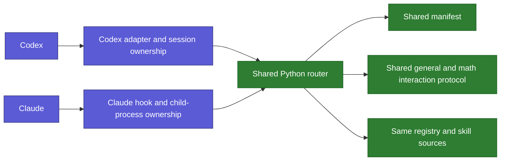

# Folder and Platforms

Back: [follow a request](01_FOLLOW_A_REQUEST.md). Next: [skills and controls](03_SKILLS_AND_CONTROLS.md).

## Folder roles

```mermaid
flowchart TD
    ROOT["skills_ai/"] --> ENTRY["AGENTS.md and CLAUDE.md<br/>small platform entry rules"]
    ROOT --> DOCS["docs/<br/>governance and human guide"]
    ROOT --> REG["registry/<br/>routes and activation"]
    ROOT --> IP["interaction-protocol/<br/>general and math response contract"]
    ROOT --> RUN["runtime/<br/>wire protocol and manifest"]
    ROOT --> SCRIPT["scripts/<br/>compile, route, validate, install"]
    ROOT --> ADAPT["adapters/<br/>Codex and Claude access"]
    ROOT --> TEST["tests/<br/>routing and lifecycle checks"]
    ROOT --> SKILLS["skill collections<br/>design, theory, external"]
    ROOT --> REQ["requests/<br/>review-only external change inbox"]

    classDef entry fill:#5B5BD6,color:#fff,stroke:#32327A
    classDef source fill:#2E7D32,color:#fff,stroke:#1B5E20
    classDef support fill:#546E7A,color:#fff,stroke:#29434E
    class ROOT,ENTRY entry
    class REG,IP,RUN,SKILLS source
    class DOCS,SCRIPT,ADAPT,TEST,REQ support
```



The registry describes where skills live. It does not copy skill bodies into
routing files. The interaction protocol is shared response context rather than
a task skill, while `theory-reference/` remains a separate Git submodule.

## What Codex and Claude share



The Python router owns framing, validation, selection, privacy, and its own
one-shot exit. Codex owns Codex session cleanup. Claude owns its live hook,
child timeout, installation, and Claude-specific acceptance.

## Local process API

Version 1 is a newline-terminated JSON request to a short-lived local process,
not an HTTP server:

```json
{"protocol":"skills-ai/1","client":"codex","query":"Explain this code"}
```

The response is either `MATCH` with one canonical skill record or `NORMAL` with
no skill body. Avoiding a permanent daemon removes port, authentication, and
orphan-service complexity.
