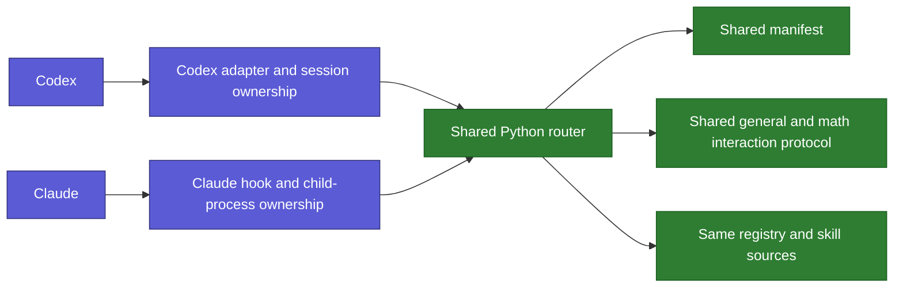

# Folder and Platforms

Back: [follow a request](01_FOLLOW_A_REQUEST.md). Next: [skills and controls](03_SKILLS_AND_CONTROLS.md).

## Folder roles

```mermaid
flowchart TD
    ROOT["skills_ai/"] --> ENTRY["AGENTS.md and CLAUDE.md<br/>small platform entry rules"]
    ROOT --> DOCS["docs/<br/>governance and human guide"]
    ROOT --> REG["registry/<br/>routes and activation"]
    ROOT --> IP["interaction-protocol/<br/>general and math response contract"]
    ROOT --> RUN["runtime/<br/>wire protocol and manifest"]
    ROOT --> SCRIPT["scripts/<br/>compile, route, validate, install"]
    ROOT --> ADAPT["adapters/<br/>Codex and Claude access"]
    ROOT --> TEST["tests/<br/>routing and lifecycle checks"]
    ROOT --> SKILLS["skill collections<br/>design, theory, external"]
    ROOT --> REQ["requests/<br/>review-only external change inbox"]
    ROOT --> CONTRACT["repository contract<br/>change roles and consistency"]

    classDef entry fill:#5B5BD6,color:#fff,stroke:#32327A
    classDef source fill:#2E7D32,color:#fff,stroke:#1B5E20
    classDef support fill:#546E7A,color:#fff,stroke:#29434E
    class ROOT,ENTRY entry
    class REG,IP,RUN,SKILLS source
    class DOCS,SCRIPT,ADAPT,TEST,REQ,CONTRACT support
```



The registry describes where skills live. It does not copy skill bodies into
routing files. The interaction protocol is shared response context rather than
a task skill, while `theory-reference/` remains a separate Git submodule and
`external-skills/` contains declared external pointers. The repository-owned
Research Context Scout is a normal top-level package beside these shared
systems rather than an external target.

Python owns shared matching, Fit, controls, safe logging, validation, and
maintenance. The single JavaScript adapter translates Claude's hook format,
bounds and reaps its Python child, validates the selected path, and injects the
shared receipt. It uses Node built-ins only and does not contain trigger rules.
Codex calls the same Python router through its own lifecycle.

Ignored `.runtime/` contains only local prompt-free observations. It is neither
a skill source nor part of generated human or agent views.

Open the visible [Interaction Protocol hub](../../interaction-protocol/README.md)
to follow its controls, runtime, API, migration record, tests, and general/math
flows in the Obsidian graph.

## What Codex and Claude share



The Python router owns framing, validation, selection, privacy, and its own
one-shot exit. Codex owns Codex session cleanup. Claude owns its live hook,
child timeout, installation, and Claude-specific acceptance.

The Claude hook injects the shared context, including the requested depth, as
one `key=value` line per field, then a blank line before a selected skill body.
Codex's compact context carries the same depth field. Fail-open diagnostics name
the failing layer: `ADAPTER_INVALID_INPUT` for a malformed host payload,
`ROUTER_INVALID_OUTPUT` for an unusable router reply. Neither ever contains the
prompt, the skill body, or the child's own error text.

That hook also holds a single budget for the whole run, so its Python child
never outlives the deadline Claude settings declare, however slowly host input
arrives. The child runs in its own process group and carries the same deadline,
so neither an interpreter wrapper script nor a host that stops the hook early
can leave a router process behind.

Repository maintenance is also shared: both platforms read the same
`CONTRACT.json` and `scan_consistency.py` receipt. The scanner validates shared
behavior; each platform still certifies only its own live adapter lifecycle.
That contract also protects the Obsidian node types: a visible concept entry is
a teal hub, not a green registry or violet skill.

Both platforms also share the plan-only boundary and the local `/sudo`
receipt. A `plan.md`-only idea stays outside skill governance; `/sudo` bypasses
only local procedure for one request and leaves each host's hard boundaries in
force.

## Local process API

Version 1 is a newline-terminated JSON request to a short-lived local process,
not an HTTP server:

```json
{"protocol":"skills-ai/1","client":"codex","query":"Explain this code"}
```

The response is either `MATCH` with one canonical skill record or `NORMAL` with
no skill body. Avoiding a permanent daemon removes port, authentication, and
orphan-service complexity.

For a registry-declared leading command, the same response adds a bounded
`skill_invocation` containing only command, mode and current-request scope.
Codex and Claude receive the same shared mode without either adapter owning the
alias rules.

## Continue from the map to the files

This chapter gives the first folder-level picture. Continue to the
[repository atlas](08_REPOSITORY_ATLAS.md) for a progressive explanation of
canonical, generated, explanatory, platform, test, personal, submodule, and
external files. The atlas then links to the exhaustive generated file index.

Codex and Claude root entries are generated from one shared source plus one
small platform overlay. They remain standalone at runtime, so sharing the source
does not add another read or token hop.
