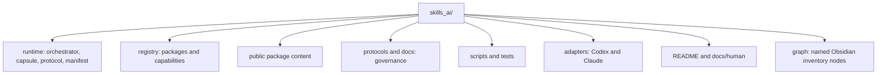
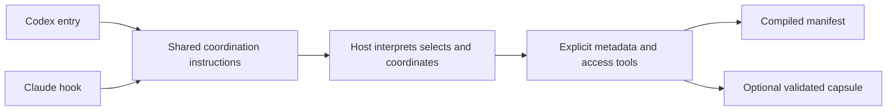

# Folder and Platforms

Back: [follow a request](01_FOLLOW_A_REQUEST.md). Next: [skills and controls](03_SKILLS_AND_CONTROLS.md).

## Folder roles



| location | role |
|---|---|
| `runtime/skills-orchestrator/` | always-active model-led coordination and on-demand modules |
| `runtime/project_context.py` | explicit capsule CLI and validation runtime |
| `runtime/project-context.schema.json` | strict capsule data contract |
| `runtime/manifest.json` | generated package and capability metadata |
| `registry/activation.md` | separate orchestrator record, public skill states, and internal gates |
| `registry/*.md` | family-level capability metadata |
| `interaction-protocol/` | one public interaction package and its modes |
| `markdown-protocol/` | one repository-owned active package for automatic Markdown handling, proportional design review, portable layered structure, formatting examples, visuals, and validation |
| `theory-reference/` | one separately owned submodule package |
| `research-context-scout/` | one repository-owned manual package |
| `optimizer/` | one repository-owned manual package with separate system-build review, adaptive campaign, and situation-analysis workflows |
| `external-skills/` | controlled pointers to externally owned packages |
| `graph/` | generated descriptive nodes for Obsidian inventory browsing |
| `docs/human/` | explanatory pages excluded from normal task work |

The project capsule is different from repository `.runtime/` observations.
`.skills-ai/project.json` lives inside the project being worked on and stores
approved stable context. Repository `.runtime/` contains ignored local diagnostic and recovery data; it is never selection authority. Neither is a skill source.

## Shared platform flow



Codex owns Codex invocation and session cleanup. Claude owns hook input,
timeouts, child-process cleanup, installation, and Claude live acceptance.
Skills AI packages are not installed as native Claude skills: a copy under
`~/.claude/skills/` would be loaded by Claude Code itself and skip the
orchestrator, so the Claude installer check reports it.
Neither platform duplicates package triggers, capability selection, project
context validation, or interaction rules.

The adapters deliver the shared entry and bounded metadata. The host interprets
management requests, selects task capabilities and loads their complete entries
through explicit access tools. Shared runtime checks and platform lifecycle
checks establish different parts of that behavior.

## Local process API

```bash
python3 scripts/orchestrate.py context --format json --project-root /absolute/project
python3 scripts/orchestrate.py discover --format text
python3 scripts/orchestrate.py load --capability theory-reference
```

Context assembly receives no task prose. It reads the fixed core and registry metadata, and may inspect only the exact project capsule. Discovery reads no candidate bodies; loading returns complete explicitly selected entries and content identities. Invalid access returns a structured error; optional hook failures do not erase required obligations.

Generated `AGENTS.md` and `CLAUDE.md` come from one shared source plus one small
platform overlay. Repository context is resolved on demand with bounded native
file search; generated entries do not preserve externally appended tool blocks.
Generated human indexes come from the documentation model,
registry, and repository contract. All are projections of current declared sources, not canonical edit targets.
Deleted files and archived workspaces do not become available capabilities.

Continue to the [repository atlas](08_REPOSITORY_ATLAS.md) for the deeper file map.

Both hosts interpret the same simple use/mode controls and render the same bullet task receipt. If equivalent native fields are already visible, add only missing fields. The hook supplies instructions; it does not construct a semantic receipt from the prompt.

For the complete architecture, controls and working examples, see [the walkthrough](10_MODEL_LED_ORCHESTRATOR.md).

## Working with contained changes

Contained repair copies live permanently under ignored `.runtime/repair/workspaces/`. The dot hides the folder in Finder; Command-Shift-G opens its exact path. Codex and Claude use host session identities, while installation tests use separate config directories. See [Safe changes](04_SAFE_CHANGES.md).

Contained submodule references use independent Git metadata so package wrappers and generated catalogs remain readable. Local host settings are excluded, and reference snapshots are never deployed as skill edits.

## Current context flow

Every connected host uses the shared controls, status and exact-access contract. Catalog IDs are local integration IDs, not assumed native tool names. Settings, permissions and transport remain each host’s responsibility. Status reads facts without loading skills or creating memory; the host reports effective controls and retained context.

Discovery/access checks the manifest's bounded registry-source bindings first. Stale activation or family metadata stops capability access until an authorized rebuild; skill bodies are not scanned to perform that check. Optional failure still preserves required task and repair obligations.

## Terminal maintenance

`scripts/skills_ai` is the executable facade; `runtime/maintenance/` separates inspection, workspace, checks, host adapters and deployment. Explicit host bindings and private maintenance receipts live under ignored `.runtime/maintenance/`. A refresh verifies installed files; running-host context is a separate concern.
