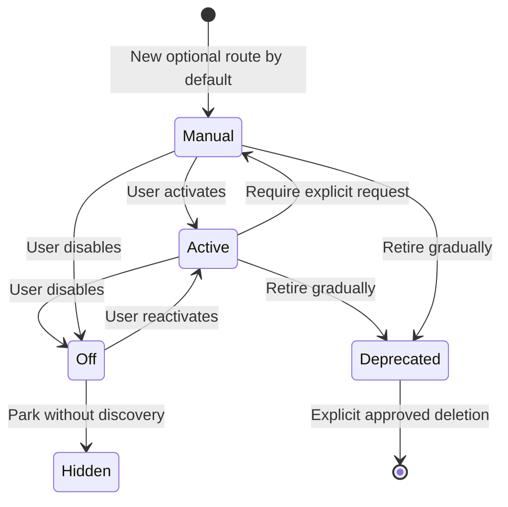

# Skills and Controls

Back: [folder and platforms](02_FOLDER_AND_PLATFORMS.md). Next: [safe changes](04_SAFE_CHANGES.md).

This page explains the controls without describing every skill body.

## Activation states



| State | What happens |
|---|---|
| `active` | May be selected when the task clearly matches |
| `manual` | Selected only by an explicit matching request |
| `off` | Visible in live status but never routed |
| `hidden` | Not routed and omitted from normal discovery |
| `deprecated` | Not routed; retained temporarily for history |

Active and manual routes use Obsidian wikilinks. Off, hidden, and deprecated
routes remain plain paths, so the graph does not pretend they are enabled.

The Activation Register is the teal global switchboard. The seven family route
tables are green registries. Their linked task instructions are violet skills,
so activation, routing metadata, and executable instructions remain visually
different.

## Live discovery

Ask “What skills are available?” or run:

```bash
python3 scripts/list_registry.py
```

The answer comes from the live manifest. It reports active, manual, and off
identifiers without reading skill bodies. Hidden and deprecated identifiers are
shown only during explicit maintenance.

## Safe toggling

Preview first, then apply only the requested state:

```bash
python3 scripts/toggle_registry.py --dry-run --json active interaction.general
python3 scripts/toggle_registry.py manual interaction.math
python3 scripts/toggle_registry.py --check
```

The toggle script validates identifiers, link form, parent-child activation,
target paths, and the compiled manifest. Activation changes routing availability;
they do not authorize a skill to write files or access external systems.

For `interaction.math`, `active` enables safe automatic mathematical-intent
detection, `manual` requires `#> interaction math`, and `off` disables the math
overlay. `#> interaction general` overrides automatic math selection for the
current request.

## Per-request controls

| Control | Effect |
|---|---|
| `#> skill auto` | Select at most one clearly relevant active skill |
| `#> skill normal` | Use no local task skill for this request |
| `#> skill <exact-id>` | Explicitly request one enabled route; required when that route is `manual` |
| `#> skill research-context-scout initial|deepen <paths>` | Canonical Scout form with a required validated mode |
| `#> scout <project-path> [focus]` | Select Research Context Scout in initial mode |
| `#> scout-again <paths> [focus]` | Select the same skill in delta-based deepening mode |
| `#> interaction general|math` | Select prose or equation-led response style |
| `#> format mermaid+summary` | Request one or more known output forms |
| `#> depth brief|standard|detailed` | Select explanation depth |
| `#> receipt auto|on|off` | Show the compact task receipt when useful, always, or never |

“Do not use any local skill” is a natural alias for `#> skill normal`. Exact
current-request controls win over session, project, global, and automatic
defaults. Fit `3` means exact explicit route, `2` one clear contextual route,
`1` equal candidates needing a possible choice, and `0` no skill. It is not a
score for whether the final answer is true.

Directive aliases are declared beside their family route and must be the first
task directive; receipt, depth, format or interaction controls may precede
them. They are case-insensitive exact selectors with whitespace required after
`#>`, not natural-language trigger synonyms, and grant no additional file or
network authority.

The [Interaction Protocol hub](../../interaction-protocol/README.md) links
these controls to the registry, runtime behavior, API receipt, and prompt tests.

For a human-readable list containing current purpose, triggers, exclusions,
state, source path, structure type, approximate size, and declared package
contents, open the [live skill catalog](_LIVE_SKILL_CATALOG.md). It is generated
from the same registry used by Codex and Claude; it is not a second catalog to
maintain manually.
