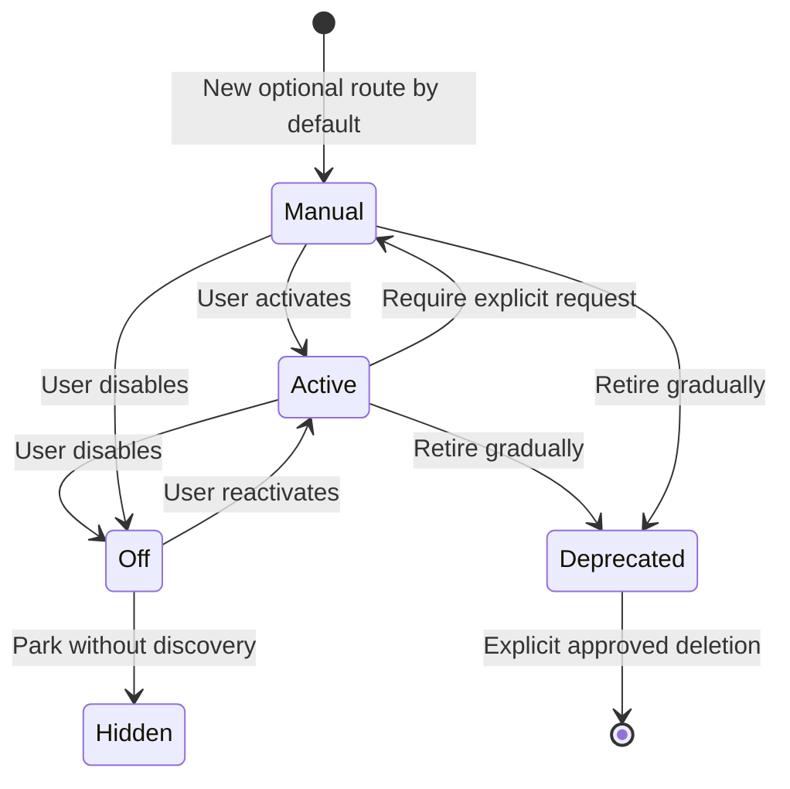

# Skills and Controls

Back: [folder and platforms](02_FOLDER_AND_PLATFORMS.md). Next: [safe changes](04_SAFE_CHANGES.md).

This page explains the controls without describing every skill body.

## Activation states



| State | What happens |
|---|---|
| `active` | May be selected when the task clearly matches |
| `manual` | Selected only by an explicit matching request |
| `off` | Visible in live status but never routed |
| `hidden` | Not routed and omitted from normal discovery |
| `deprecated` | Not routed; retained temporarily for history |

Active and manual routes use Obsidian wikilinks. Off, hidden, and deprecated
routes remain plain paths, so the graph does not pretend they are enabled.

## Live discovery

Ask “What skills are available?” or run:

```bash
python3 scripts/list_registry.py
```

The answer comes from the live manifest. It reports active, manual, and off
identifiers without reading skill bodies. Hidden and deprecated identifiers are
shown only during explicit maintenance.

## Safe toggling

Preview first, then apply only the requested state:

```bash
python3 scripts/toggle_registry.py --dry-run --json active interaction.general
python3 scripts/toggle_registry.py manual interaction.math
python3 scripts/toggle_registry.py --check
```

The toggle script validates identifiers, link form, parent-child activation,
target paths, and the compiled manifest. Activation changes routing availability;
they do not authorize a skill to write files or access external systems.

For `interaction.math`, `active` enables safe automatic mathematical-intent
detection, `manual` requires `/interaction math`, and `off` disables the math
overlay. `/interaction general` overrides automatic math selection for the
current request.

The [Interaction Protocol hub](../../interaction-protocol/README.md) links
these controls to the registry, runtime behavior, API receipt, and prompt tests.
