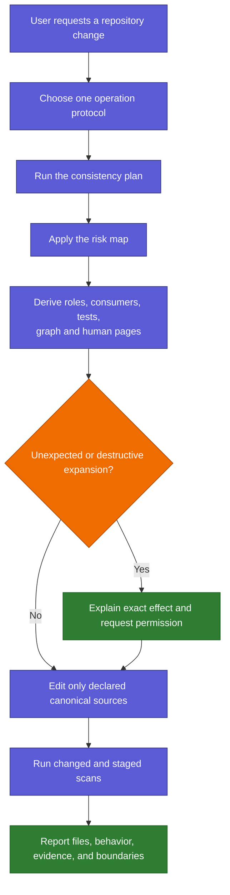
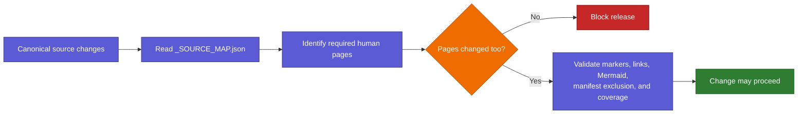

# Safe Changes

Back: [skills and controls](03_SKILLS_AND_CONTROLS.md). Next: [speed and troubleshooting](05_SPEED_AND_TROUBLESHOOTING.md).

For the complete add/edit/move/delete workflow, scan output, and examples, read
[maintaining skills](07_MAINTAINING_SKILLS.md).

## Change-control flow

Selecting a skill is never permission. Deletion, external installation,
credentials, account actions, Git-history rewrites, protocol changes, and
unexpected expansion require their own explicit authority.

The general and math interaction protocols only shape an answer. They do not
grant permission or weaken any read-only, review, write, network, credential,
or destructive-action boundary.

Changes anywhere under `interaction-protocol/` are mapped canonical changes:
the routing guide pages and visible protocol hub must remain synchronized.

External change-request packets are capped at 64 KiB before any Markdown is
written. Local ambiguity observations are different: they contain no prompt,
answer, path, or file content; stay under ignored `.runtime/` with restrictive
permissions; stop growing at 1 MiB; and never grant authority or affect routing.

## Keeping this human guide current

Relevant canonical sources are mapped to the human pages that explain them.
Whenever one changes, the mapped page must be updated in the same staged change.

The guard proves that documentation was changed alongside mapped behavior. It
cannot prove that prose is conceptually perfect, so human review remains the
final quality gate.

Generated `_LIVE_` pages are checked for exact compiler freshness rather than
being falsely required to receive a manual edit when regeneration produces the
same bytes.

The guide also enforces small Mermaid diagrams. Oversized left-to-right flows
must be changed to top-down form or split into focused diagrams before release.

Shared factual views add one more safety boundary: edit the canonical registry,
documentation model, common agent-entry source, or platform overlay, then run
`python3 scripts/compile_repository_views.py`. Do not repair `AGENTS.md`,
`CLAUDE.md`, or either `_LIVE_` human index by hand. The staged scanner rejects
stale projections, while semantic review still checks whether the illustrated
teaching pages remain accurate and understandable.

## External tasks

A task that starts outside this repository treats Skills AI as read-only. With
explicit permission it may create one Markdown request under `requests/pending/`.
Implementation then moves to a dedicated maintenance task rooted in this folder.
The request inbox is never routing or skill authority.
