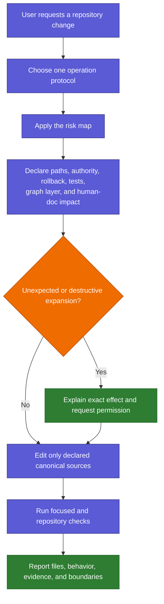
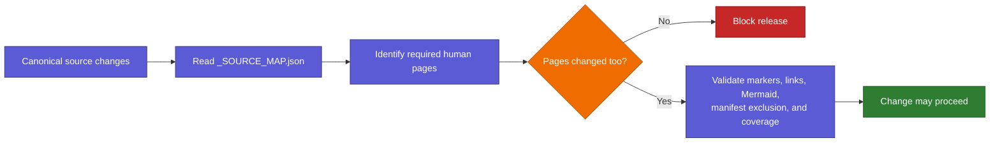

# Safe Changes

Back: [skills and controls](03_SKILLS_AND_CONTROLS.md). Next: [speed and troubleshooting](05_SPEED_AND_TROUBLESHOOTING.md).

## Change-control flow

Selecting a skill is never permission. Deletion, external installation,
credentials, account actions, Git-history rewrites, protocol changes, and
unexpected expansion require their own explicit authority.

## Keeping this human guide current

Relevant canonical sources are mapped to the human pages that explain them.
Whenever one changes, the mapped page must be updated in the same staged change.

The guard proves that documentation was changed alongside mapped behavior. It
cannot prove that prose is conceptually perfect, so human review remains the
final quality gate.

## External tasks

A task that starts outside this repository treats Skills AI as read-only. With
explicit permission it may create one Markdown request under `requests/pending/`.
Implementation then moves to a dedicated maintenance task rooted in this folder.
The request inbox is never routing or skill authority.
