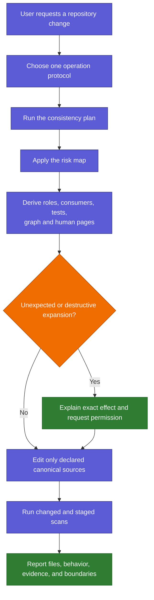
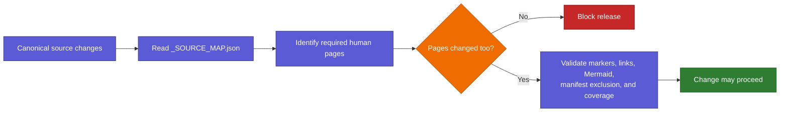
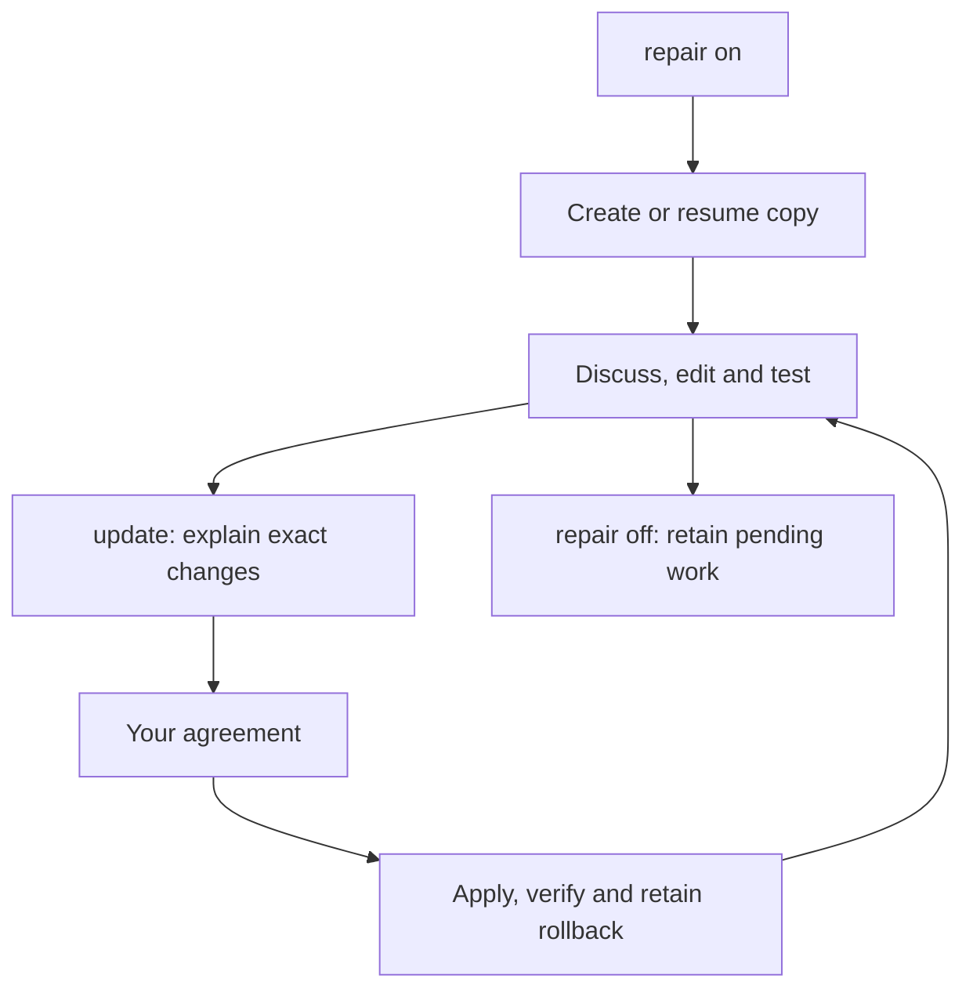

# Safe Changes

Back: [skills and controls](03_SKILLS_AND_CONTROLS.md). Next: [speed and troubleshooting](05_SPEED_AND_TROUBLESHOOTING.md).

For the complete add/edit/move/delete workflow, scan output, and examples, read
[maintaining skills](07_MAINTAINING_SKILLS.md).

## Change-control flow



Selecting a package or capability is never permission. Deletion, external installation,
credentials, account actions, Git-history rewrites, protocol changes, and
unexpected expansion require their own explicit authority.

Removing a package also removes its registry records and generated inventory
entry, and updates dependent examples and tests. Preserve unrelated working-tree
changes and a recoverable copy of dirty files being removed; package cleanup
does not authorize deleting external installations or rewriting Git history.

The Interaction Protocol is one public skill package whose general and math
modes only shape an answer. They do not
grant permission or weaken any read-only, review, write, network, credential,
or destructive-action boundary.

The manual `optimizer` package also does not grant broad implementation
permission. `#> build-system` must first present a system-build plan and wait
for review before it creates or edits `system.py`; `#> optimize` accepts only an
existing verified system. `#> optimizer intervene` and `branch` make tactic or
new-problem changes explicit; neither silently edits a system or upgrades a
claim. Ordinary work resolves the selected stable route; library improvements
belong in contained development and are never promoted automatically.

The always-active Skills Orchestrator coordinates package and capability changes,
documentation mapping, regeneration, and verification. It does not replace the
risk map, change control, operation cards, host permissions, or user approval.

Orchestrator sudo requires an exact operation and target and bypasses only local
Skills AI procedure. Bare `#> sudo` is inert. Project capsule values are also
permission-neutral untrusted data; create, replace, and delete remain explicit.
Normal receipts omit operational commands, and receipt rendering neutralizes
instruction-like role and `#>` markers. Explicit inspection still grants no
permission and never executes stored text.

Changes anywhere under `interaction-protocol/` are mapped canonical changes:
the guide pages and visible protocol hub must remain synchronized.

External change-request packets are capped at 64 KiB before any Markdown is
written. Private context-delivery markers contain section hashes only and stay
under ignored `.runtime/` with restrictive permissions. Repair records carry
workspace and recovery information. Neither kind of record grants authority or
chooses task skills; they are not transcript or prompt logs.

Repository cleanup preserves local learning material and active repair work.
Abandoned copies are archived and verified before removal; redundant branches
are deleted only after their commits are retained. A clean canonical Git
checkpoint records the intended current version without resetting existing work.

## Keeping this human guide current

Relevant canonical sources are mapped to the human pages that explain them.
Whenever one changes, the mapped page must be updated in the same staged change.



The guard proves that documentation was changed alongside mapped behavior. It
cannot prove that prose is conceptually perfect, so human review remains the
final quality gate.

Generated `_LIVE_` pages are checked for exact compiler freshness rather than
being falsely required to receive a manual edit when regeneration produces the
same bytes.

Working-tree coverage uses the same scope classifier as the consistency
scanner. Ignored paths are excluded, user-owned paths such as personal Obsidian
display state are preserved unless explicitly declared, and an intentional
user-owned edit remains subject to its mapped documentation checks.

The guide also enforces small Mermaid diagrams. Oversized left-to-right flows
must be changed to top-down form or split into focused diagrams before release.

Shared factual views add one more safety boundary: edit the canonical registry,
documentation model, common agent-entry source, or platform overlay, then run
`python3 scripts/compile_repository_views.py`. Do not repair `AGENTS.md`,
`CLAUDE.md`, or either `_LIVE_` human index by hand. The staged scanner rejects
stale projections, while semantic review still checks whether the illustrated
teaching pages remain accurate and understandable.

The orchestrator and public skill packages have separate Activation sections.
A task package
may expose internal capability files or a root `SKILL.md`; protocol and
composite packages may use another declared canonical entry. Conventional
nested `shared/SKILL.md`, `codex/SKILL.md`, or `claude/SKILL.md` files remain
support wrappers, not extra public skills.

The active `markdown-protocol` package applies whenever requested work creates,
edits, reviews, or restructures Markdown, including inside another task, but
automatic selection does not authorize a write. It announces the
protocol, inspects the relevant structure, and presents a proportional proposal
for user agreement before changing Markdown. It may restructure user-owned
Markdown only inside that reviewed scope, preserves useful conventions and
user edits, keeps portable text authoritative, and treats diagram or equation
rendering as unverified until checked in the named viewer.

Future skill-package Markdown work uses the protocol's skill-package add-on
inside the same reviewed change boundary. The smallest useful profile wins,
and existing packages are never normalized in bulk: each migration requires an
individually named, reviewed scope.

Graph roles are explicit: declared hubs are L1 teal, family registries L2 green,
and skill or phase files L4 violet. The validator checks these meanings and
their links. Graph file counts are never public skill counts.

A draft under `skill-plans/<name>/plan.md` needs no package machinery until
explicit promotion. A leading `#> override <instruction>` can bypass local
procedure for one request while preserving user scope and higher authority.
For a dirty worktree, an optional prompt-free baseline can preserve an identical
pre-existing failure; new, worsened and in-scope failures still block.

## External tasks

A task that starts outside this repository treats Skills AI as read-only. With
explicit permission it may create one Markdown request under `requests/pending/`.
Implementation then moves to a dedicated maintenance task rooted in this folder.
The request inbox is never selection or skill authority.

A task receipt names the objective, plan, selected skills and adherence mode. It is an action summary and does not create approval. A use list explicitly invokes named packages while preserving write, worker and scope boundaries; use none leaves governance active.

For the complete architecture, controls and working examples, see [the walkthrough](10_MODEL_LED_ORCHESTRATOR.md).

## Contained repair mode

Use these commands across ordinary messages:

```text
#> repair on
```

This creates or resumes this chat's contained copy. Continue discussing, editing
and testing there for as many messages as needed. The active source and installed
adapters remain unchanged. Repeating on resumes the same copy.

```text
#> update
```

The assistant compares the contained changes, runs relevant checks and explains
what would change. After your agreement it applies only the reviewed changes,
checks the installation and retains rollback and Git history. Update preserves
repair mode. Changed files or conflicts require an updated review.

```text
#> repair off
```

Off returns to normal working locations and retains the contained copy. It does
not deploy or delete pending work. An explicit live-edit exception applies only
to that action. New chats default off; repair is independent of use/mode controls.

The permanent local folder is `.runtime/repair/workspaces/<workspace-id>/repo/`.
The leading dot hides it in normal Finder views, and `.runtime/` is ignored by Git.
Use Finder **Go → Go to Folder** (Command-Shift-G), enter
`/Users/billabobz/skills_ai/.runtime/repair/`, and open the returned workspace.
The assistant also reports its exact working location when enabling repair.
No manual copying or repeated cloning is necessary.

The source-owned `scripts/repair_workspace.py` handles snapshots, resume, checks,
exact update previews and recovery. A candidate controller cannot approve its own
installation. Tests run against the contained copy with separate test configs.
Saved state identifies work; actual conversation instructions supply authority.
Git records are first kept in the contained repository; live staging must exclude
inherited changes. The first version operates in Skills AI maintenance chats;
other projects retain the request/handoff boundary.



See [the repair protocol](../../protocols/repository/REPAIR_WORKSPACE.md) for
script operations, drift handling and recovery. Filesystem permissions provide
the hard write boundary; contained paths and locks govern the managed workflow.

Contained submodule references use independent Git metadata so package wrappers and generated catalogs remain readable. Local host settings are excluded, and reference snapshots are never deployed as skill edits.

## Current context flow

Repair on creates or resumes containment before edit-related work. Denied creation means pending containment, never permission to edit live. Status identifies its repository root; the candidate’s state is separate from the source association. Update uses the known source association; without one, it reports no associated update instead of searching old workspaces. Corrupt known state blocks mutations; an off association still retains reviewable work.

Discovery/access checks the manifest's bounded registry-source bindings first. Stale activation or family metadata stops capability access until an authorized rebuild; skill bodies are not scanned to perform that check. Optional failure still preserves required task and repair obligations.

## Terminal maintenance

Terminal updates bind the candidate review and exact installation targets to one approval. Source-check failures use repair rollback; a later refresh failure is reported as partial with backup and receipt pointers. Source deployment keeps the live index unchanged. See [the terminal walkthrough](11_TERMINAL_MAINTENANCE.md).
