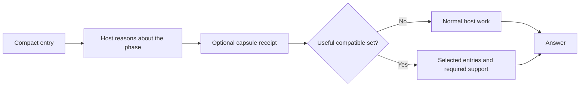
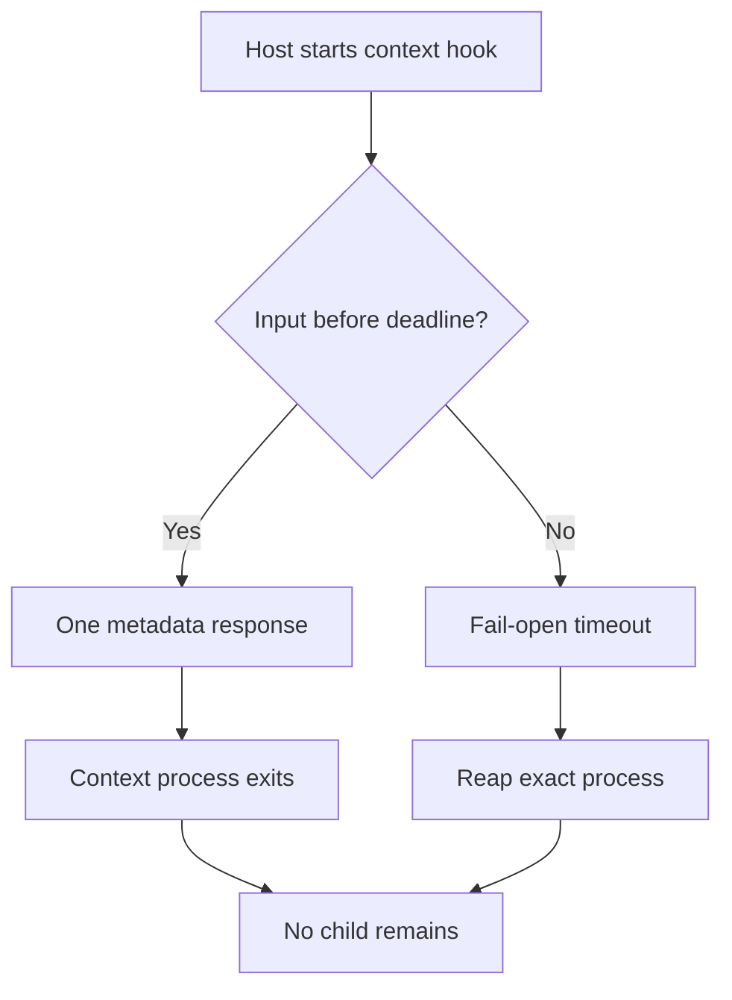

# Speed and Troubleshooting

Back: [safe changes](04_SAFE_CHANGES.md). Next: [graph and colors](06_GRAPH_AND_COLORS.md).

## Hot-path loading



The shared tools read compiled metadata, not the whole skill library. The selected
entry's token estimate does not include all references the skill may require;
measure the complete loading path before claiming savings.

Manual command aliases such as `#> optimizer` enter the explicitly named primary package;
they do not load every package or turn operation tokens into additional capabilities.

Repository discovery follows the same cold-path principle. If a path is known,
the agent reads only that path or a bounded line range. Otherwise it narrows
with `rg --files`, searches a literal identifier with `rg -n`, and inspects
exact references, diffs, and mapped tests. No background index, file watcher,
telemetry process, or network update checker is part of ordinary work.

An optional package `INDEX.md` is a human navigation surface, not a hot-path
instruction source. Ordinary execution starts from the compact `SKILL.md` and
loads only the focused references required for the task.

## Measure context and latency

Measure metadata delivery, selected instructions, required references and repeated
loads separately. Record actual tokenizer or host usage when available. A
`ceil(bytes/4)` estimate is only an approximation; it is not a fixed token bound
or a measure of answer quality.

Tool latency measures transport and file access. Semantic quality needs task
scenarios with inspected decisions and artifacts. Keep those two measurements
separate when diagnosing slow or unsuitable work.

```bash
python3 scripts/measure_context.py --json
```

This command measures context delivery; complete-task measurements also include
host reasoning, selected references and verification.

## Capsule bounds

- file: `.skills-ai/project.json`, maximum 32 KiB;
- hot receipt: maximum 4 KiB;
- exact project root supplied by the host and never echoed;
- no project scan to create missing context;
- no symlink, absolute personal path, path escape, secret-like value, or permission grant;
- stored commands and validation commands omitted from normal hot receipts;
- missing, invalid, unavailable, oversized, or stale means continue without hints;
- truncated receipt means inspect the full validated capsule before consequential work.

## Timeout and cleanup



Claude spends one timeout budget across input, Python context delivery, shared core
read, and output. The child runs in its own process group and receives the same
deadline. Codex owns its own session cleanup. Neither host certifies the other.

## Quick diagnosis

| symptom | check |
|---|---|
| public list contains capability entries | regenerate the package-first catalog; public rows must equal Activation packages |
| unsupported management action | use one supported exact action and include a target when required |
| bare `#> sudo` has no effect | use the full `#> orchestrator sudo <operation> <exact-target>` form |
| `CAPSULE_MISSING` | normal fail-open status; initialize only when explicitly wanted |
| `MANIFEST_HASH_MISMATCH` | capsule is stale; inspect, then explicitly refresh |
| capsule receipt is truncated | inspect the full validated capsule before writes or other consequential work |
| `SYMLINK_REJECTED` or `CAPSULE_TOO_LARGE` | replace with a regular bounded file through the explicit context CLI |
| unsuitable capability | inspect discovery metadata and the host decision; add a task scenario with a justified expected decision |
| repeated ambiguity | analyze prompt-free candidate metadata; never inspect stored prompts because none are written |
| maintenance selects a task package | let the host interpret exact management scope; the transport never scores tasks |
| `MANIFEST_UNAVAILABLE` | compile and validate; the original task should continue normally |
| installed adapter is stale | dry-run, inspect, then reinstall with platform-owner approval |
| Claude check names a native skill that shadows a package | Claude Code would load that copy with its own Skill tool and skip the orchestrator; move it out of `~/.claude/skills/` |
| generated root entry or live index is stale | edit canonical source and rerun `compile_repository_views.py` |
| laptop heats during repository lookup | verify no external indexer or watcher is installed; Skills AI requires none |

Maintenance scans and generated-view compilation are cold-path operations. They
do not add reads or token cost to ordinary work.

Use none avoids unnecessary optional discovery and task bodies. Show one compact bullet receipt for a substantive task, reuse conversation context on ordinary continuations and update changed fields only. Do not scan files or persist state merely to fill or deduplicate a receipt.

For the complete architecture, controls and working examples, see [the walkthrough](10_MODEL_LED_ORCHESTRATOR.md).

## Working with contained changes

Repair copies are created once and resumed, avoiding repeated cloning and instruction loading. A missing or damaged known workspace stops mutations; it never redirects edits live. Changed preview bytes or source drift require fresh review. See [Safe changes](04_SAFE_CHANGES.md).

Contained submodule references use independent Git metadata so package wrappers and generated catalogs remain readable. Local host settings are excluded, and reference snapshots are never deployed as skill edits.

## Current context flow

Reference-flow delivery budgets are 5.5 KiB core and 8 KiB bootstrap, separate from transport limits. Startup catalog text is capped at 3 KiB with explicit expansion for a larger skill collection. Shared batch bodies can be delivered once while keeping each capability’s gates and identity. Zero additional bytes on unchanged turns measures delivery, not total model usage. Recovery restores missing context; status creates no checkpoint or delivery marker.

Discovery/access checks the manifest's bounded registry-source bindings first. Stale activation or family metadata stops capability access until an authorized rebuild; skill bodies are not scanned to perform that check. Optional failure still preserves required task and repair obligations.

## Terminal maintenance

`skills_ai status` exposes version and installation mismatches directly. `skills_ai refresh` reuses explicitly saved host targets; repeated current operations need no repeat approval. These commands run on demand, with no watcher or background updater, and disk freshness does not establish model retention.
