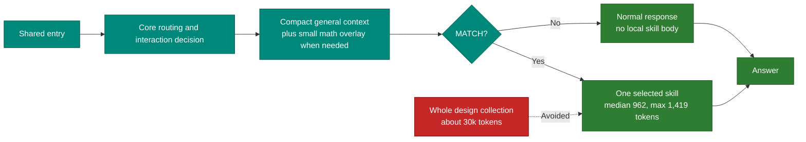
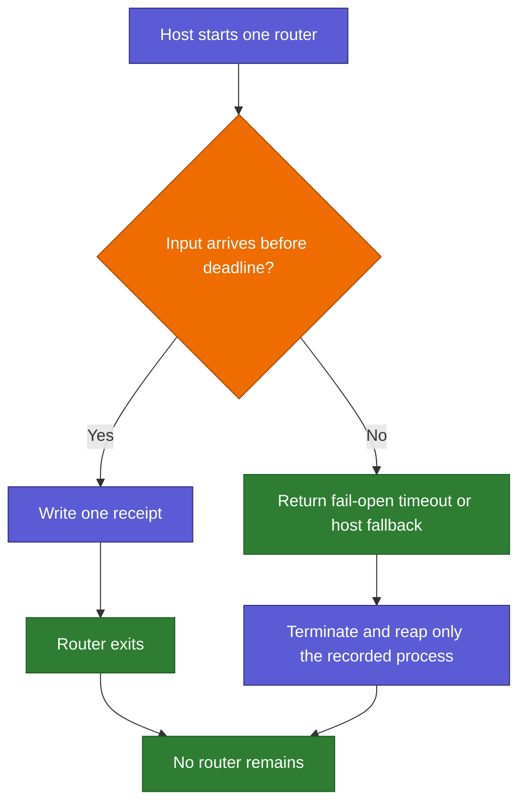

# Speed and Troubleshooting

Back: [safe changes](04_SAFE_CHANGES.md). Next: [graph and colors](06_GRAPH_AND_COLORS.md).

## What is loaded



The 2026-08-01 documentation-model benchmark measured 27/27 fixture accuracy,
about `0.40 ms` core-routing p95, and about `36.9 ms` complete-process p95.
The compact receipt measured 82 tokens at the median and 102 at the maximum.
Process time includes
starting Python, reading the request, loading the manifest, routing, writing JSON,
and exiting. Values vary by machine and load; refresh them with:

```bash
python3 scripts/benchmark_router.py --json
```

Maintenance scans are separate from the hot routing path. They use Git to load
only changed paths and affected authorities; the full unit suite is currently a
few seconds, while ordinary routing keeps its small one-shot process.

The shared documentation model adds no normal-task file read. `AGENTS.md` and
`CLAUDE.md` are generated as complete standalone entries, and the live human
indexes remain excluded from the router manifest. Repository-view generation
runs only during maintenance and documentation checks.

## Timeout and cleanup



The Claude hook spends one budget across the whole run rather than one timer per
phase. A timer bounds the wait for host input; after input ends the Python child
and the single skill-body read are bounded by subtracting elapsed time from the
same budget, because a blocking call cannot be interrupted by a timer. Slow host
input therefore shortens the child instead of pushing the hook past the deadline
Claude settings declare.

Cleanup then has two layers, because a `python3` entry is often a small shell
script in front of the real interpreter, and because the host decides when a
hook run ends. The child starts as its own process-group leader, so a timeout
clears the whole group instead of only the script in front; and the child also
carries the same deadline itself, so it still exits on time when the host stops
the hook first.

## Quick diagnosis

| Symptom | Check |
|---|---|
| Task waits | Confirm one newline-framed request and the configured input deadline |
| `MANIFEST_UNAVAILABLE` | Run compile and registry validation; the task should still continue normally |
| Wrong skill | Add a regression prompt and inspect trigger or ambiguity scoring |
| Maintenance request selects a task skill | Confirm `SKILLS_AI_MAINTENANCE` is returned before route scoring |
| Consistency scan says `REVIEW` | Read its bounded AI questions and inspect only the listed impacted files |
| Consistency scan says `BLOCK` | Resolve the deterministic missing role, consumer, generated output, link, or failed check |
| Wrong math style | Check action + mathematical-object detection and artifact exclusions |
| Design route on ordinary search | Confirm the explicit design-request gate and its negative corpus |
| Claude hook timeout | Keep the Python child timeout below the outer hook timeout |
| `ADAPTER_INVALID_INPUT` | The host sent the hook a payload that is not one JSON object; the shared router was never reached |
| `ADAPTER_DEADLINE_EXCEEDED` | The whole-run budget ran out before a reply could be written; raise `SKILLS_AI_ADAPTER_TIMEOUT_MS` with the hook timeout in Claude settings |
| `ADAPTER_CANCELLED` | The host stopped the Claude hook while it was waiting for input; the task continues normally |
| `ROUTER_INVALID_OUTPUT` | The shared router replied with something other than one JSON decision; recompile and validate the manifest |
| Router process remains | Terminate and reap only the exact recorded process/session |
| Installed adapter is stale | Dry-run, inspect, then reinstall with platform-owner approval |
| Root entry or live human index is stale | Edit its canonical source, run `compile_repository_views.py`, then re-run the changed or staged scan |
