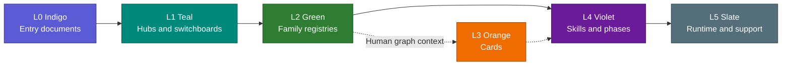

# Graph and Colors

Back: [speed and troubleshooting](05_SPEED_AND_TROUBLESHOOTING.md). Next:
[maintaining skills](07_MAINTAINING_SKILLS.md).

Protocol version 8 makes color describe the kind of node you are looking at.
The palette is unchanged, but Activation and every declared concept entry are
now teal hubs instead of being mixed with registries or skills.

Protocol version 10 changes prompt directive syntax only. It adds no graph
layer or node type, so the existing L0–L5 colour contract remains unchanged.

Color describes architectural role, not topic. Individual skills do not get
individual colors.



| Layer | Examples |
|---|---|
| L0 | Human and agent entry notes |
| L1 | Skills Hub, Activation, protocol/documentation hubs, risk, color, combination, and change-control maps |
| L2 | Family route tables such as design, UI, build, interaction, and theory |
| L3 | Human-visible legacy or context cards |
| L4 | Canonical skills, external pointers, and theory phases |
| L5 | Human guide, protocols, runtime, adapters, scripts, tests, and requests |

`skill-plans/*/plan.md` is the one deliberate Markdown exception: it is an
unimplemented idea, so it is excluded from graph nodes and colour counts until
promotion.

The promoted `research-context-scout/` package is a normal repository-owned L4
skill collection. Its human README, root entry, shared phases and platform
wrappers stay linked as one package; it is no longer represented as an
external pointer.

`registry/interaction.md` is an L2 green family registry. The visible
[Interaction Protocol hub](../../interaction-protocol/README.md) is L1 teal and
links the skills hub, activation, registry, canonical JSON contract, runtime,
API, migration record, and tests. The Shared Documentation Model is also an L1
hub. JSON and test files remain slate support rather than extra hubs.

With the current repository this gives 4 indigo entries, 8 teal hubs, 7 green
family registries, 1 orange parked card, 57 violet skill bodies or phases, and
44 slate support notes. Two unrelated unclassified draft notes remain outside
these counts and are reported by validation until their owner classifies them.

## Default overview

The global graph starts with low-level maintenance paths hidden. This leaves the
entry -> hub -> registry -> skill route visible. Open a green registry's Local
Graph to inspect only its linked violet skills. Clear the search filter when you
need runtime, tests, operation cards, or other slate support.

The filter does not delete or unlink anything. Zoom, force settings, orphan
visibility, and collapsed panels remain personal view state, and color-group
synchronization preserves them.

Generic concept links now come from `protocols/repository/CONTRACT.json`.
Therefore a future JSON- or code-backed protocol must declare a visible
Markdown entry and its required links. The same contract requires that entry to
be L1 teal instead of adding a one-off validator.
The graph check also catches ordinary dangling wikilinks after moves and
deletions while allowing only explicitly declared external skill pointers.

The shared documentation model is another declared graph concept. Its L5
architecture record links the change-control authority, repository atlas, skill
anatomy chapter, common agent-entry source, and platform overlays. Generated
live indexes remain human L5 support and do not become routing nodes.

Validate both the documented policy and the live Obsidian graph:

```bash
python3 scripts/graph_layers.py --check
```

If the policy is correct but Obsidian groups are stale:

```bash
python3 scripts/graph_layers.py --sync
```

Synchronization replaces only `colorGroups`. Personal settings such as zoom,
orphan visibility, and collapsed panels are preserved. A genuinely new layer or
color requires an explicit protocol amendment.
