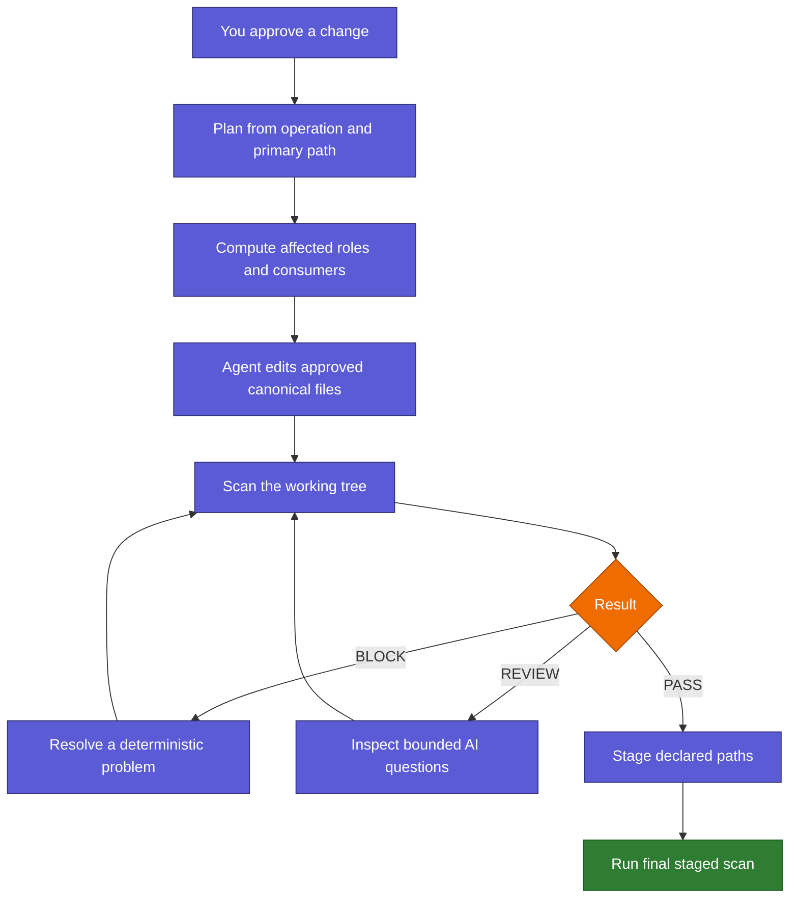
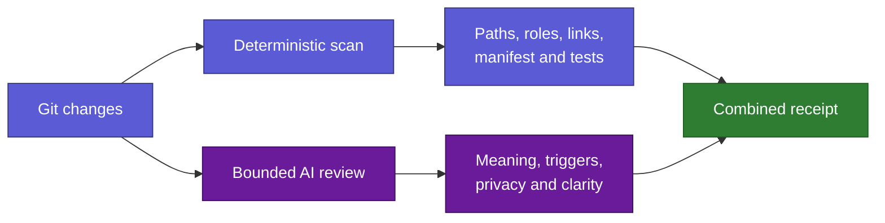

# Maintaining Skills

Back: [graph and colors](06_GRAPH_AND_COLORS.md). Next:
[repository atlas](08_REPOSITORY_ATLAS.md). Return to the [human guide](../../README.md).

This chapter is the human explanation for adding, editing, updating, moving,
disabling, deleting, or installing Skills AI components. You can use it whenever
you are unsure what the agent should update. Machine authority remains in
`docs/06_CHANGE_CONTROL.md`, the selected operation card, and
`protocols/repository/CONTRACT.json`.

## The main idea

You identify the intended operation and primary path. The scanner discovers the
rest from Git and the repository contract, so you do not need to inspect every
registry, graph, manifest, test, and documentation file yourself.

First run the one-step classifier. If it returns `PLAN_ONLY`, create or update
only `skill-plans/<name>/plan.md`; no operation card or full scan applies. If it
returns `GOVERNED_CHANGE`, open exactly the returned card. A folder becomes a
skill only when `SKILL.md` is explicitly requested.

```bash
python3 scripts/scan_consistency.py classify --path path/to/target
```



## What is updated for each operation

| Operation | The scanner checks |
|---|---|
| Add | Role, family route, activation, hub, graph entry, risk, tests, manifest, and human pages |
| Edit | Canonical source, semantic behavior, mapped consumers, focused tests, and generated freshness |
| Update or migrate | Old/new contract, compatibility, rollback, shared runtime, platform boundaries, and documentation |
| Move or rename | Git old/new identity, inbound links, imports, activation, manifest, graph, tests, and aliases |
| Deprecate or delete | Approval, recovery, routes, links, generated outputs, tests, documentation, and installed copies |
| Toggle activation | Allowed state transition, link form, parent state, target path, and compiled manifest |
| Install or uninstall | Repository consistency first, then explicit external approval and owning-platform acceptance |

Deletion, protocol amendments, external writes, and unexpected scope expansion
still require explicit permission. The scanner discovers impact; it does not
grant authority.

Protocol version 10 uses the platform-neutral `#>` directive namespace instead
of unregistered leading slash commands. `#> override` bypasses only local
Skills AI procedure for one request; named directives such as `#> skill`,
`#> depth`, and `#> scout` retain their narrower routing or presentation roles.

## Commands you will see

Before editing:

```bash
python3 scripts/scan_consistency.py plan --operation add --path path/to/skill.md
```

In a worktree with known unrelated failures, the plan may optionally save only
prompt-free failure signatures under ignored runtime state. The changed scan
then preserves identical old failures while still blocking anything new. The
baseline cannot be reused across a different protocol version, operation, or
path set:

```bash
python3 scripts/scan_consistency.py plan --operation update --path path/to/source --baseline-out .runtime/change-baseline.json
python3 scripts/scan_consistency.py changed --operation update --path path/to/source --baseline .runtime/change-baseline.json
```

After editing:

```bash
python3 scripts/scan_consistency.py changed --operation add --path path/to/approved-scope
```

Before committing:

```bash
python3 scripts/scan_consistency.py staged --operation add --path path/to/approved-scope
```

For a repository-wide health check or a compact receipt:

```bash
python3 scripts/scan_consistency.py full
python3 scripts/scan_consistency.py changed --json
python3 scripts/scan_consistency.py changed --ai-packet
```

`--ai-packet` contains changed paths, roles, deterministic blocks, and focused
review questions. It does not call a network model or include a whole skill
collection.

An agent may use the explicitly approved generated-only action when a canonical
registry change makes the router manifest stale:

```bash
python3 scripts/scan_consistency.py apply-generated --operation update \
  --path registry/example.md --approval-ref approved-change
```

This action can rebuild only a code-allowlisted generated artifact. It cannot
write semantic documentation, skill bodies, external configuration, Git staging,
or commits.

## How to read the result

| Result | Meaning | What happens next |
|---|---|---|
| `PASS` | Deterministic checks found no blocking inconsistency | The declared change may proceed to the next gate |
| `REVIEW` | Mechanical checks pass but semantic judgment is needed | Codex or Claude inspects only the listed files and questions |
| `BLOCK` | Scope, role, graph, registry, manifest, documentation, or a test is inconsistent | Resolve it before staging or committing |

The scanner also lists preserved and ignored changes. For example, personal
Obsidian display preferences can remain visible without being absorbed into a
skill-maintenance commit.

The focused human-document guard uses that same classification for working-tree
checks. Give it the approved scope when unrelated work is present:

```bash
python3 scripts/human_docs_guard.py --check-changed \
  --path scripts/human_docs_guard.py
```

Ignored paths are removed automatically. A user-owned path is preserved unless
it is named in the approved scope; when named, its mapped human pages are still
required. `--check-staged` remains strict over every staged path.

Prompt-free ambiguity evidence is also ignored repository state. Use
`python3 scripts/analyze_ambiguities.py --limit 500` to find recurring candidate
pairs, then change canonical triggers and regression fixtures through the same
plan/changed/staged transaction. Never turn the observation file into routing
authority or commit it.

## Code scan and AI review



Code owns facts that can be proven: Git scope, paths, symlinks, activation,
manifest freshness, links, generated files, test exit codes, and platform
boundaries. AI reviews meaning: whether a trigger is too broad, a `not for`
boundary is missing, the requested behavior was preserved, or the explanation
is confusing. AI cannot override a deterministic block.

Repository files are treated as untrusted data. Instructions embedded inside a
skill body or document are never executed by the scanner. Commands are selected
from a fixed allowlist in code, the scan is local and network-free, and external
configuration remains outside its write authority.

## Example: adding a skill

Suppose `design-with-claude/example.md` is added. The scanner should report if
any of these are missing:

1. A row in the correct family registry.
2. An approved activation state, normally `manual` for a new route.
3. Positive, negative, ambiguous, negated, and injection-resistant prompt cases.
4. A valid graph layer and visible graph relationship.
5. A risk rule if the skill can write, use credentials, access a network, or
   change an account.
6. A fresh generated router manifest.
7. Every mapped human page needed to explain new public behavior.

The agent receives exact paths and suggestions instead of asking you to inspect
the entire folder manually.

Packaged skills still have one registered root entry. A shared or platform
wrapper named `shared/SKILL.md`, `codex/SKILL.md`, or `claude/SKILL.md` beneath
that root is package support, not another selectable route. This exception is
deliberately narrow: other nested `SKILL.md` files must be registered or
removed.

## Human-guide and Mermaid rule

Canonical behavior is mapped to the human pages that explain it. A mapped source
change must update those pages in the same staged change. Human pages stay out
of runtime routing and never become skill authority.

Mermaid diagrams are intentionally bounded. A diagram may have at most twelve
nodes and twelve edges; a left-to-right diagram may have at most eight nodes.
Larger ideas must use top-down layout or several focused diagrams. This keeps
the guide readable in Obsidian and narrow application panes.

Graph colors are also checked by role. When a future change adds a declared
concept hub, the same change must add its exact L1 query and a regression
sentinel. New family registry files inherit L2 from `registry/`; new skill files
inherit L4 from their canonical skill collection. A fallback support color is
never accepted for a new hub merely because the Markdown file is valid.

## Codex and Claude

Both platforms use the same contract, scanner, registry, manifest, graph rules,
and human documentation. Codex owns Codex session cleanup and live acceptance.
Claude owns its hook, child-process lifecycle, installation, and live Claude
acceptance. Neither platform silently certifies the other.

If a new platform is added later, it should consume the same scan receipt and
add only its own thin lifecycle acceptance layer.

## Shared documentation projections

Repository facts are maintained once and projected into standalone Codex and
Claude entries plus exhaustive human indexes. Run:

```bash
python3 scripts/compile_repository_views.py
python3 scripts/compile_repository_views.py --check
```

Edit the common agent-entry source or the matching platform overlay, never the
generated root entry. Edit registry and documentation contracts, never the
generated live indexes. Generated guides are compiler-freshness outputs rather
than mandatory hand edits. The consistency scanner blocks stale projections.

The [repository atlas](08_REPOSITORY_ATLAS.md) and
[skill anatomy](09_SKILL_ANATOMY.md) teach the structure progressively before
linking to the exhaustive generated facts.
