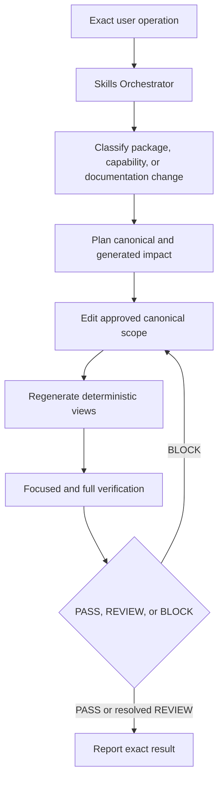
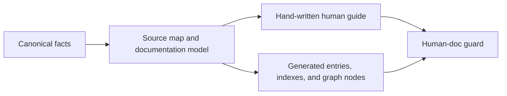

# Maintaining Skills

Back: [graph and colors](06_GRAPH_AND_COLORS.md). Next:
[repository atlas](08_REPOSITORY_ATLAS.md). Return to the [human guide](../../README.md).

The Skills Orchestrator coordinates inventory, inspection, addition, editing,
deletion, activation, migration, repair, documentation, project context, and
verification. Machine authority remains in `docs/06_CHANGE_CONTROL.md`, one
operation card, the risk map, and the repository contract.

## Management model



The orchestrator discovers consumers so the user does not need to enumerate
registries, manifests, tests, graph links, and human pages. It never manufactures
approval or absorbs unrelated dirty files.

## Package change versus capability change

| operation | meaning |
|---|---|
| add public package | add one Activation package row, entry boundary, routing metadata, documentation model, tests, and generated named graph node |
| add capability | add an internal route under an existing package; public skill count stays unchanged |
| edit capability | preserve package identity while changing focused behavior and tests |
| migrate package | change a public contract, schema, path model, platform behavior, or compatibility boundary |
| activate/deactivate | change availability while preserving content and permission boundaries |
| delete | remove exact package/capability references, tests, projections, and installed copies only with explicit authority |
| document | synchronize canonical technical docs, mapped human explanations, and generated projections |

Adding a phase under an existing package does not add another public skill.
A new registered capability needs explicit metadata, appropriate access checks
and domain verification. Removed files are not reusable entry points; restore
and review them explicitly before integrating them again.

The manual `optimizer` package illustrates one public package: one
Activation row, one family registry, one root instruction entry, focused tests,
and one generated inventory node. Its `#> build-system` and `#> optimize`
aliases, plus `explore`, `intervene`, `continue`, and `branch` operations under
`#> optimizer`, select internal workflows, not new skills. The overview hides
technical `optimizer/` files but keeps its generated
`graph/skills/optimizer.md` node visible, so that public entry is the graph
discovery point for the package.

## Governance commands

```bash
python3 scripts/scan_consistency.py classify --path path/to/target
python3 scripts/scan_consistency.py plan --operation <operation> --path path/to/target
python3 scripts/scan_consistency.py changed --operation <operation> --path path/to/scope
python3 scripts/scan_consistency.py staged --operation <operation> --path path/to/scope
```

`PLAN_ONLY` means exactly `skill-plans/<name>/plan.md` and no skill machinery.
`GOVERNED_CHANGE` returns one operation card. `PASS` clears deterministic
checks, `REVIEW` requires bounded semantic inspection, and `BLOCK` must be
resolved before staging or committing.

An optional prompt-free baseline may preserve identical pre-existing failures
in a noisy worktree. New, worsened, and in-scope failures still block.

## Exact orchestrator controls

```text
#> orchestrator status
#> orchestrator inspect <exact-target>
#> orchestrator add <exact-target>
#> orchestrator edit <exact-target>
#> orchestrator delete <exact-target>
#> orchestrator document <exact-target>
#> orchestrator sudo <operation> <exact-target>
```

Sudo is a local procedure override, not general privilege. It retains host,
sandbox, permission, credential, external-action, destructive, activation, and
scope boundaries. Unknown actions and missing targets fail safely.

Place controls in the leading user-authored block. The host interprets
management requests using the shared core and explicit natural instructions.
Material ambiguity is resolved from current metadata and the actual request;
there is no background ambiguity logger.

## Documentation ownership

Canonical behavior is mapped through `docs/human/_SOURCE_MAP.json`. When a
mapped source changes, every listed hand-written page must change in the same
transaction. `protocols/repository/DOCUMENTATION.json` defines the separate
orchestrator, public skill contents, descriptive graph entries, and generated projections.



The live catalog shows the orchestrator separately, then public skills. Its
capability appendix is technical detail, not another inventory. Generated
`AGENTS.md`, `CLAUDE.md`, `_LIVE_` pages, and `graph/` inventory nodes must be
rebuilt with `scripts/compile_repository_views.py`, never hand-edited.

## Verification levels

1. Structural: paths, roles, package mapping, unique graph labels, default visibility, links, schema, and generated freshness.
2. Behavioral: native-host control interpretation, compatible selection, ambiguity and failure handling; local fixtures separately test metadata and access.
3. Safety: permissions, capsules, secrets, symlinks, sudo, and destructive boundaries.
4. Platform: shared runtime plus separate Codex and Claude lifecycle acceptance.
5. External-project: valid, missing, invalid, stale, oversized, and symlinked capsule cases.
6. Performance: context delivery, complete process, context size and selected-capability load.

Tasks started outside this repository remain read-only. With explicit authority
they may create one bounded request under `requests/pending/`; implementation
belongs to a dedicated maintenance task rooted here.

Management stays active under use none. Maintain the shared use/mode meanings and Task understood/Plan/Skills/Mode receipt in the coordination sources; platform adapters deliver them. Verify semantic scenarios separately from instruction delivery.

For the complete architecture, controls and working examples, see [the walkthrough](10_MODEL_LED_ORCHESTRATOR.md).

## Working with contained changes

The source-owned repair controller snapshots the current dirty tree into independent Git. Keep checks and generated outputs in that copy; update waits for exact review agreement. Preserve rollback and exclude inherited live work from staging. See [Safe changes](04_SAFE_CHANGES.md).

Contained submodule references use independent Git metadata so package wrappers and generated catalogs remain readable. Local host settings are excluded, and reference snapshots are never deployed as skill edits.

## Current context flow

Test successful operations and exact artifacts, not only attempted commands or answer keywords. Record passes, failures, blocked checks, skips and superseded fixtures separately. Multi-turn scope scenarios must run as separate user turns. Keep shared verification separate from each host’s integration acceptance; preserve default batch compatibility and command aliases.

Discovery/access checks the manifest's bounded registry-source bindings first. Stale activation or family metadata stops capability access until an authorized rebuild; skill bodies are not scanned to perform that check. Optional failure still preserves required task and repair obligations.
