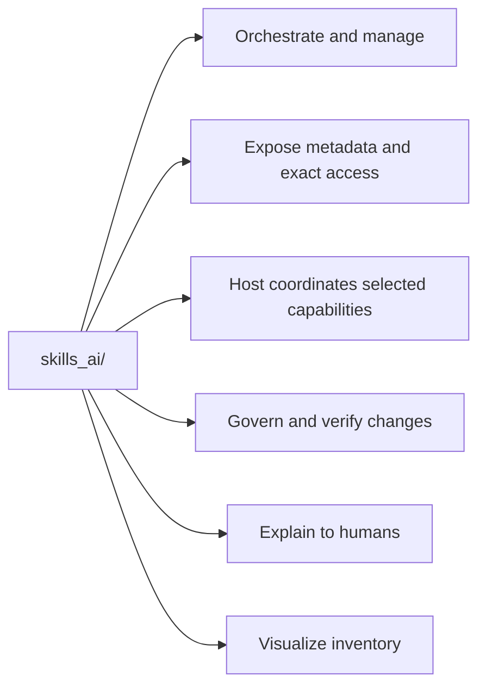
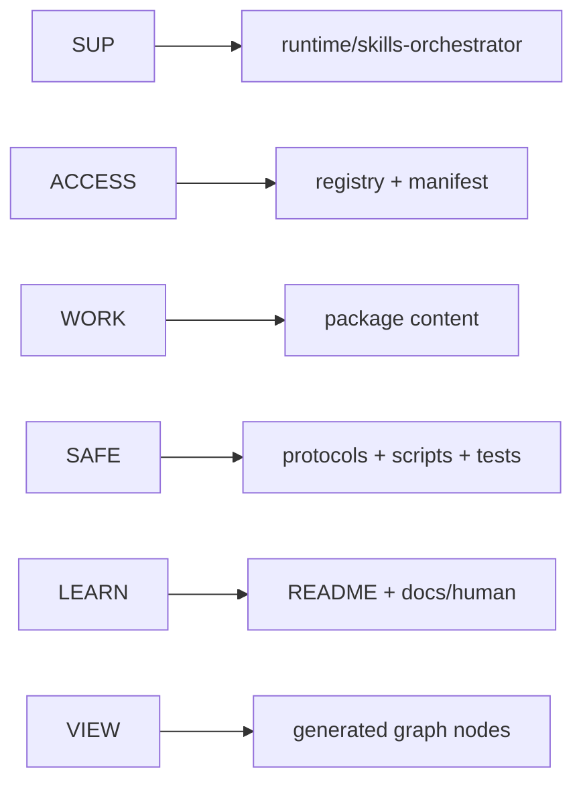

# Repository Atlas

Back: [maintaining skills](07_MAINTAINING_SKILLS.md). Next:
[skill anatomy](09_SKILL_ANATOMY.md). Return to the [human guide](../../README.md).

## Responsibility map

## Folder meanings

| folder | meaning |
|---|---|
| `runtime/` | orchestrator, shared coordination core and on-demand modules, capsule validator/schema, API, protocol, entry, and manifest |
| `registry/` | public package states plus internal family/capability metadata |
| `graph/` | generated, uniquely named Obsidian entries for the orchestrator and six public skills |
| `interaction-protocol/` | one public interaction package with general and math modes |
| `markdown-protocol/` | independently cloneable active submodule with a compact operational entry, optional navigation index, proportional design review, layered architecture, focused add-ons, formatting examples, visual fallbacks, and validation |
| `theory-reference/` | one public task package owned as a Git submodule |
| `research-context-scout/` | independently cloneable manual research task submodule |
| `optimizer/` | independently cloneable manual task submodule for version-resolved OLGS build review, adaptive campaigns, and explicit situation analysis |
| `external-skills/` | non-traversed pointers to externally owned packages |
| `protocols/repository/` | operation-specific repository rules, plus the Git governance card for clone modes, commit order, versions, releases and rollback |
| `scripts/` | on-demand metadata access, compilation, context, validation, scanning, context measurement and installation tools |
| `tests/` | mechanical evidence for runtime and documentation promises; package behavior is tested in each package |
| `.github/` | the CI workflow that runs `scripts/verify_all.py` on every push |
| `adapters/` | thin Codex and Claude lifecycle layers |
| `docs/human/` | progressive explanation outside the task hot path |
| `requests/` | bounded intake from tasks that started outside this workspace |
| `skill-plans/` | architecture notes and unimplemented proposals, distinct from active package entries |
| `.runtime/` | ignored local diagnostic and recovery data; never selection authority |

The optional `.skills-ai/project.json` capsule lives in the external project
being worked on, not in this repository's `.runtime/`. It is validated before
use and remains advisory. Normal receipts exclude stored commands and
validation commands; explicit inspection may expose only neutralized data.

There is no separate repository code-index directory or background indexing
service. Agents locate context with bounded native file search, then open only
the relevant files or line ranges. The generated `graph/` directory is a small
human-facing inventory projection, not a code index and not a runtime service.

## File authority

| kind | editing rule |
|---|---|
| canonical source | edit through the matching operation protocol |
| generated projection | regenerate from canonical sources; never hand-edit |
| human explanation | synchronize with behavior; never use as selection authority |
| package entry | defines one public package boundary or workflow |
| capability file | focused internal instructions selected for one phase |
| platform overlay | host-specific lifecycle only |
| external/submodule | preserve ownership boundary; change the package in its own repository first |
| personal state | preserve unless explicitly requested |

The [live repository index](_LIVE_REPOSITORY_INDEX.md) is the exhaustive
generated file reference. The [live skill catalog](_LIVE_SKILL_CATALOG.md) is
package-first and separates its capability appendix.

The simple commands and visible receipt are defined in runtime/skills-orchestrator/SKILL.md and CONTROLS.md. Their agent-entry projection is generated from runtime/AGENT_ENTRY_SHARED.md. No separate command parser or persistent receipt store is required.

For the complete architecture, controls and working examples, see [the walkthrough](10_MODEL_LED_ORCHESTRATOR.md).

## Working with contained changes

`scripts/repair_workspace.py` is the maintenance CLI; `runtime/repair_workspace.py` implements snapshots and exact transactions. Their private workspace records live under `.runtime/repair/` and are excluded from this atlas’s generated inventory. See [Safe changes](04_SAFE_CHANGES.md).

The atlas traverses tracked files in declared skill submodules for explanation,
but the parent owns only their pinned commit references. Each child repository
can be cloned independently. Local host settings are excluded, and reference
snapshots are never deployed as skill edits.

## Current context flow

`runtime/model_context.py` exposes bounded discovery, declared reference metadata, read-only status tied to its repository root and opt-in shared-body batch delivery. `scripts/orchestrate.py` is the access CLI. Effective controls and semantic decisions stay with the host; `MANAGEMENT.md` defines readable status and bounded repair/update discovery.

Discovery/access checks the manifest's bounded registry-source bindings first. Stale activation or family metadata stops capability access until an authorized rebuild; skill bodies are not scanned to perform that check. Optional failure still preserves required task and repair obligations.

## Terminal maintenance

`runtime/maintenance/` holds modular terminal operations; `scripts/skills_ai` is their human/agent entry. `protocols/repository/TERMINAL_MAINTENANCE.md` is the on-demand agent procedure, and `.runtime/maintenance/` contains excluded local profiles, review records, receipts and backups.
