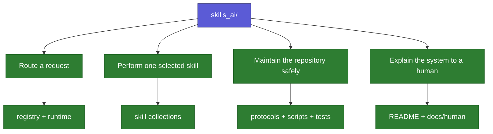
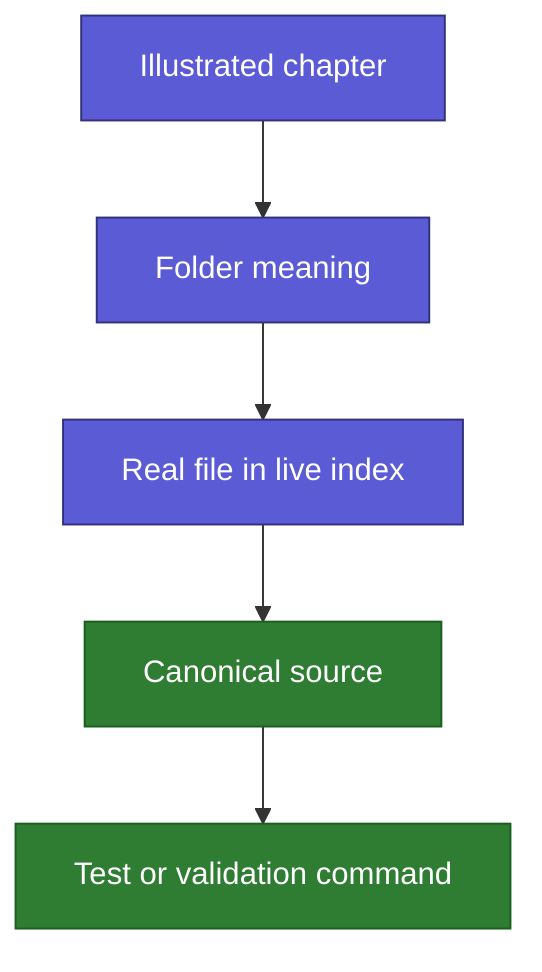

# Repository Atlas

Back: [maintaining skills](07_MAINTAINING_SKILLS.md). Next:
[skill anatomy](09_SKILL_ANATOMY.md). Return to the [human guide](../../README.md).

This chapter moves from the simple picture to the real repository. Use it when
you want to know where an idea lives before opening individual files.

## First picture: four responsibilities

## Folder meanings

| Folder | Plain-language purpose | Open it when |
|---|---|---|
| `registry/` | Directory of skill purpose, triggers, exclusions, paths, and activation | You want to know why or whether a skill can be selected |
| `runtime/` | Shared request/response contract and generated router manifest | You want to understand the fast normal-task path |
| `design-with-claude/` | Many independent single-file skills | One visual, UI, setup, deploy, or explanation skill was selected |
| `theory-reference/` | Separately owned multi-file theory skill | A theory phase was selected or you are inspecting package anatomy |
| `interaction-protocol/` | General and mathematical response behavior | You want to understand answer style rather than task selection |
| `protocols/repository/` | Rules for repository operations | A file, protocol, skill, or integration will change |
| `scripts/` | Deterministic local commands | You need to compile, route, validate, scan, benchmark, or install |
| `tests/` | Mechanical evidence | You want to see which promises are actually tested |
| `adapters/` | Codex- and Claude-specific access | You are checking platform lifecycle or installation |
| `docs/human/` | Progressive illustrated learning route | You are learning or reviewing the architecture |
| `requests/` | Controlled external-task intake | A request started outside this repository |
| `research-context-scout/` | Repository-owned multi-file research-orientation skill | A new project needs user-guided context, evidence, applications, or iterative deepening |
| `external-skills/` | Pointers to separately owned skills | You need ownership or activation information without traversing the target |
| `.runtime/` | Ignored prompt-free ambiguity observations | You are locally analyzing repeated equal route pairs; never commit it |

Cross-platform prompt controls use the shared `#>` directive namespace. This
keeps routing, presentation, Scout, and local-override instructions in ordinary
prompt text so a host command menu cannot consume them before the router runs.

## How to move deeper

For an exhaustive current list, open the
[live repository index](_LIVE_REPOSITORY_INDEX.md). It is generated from Git,
the repository roles, registry metadata, and file introductions. It shows every
tracked file plus role-resolved untracked additions without letting arbitrary
scratch files make the view stale. Ignored runtime state remains outside it.

## Canonical, generated, and explanatory files

| Kind | Meaning | Editing rule |
|---|---|---|
| Canonical source | Defines behavior or governance | Edit only through the matching repository protocol |
| Generated projection | Repeats canonical facts in a usable view | Regenerate; do not hand-edit |
| Human explanation | Teaches the idea with diagrams and examples | Keep synchronized, but it never overrides canonical behavior |
| Platform overlay | Contains only Codex- or Claude-specific lifecycle differences | Shared routing rules do not belong here |
| Test | Proves a deterministic promise | Update when public behavior changes |
| Personal state | Local display preference such as Obsidian graph layout | Preserve unless explicitly requested |
| External or submodule | Separately owned content | Do not cross the ownership boundary implicitly |
| Plan-only idea | One `skill-plans/<name>/plan.md` draft | Keep outside routing, generated views, and graph until explicit promotion |

The deeper technical rationale is recorded in the
[shared documentation model](../SHARED_DOCUMENTATION_MODEL.md).

Obsidian color groups are the controlled part of `.obsidian/graph.json`: they
encode node roles and are validated. Zoom, force settings, orphan visibility,
and collapsed panels remain personal state. The approved default overview
filter hides maintenance folders without removing their files or links.
