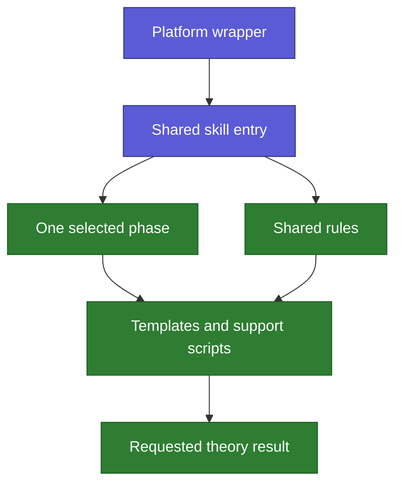
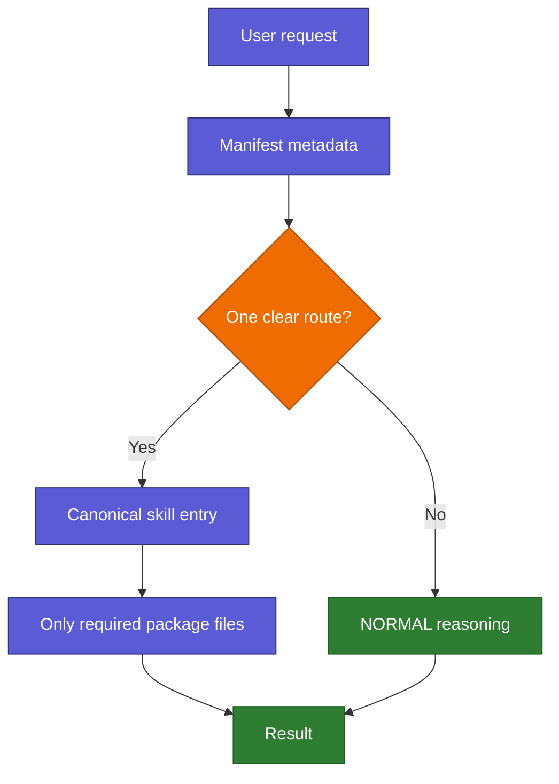

# Skill Anatomy

Back: [repository atlas](08_REPOSITORY_ATLAS.md). Return to the
[human guide](../../README.md). For the exhaustive current result, open the
[live skill catalog](_LIVE_SKILL_CATALOG.md).

A skill may be one file or a package of several files. The router always returns
one canonical entry path; it does not load every possible skill or package.

Before either form exists, an idea may live as only
`skill-plans/<name>/plan.md`. That directory is not a skill package. The
presence of `SKILL.md` is the clear promotion boundary that activates the full
registry, tests, graph, documentation, and validation protocol.

## Single-file skill

Most files under `design-with-claude/` are independent single-file skills.

| Part | Role |
|---|---|
| Family registry row | Says what the skill does, when it triggers, what it is not for, and where it lives |
| Activation state | Allows automatic use, explicit-only use, or disables routing |
| Skill Markdown file | Contains the actual task instructions |
| Prompt fixtures and tests | Check positive, negative, ambiguous, negated, and injection-resistant routing |

The registry describes the skill but does not copy its instruction body.
A `manual` task skill is never automatically selected: the request must name
its exact id through `#> skill <id>`, the equivalent exact “use the `<id>` skill”
form, or a registry-declared leading directive alias. Output format and receipt
controls change presentation without consuming this one task-skill slot.

In the Obsidian graph, Activation is a teal switchboard, the family registry is
green, and the actual skill Markdown is violet. This makes those three parts of
the same route visually distinct.

## Multi-file packaged skill

The `theory-reference/` submodule and repository-owned Research Context Scout
are packages with reusable layers.

| Package file type | Meaning |
|---|---|
| Wrapper | Connects a platform to the shared skill without duplicating its logic |
| Shared entry | Defines the common workflow and chooses the necessary phase |
| Phase | Instructions for one operation such as planning, evaluation, or chapter building |
| Rule | Constraint reused across phases, such as notation or writing rules |
| Template | Reusable output skeleton |
| Script | Deterministic installation, synchronization, figure, or validation support |
| README | Human orientation rather than runtime authority |

The main repository records the submodule commit. Changes inside the submodule
belong to its own Git history and require an explicit boundary crossing.

Research Context Scout instead lives in the top-level
`research-context-scout/` package. Its long `README.md` preserves the approved
human plan, while its root entry loads one
shared phase and one thin host wrapper. The manual route can be selected by the
validated `#> skill research-context-scout initial|deepen ...` form or its
exact `#> scout` and `#> scout-again` task directives. Optional presentation
controls may precede them. All forms carry `initial` or `deepen` without
creating duplicate skill routes.

## Shared protocol package

`interaction-protocol/` shapes the response but is not a selected task skill:

- `protocol.json` is the canonical machine-readable contract.
- `README.md` is the visible human and Obsidian entry.
- Runtime code applies the selected general or mathematical response context.
- It does not consume the one task-skill slot.

Its `README.md` is therefore a teal protocol hub rather than a violet skill.

## External skill pointer

An external symlink is different from a submodule. Skills AI may record its
identifier, activation state, and pointer, but the external repository owns the
content. The generated catalog deliberately does not traverse that target.

## Follow one real request

The [live skill catalog](_LIVE_SKILL_CATALOG.md) is the final factual layer. It
shows current states, triggers, exclusions, paths, approximate token sizes, and
the file roles inside declared packages without loading those bodies into an
ordinary task.
