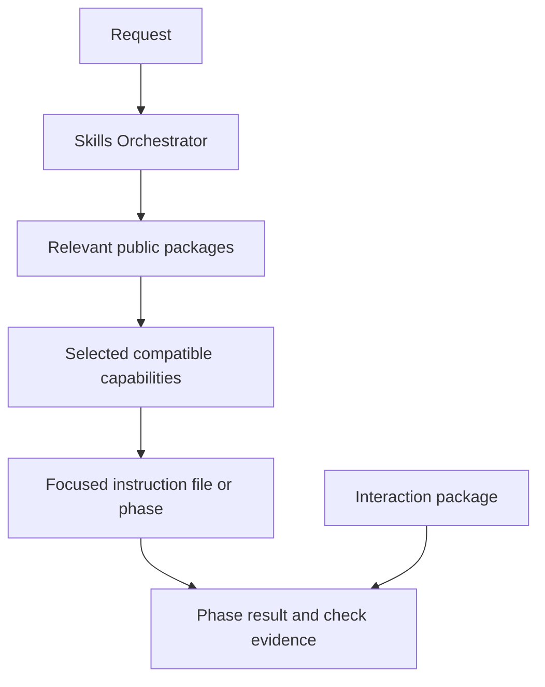
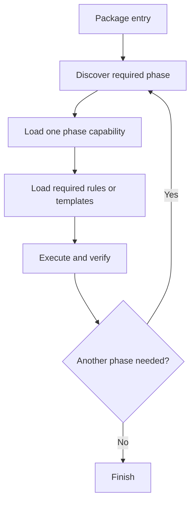

# Skill Anatomy

Back: [repository atlas](08_REPOSITORY_ATLAS.md). Return to the
[human guide](../../README.md). Generated facts:
[live skill catalog](_LIVE_SKILL_CATALOG.md).

## Public package and internal capability



The package is the public skill and inventory unit. A capability is an internal
entry used to select focused instructions. Files, phases, modes, components,
family rows, and capability entries never increase the public skill count.

The Skills Orchestrator sits above this anatomy. It selects and manages skills
but is not a package, capability, or inventory row.

## Package forms

| public package | anatomy |
|---|---|
| `interaction-protocol` | canonical JSON contract, human hub, general/math modes independent of task selection |
| `markdown-protocol` | submodule package with compact active entry, optional human index and generated inventory, proportional review workflow, selectively loaded references, on-demand checker, add-ons, and small human learning examples |
| `theory-reference` | submodule package with entry, shared router, phases, rules, templates, and scripts |
| `research-context-scout` | submodule package with entry, initial/deepen phases, an optional math-method lens, gate-sized rules for alignment, acquisition/extraction, evidence, relation mapping and collective synthesis, templates, and wrappers |
| `optimizer` | submodule package with a stable-route resolver, guarded TeX-to-OLGS build workflow, adaptive campaign and situation-analysis workflows, and read-only discovery helper |
| `quantum-job-collector` | externally owned pointer whose package state is currently off |

## Machine and human entries

`SKILL.md` is the compact machine entry and router. A navigable multi-file
package may also expose `INDEX.md` as a human map of its layers, references, and
maintenance routes. The index is neither a public skill nor an internal
capability, and ordinary task execution does not load it.

For future skill creation, documentation, or substantial Markdown
restructuring, the orchestrator composes the Markdown Protocol's skill-package
add-on with the native skill workflow. The add-on chooses among minimal,
routed, navigable, and tool-bearing profiles. Existing packages move to this
shape only when individually named and reviewed.

The package's named modes remain operations within the same public skill:
`#> md_protocol` selects guided work, `#> md_deepen <term>` proposes one linked
deep note, and `#> md_check` runs a read-only structural check. They are not
additional skills and do not broaden authority.

## Capability record

An internal task capability has a family, package id, activation state, purpose,
triggers, exclusions, canonical path and appropriate verification obligations. The registry describes these
facts without copying the instruction body. A selected path is loaded only
after package state and path validation.

Locating that path requires no background semantic index. The host
selects an exact capability from discovery metadata; maintenance work otherwise
uses bounded native filename and literal searches followed by targeted reads.

For example, optimizer's build-system and optimization workflows belong to
one public package. An exact build-workflow selection is:

```text
#> build-system <problem.tex>
```

## Multi-phase packages



The orchestrator contract may coordinate several capabilities, but the host
verifies and reroutes between phases instead of preloading them. Explicit checkpoint tools inspect saved content bindings; the host decides recovery and phase transitions. A checkpoint may record content-bound progress, never prompts or
permission.

Research Context Scout is a concrete example: its initial phase opens only the
rules needed by the current gate, records user alignment before broad search,
and blocks synthesis until every incorporated paper is locally available and
extracted. The gate order and rule-loading table live in a separate `gates.md`
that a first cycle never has to open, and a machine-readable `load-graph.json`
records which file belongs to which gate for tooling and tests rather than for
the model. Its collective report translates source-supported ideas into project
notation; individual paper cards remain evidence rather than separate public
capabilities or visible report sections.

## Promotion boundary

An idea containing only `skill-plans/<name>/plan.md` is not a skill package.
Creating a new package normally introduces a governed `SKILL.md` and package
record. Existing composite and protocol packages may use another explicitly
declared canonical entry, such as a registry hub or protocol README. In every
case, exactly one Activation row defines the public package.

Nested platform wrappers, shared entries, phases, and capability files remain
package support. Their presence never creates additional public skills.

## Generated catalog rule

The live catalog must contain one separate orchestrator record and exactly one
public row per Activation skill package. Its separate Internal Capabilities
section may list routes, triggers, paths, and token estimates for technical
inspection, but those rows are not skills.

A comma-separated use list explicitly selects named public packages; the host resolves their exact entries and relevant phases. The task receipt reports planned selection and useful roles without treating capability leaves as extra skills or claiming unread files were loaded.

For the complete architecture, controls and working examples, see [the walkthrough](10_MODEL_LED_ORCHESTRATOR.md).

## Working with contained changes

Repair mode belongs to orchestration, not a skill package or capability. It changes the working location while existing package contracts and required evidence remain in force. See [Safe changes](04_SAFE_CHANGES.md).

The package's public identity is independent of storage form. Declared
submodules keep their own Git histories and release paths while the parent pins
the tested combination and traverses tracked child files for generated human
catalogs. Local host settings are excluded, and repair snapshots are never
deployed as skill edits.

## Current context flow

Capabilities retain separate identities, gates and contract obligations even when they share an entry body. Discovery lists declared helper references; it does not preload or require every optional phase/template. Identified additional support stays selectively readable. Package freedom remains intact while access metadata is standardized.

Discovery/access checks the manifest's bounded registry-source bindings first. Stale activation or family metadata stops capability access until an authorized rebuild; skill bodies are not scanned to perform that check. Optional failure still preserves required task and repair obligations.

## Terminal maintenance

The terminal facade lists package and capability metadata without opening skill bodies. Its maintenance modules and protocols are support infrastructure, not new skills. New task skills continue using the existing package contract and explicit activation gates.
