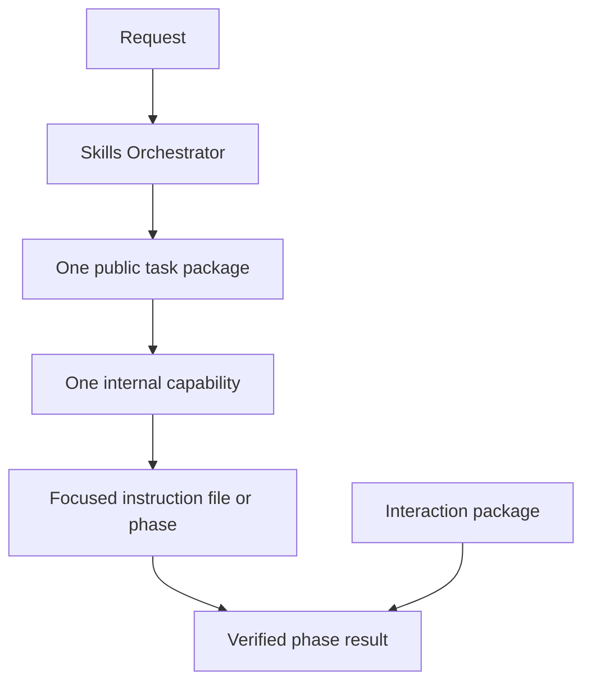
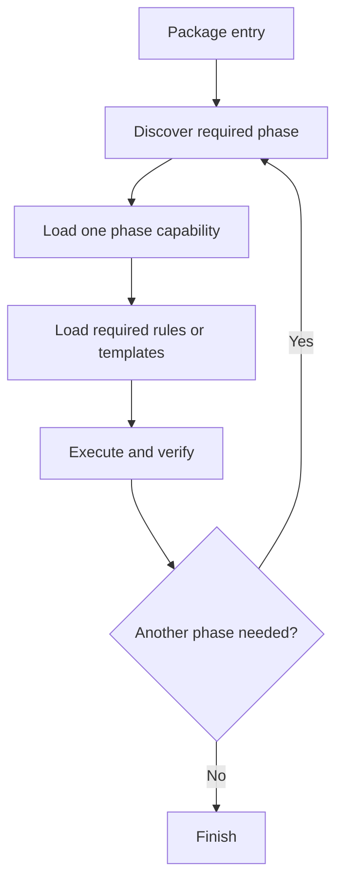

# Skill Anatomy

Back: [repository atlas](08_REPOSITORY_ATLAS.md). Return to the
[human guide](../../README.md). Generated facts:
[live skill catalog](_LIVE_SKILL_CATALOG.md).

## Public package and internal capability



The package is the public skill and inventory unit. A capability is an internal
route used to select focused instructions. Files, phases, modes, components,
family rows, and route leaves never increase the public skill count.

The Skills Orchestrator sits above this anatomy. It routes and manages skills
but is not a package, capability, or inventory row.

## Package forms

| public package | anatomy |
|---|---|
| `interaction-protocol` | canonical JSON contract, human hub, general/math modes; no task slot |
| `design-with-claude` | one composite package whose capability instructions are individual Markdown files |
| `theory-reference` | submodule package with entry, shared router, phases, rules, templates, and scripts |
| `research-context-scout` | repository package with entry, initial/deepen phases, an optional math-method lens, gate-sized rules for alignment, acquisition/extraction, evidence, relation mapping and collective synthesis, templates, and wrappers |
| `optimizer` | repository package with a stable-route resolver, guarded TeX-to-OLGS build workflow, adaptive campaign and situation-analysis workflows, and read-only discovery helper |
| `quantum-job-collector` | externally owned pointer whose package state is currently off |

## Capability record

An internal task capability has a family, package id, activation state, purpose,
triggers, exclusions, canonical path, and tests. The registry describes these
facts without copying the instruction body. A selected path is loaded only
after package state and path validation.

For example, `dark-mode-specialist` is not a public skill. It is an internal
capability of `design-with-claude`. Exact selection is:

```text
#> skill design-with-claude dark-mode-specialist
```

## Multi-phase packages



The orchestrator contract may coordinate several capabilities, but the host
verifies and reroutes between phases instead of preloading them. The router
validates and transports a bounded checkpoint; it does not enforce phase
transitions. A checkpoint may record stable approved progress, never prompts or
permission.

Research Context Scout is a concrete example: its initial phase opens only the
rules needed by the current gate, records user alignment before broad search,
and blocks synthesis until every incorporated paper is locally available and
extracted. The gate order and rule-loading table live in a separate `gates.md`
that a first cycle never has to open, and a machine-readable `load-graph.json`
records which file belongs to which gate for tooling and tests rather than for
the model. Its collective report translates source-supported ideas into project
notation; individual paper cards remain evidence rather than separate public
capabilities or visible report sections.

## Promotion boundary

An idea containing only `skill-plans/<name>/plan.md` is not a skill package.
Creating a new package normally introduces a governed `SKILL.md` and package
record. Existing composite and protocol packages may use another explicitly
declared canonical entry, such as a registry hub or protocol README. In every
case, exactly one Activation row defines the public package.

Nested platform wrappers, shared entries, phases, and capability files remain
package support. Their presence never creates additional public skills.

## Generated catalog rule

The live catalog must contain one separate orchestrator record and exactly one
public row per Activation skill package. Its separate Internal Capabilities
section may list routes, triggers, paths, and token estimates for technical
inspection, but those rows are not skills.
