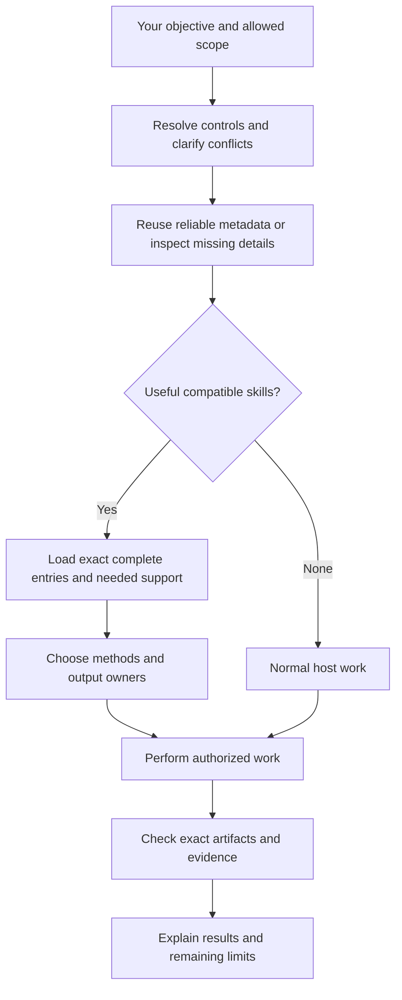
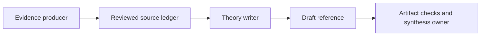
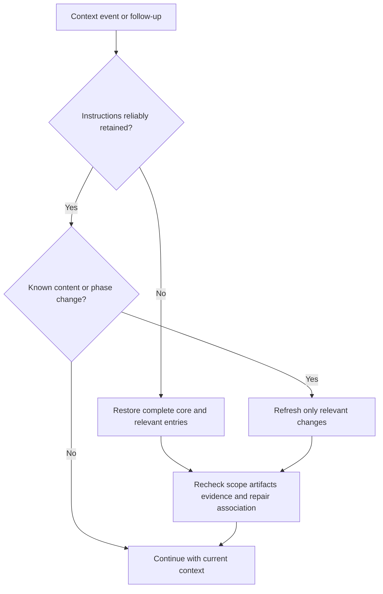

# Skills Orchestrator: walkthrough

Back: [human guide](../../README.md). Technical definitions: [integration contract](../../runtime/skills-orchestrator/CONTRACT.md), [composition](../../runtime/skills-orchestrator/COMPOSITION.md), [recovery](../../runtime/skills-orchestrator/RECOVERY.md).

## What you are using

The orchestrator is the connected host reasoning with shared coordination instructions. It understands your objective, selects useful skills, coordinates their work and checks what the evidence supports. It is always active and is not counted as a skill. Local tools provide metadata, exact file access and artifact checks. You own skill creation, editing, activation and the scope of each task.

A skill keeps its own methods, tools, templates and domain rules. Its outer contract gives the orchestrator enough information to connect it to a task without prescribing the skill's internal design.

## Start with two commands

```text
#> use theory-reference, research-context-scout
#> mode adaptive

Review the model in the supplied file and prepare a reference outline.
Wait for my review before writing chapters.
```

`use` names every package you want. Compatible targets remain part of the task, in their appropriate phases; list order does not start workers or force parallel execution. `use auto` lets the host choose; `use none` skips optional task skills. Exact package names avoid broad discovery, while meaningful capability ambiguity and required support are still resolved. An unavailable target is reported without silent substitution.

`mode` controls method flexibility:

| Mode | What changes | What remains required |
|---|---|---|
| Advisory or inspire | Use the skill for guidance; do not claim exact method compliance | Correctness, assumptions, provenance, gates, evidence and your scope |
| Adaptive | Improve defaults for a reason grounded in this task | The same obligations; disclose significant method departures |
| Strict | Follow designated required methods | The same obligations and their required method |

Mode does not authorize writes or change execution autonomy. Say “prepare a proposal and wait” for review-first work; standard execution continues authorized work; autonomous execution continues authorized phases within limits and gates. Controls default to the current request. Explicit chat preferences can persist; nothing silently changes project or global defaults.

## The task receipt

At the beginning of substantive work you see:

> **Task receipt**
>
> - **Task understood:** Review the supplied model and prepare a useful reference outline.
> - **Plan:** Inspect the relevant source, identify assumptions, prepare the outline and explain the checks needed before chapter writing.
> - **Skills:** Theory Reference and Research Context Scout, planned for their relevant phases.
> - **Mode:** Adaptive.
> - **Boundary:** Outline review before chapter edits.

The bullets make the four fields easy to distinguish. Planned selection is not a claim that instructions are loaded. Boundary is optional. `#> receipt auto` shows this once per substantive task; on shows it for each new request; off hides it. Progress messages do not repeat it. Equivalent visible host fields are reused. The receipt adds no approval pause of its own and creates no memory file.

## Follow a request



Material ambiguity is resolved before dependent work. Independent authorized work can continue. Naming a skill, selecting strict mode or saving a checkpoint never grants write, network, credential or account authority.

## Keywords to know

| Word | Meaning and example |
|---|---|
| Package | A public skill, such as theory-reference. This is what `use` names. |
| Capability | An exact entry within a package, such as interaction.math. A package may have several. |
| Metadata | Purpose, state, entry, roles and dependencies, read without skill bodies. It helps selection but grants no authority. |
| Contract | The standard integration information in `registry/contracts/`. A skill can retain its own internal structure and namespaced extensions. |
| Active | Available for automatic selection when useful. |
| Manual | Available only after actual explicit invocation; relevance or dependency metadata alone is insufficient. |
| Off / hidden / deprecated | Unavailable to capability loading. A manual override cannot bypass these gates. |
| Dependency | Required support, a reference or a tool. The host resolves it; loading does not silently select it. |
| Invariant | A condition that preserves correctness, assumptions or provenance in every mode. |
| Gate | A required condition before a named transition or result label. |
| Owner | The contributor responsible for an output artifact. Parallel writers need separate write sets and one synthesis owner. |
| Identity / binding | A hash of exact content or integration metadata. It detects changes; it does not prove instructions are remembered or a check actually ran. |
| Capsule | Optional `.skills-ai/project.json` advisory context. It is validated and bounded; operational commands are omitted from ordinary summaries. |
| Checkpoint | Explicitly authorized recovery data: objective, phase, artifact pointers, bindings and pending issues. It is not automatic session memory or approval. |
| Validation | Named checks on exact artifacts and revisions. |
| Certification | Evidence under a named domain scheme, separate from workflow completion and validation. |

## Control scope and status

Controls apply to the current request unless you explicitly choose wider scope.
After a request using strict, an unqualified follow-up returns to adaptive. The
loaded instructions may still be reused. For persistent strict use:

```text
#> mode strict for this chat
```

A request-only adaptive override changes that request, then the chat default
resumes. Repair on separately persists until off. Conflicting selection or mode
values are clarified before affected loading/work; `use none` prevents optional
task skills even if one matches.

`#> orchestrator status` shows effective controls/scope, planned versus retained
skills, catalog freshness, exact repair association and verification limits.
These facts require no body loading, repository scan or memory write. Catalog
metadata identifies local integration entries, not assumed host-native tools.

## Work with several skills

Choose the simplest useful arrangement. Single uses one capability. Sequential passes an output to the next capability. Cooperative contributors work on the same objective with named responsibilities. Parallel contributors have independent work and separate writes before synthesis. Structured composition adds explicit input/output artifacts and recovery to any arrangement; it is not another topology.



The minimum sufficient compatible set may contain several skills. It avoids speculative loading while preserving required support and every compatible skill you explicitly requested. More skills do not automatically improve a task.

## How context stays efficient

Claude receives the full coordination core at session start, resume, clear, compact and fork. Follow-up requests receive only changed core, catalog, capsule or repair sections. A delivery marker stores hashes only; it records emitted context, not model retention. Failed acknowledgment causes safe repeat delivery.

Codex gets the shared core in one installed entry with its source identity. Both hosts reuse reliable metadata and complete loaded instructions. Missing or insufficient metadata expands explicitly. Exact compatible capabilities can load together with --deduplicate: shared bodies appear once, while each capability keeps its own gates, contract and identity. Existing single/default batch responses remain compatible. A changed contract invalidates metadata and load identities even when the main entry and declared version did not change.



`--if-changed` can omit an unchanged entry body only when the complete instructions remain reliably present. It cannot restore context after compaction. Metadata lists helper-supported reference paths. Empty means none declared; other identified support can use bounded reads. Required references have separate bindings. Consequential recovery checks actual authority, artifacts, evidence and completed external effects before continuing.

Run `python3 scripts/orchestrate.py measure` to inspect context bytes and subprocess latency. Byte/4 token estimates are approximate and do not measure total task savings. No background indexer, updater, prompt logger or automatic memory is started.

## Edit safely

```text
#> repair on
```

This creates or resumes a contained workspace for this chat. Subsequent edits, tests, generated outputs and Git tracking stay there. `repair off` ends contained routing but keeps pending work. Explicit live exceptions apply only to their action.

```text
#> update
```

This prepares the exact changes and checks, explains them and waits for your agreement before applying that preview. Later edits invalidate it. Live dirty work and rollback are preserved; update leaves repair mode on. A new chat does not inherit repair mode. Missing or corrupt known state stops mutations instead of silently editing live. With no association, update reports no associated changes and stops discovery. It does not pick another workspace. Denied workspace creation is reported as pending containment.

## Install and verify

From the source checkout, use `python3 scripts/install_runtime_adapter.py --adapter codex --dry-run` or substitute claude. Inspect the preview, run without dry-run to install, then use `--check`. Alternate configuration directories can be supplied with `--config-dir`.

Codex installs one rendered core entry. Claude installs its lifecycle hook and merges owned settings while preserving foreign hooks and configuration backups. Runtime shared tests, disposable installer tests and actual native-host semantic acceptance are separate evidence. Read [the build record](../../runtime/skills-orchestrator/BUILD.md) for what has actually been verified.

Discovery/access checks the manifest's bounded registry-source bindings first. Stale activation or family metadata stops capability access until an authorized rebuild; skill bodies are not scanned to perform that check. Optional failure still preserves required task and repair obligations.
