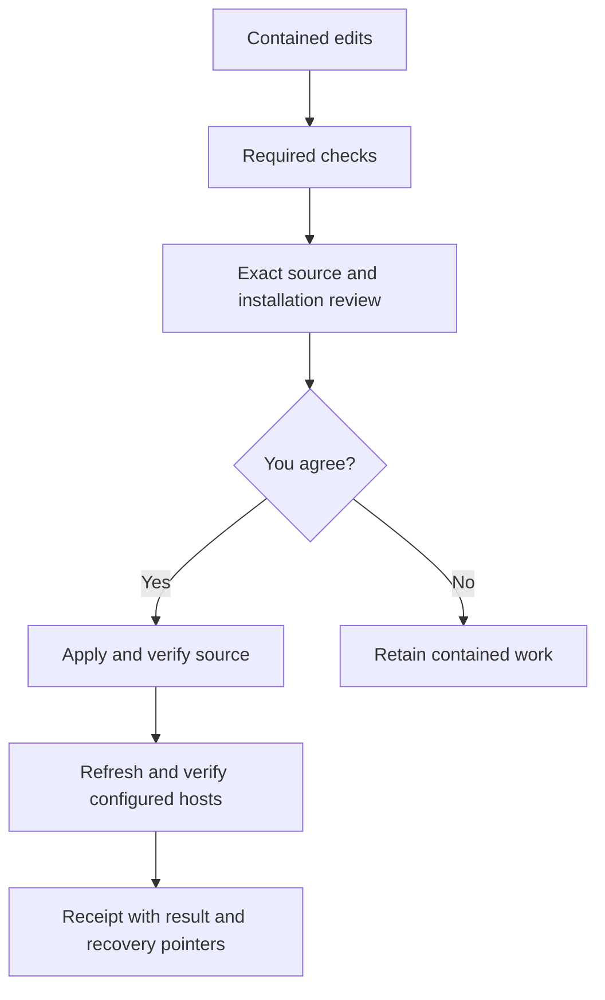

# Work from the terminal

Back: [human guide](../../README.md). Agent protocol:
[terminal maintenance](../../protocols/repository/TERMINAL_MAINTENANCE.md).

Skills AI uses Git for history and adds a small command interface for inspection,
contained work, checks, reviewed deployment and installation refresh.

## Start

```sh
export PATH="/Users/billabobz/skills_ai/scripts:$PATH"
skills_ai
skills_ai skills
skills_ai skills optimizer
```

The PATH setting applies to this terminal. You can also use the executable's
absolute path from any directory. The command does not edit your shell settings.
Skills lists packages; adding a package name shows its capability metadata.
It does not load the skills into an agent or choose what your task needs.

## Two everyday workflows

To synchronize the installed Codex entry with ready live source:

```sh
skills_ai refresh --host codex
```

Review the exact installation path and confirm in the terminal. After success
the binding is saved, so later calls can be just `skills_ai refresh`.
Use --host claude for the existing Claude installer; it owns settings/hooks
preservation. Each host's running context remains that host's responsibility.

To change the orchestrator:

```sh
skills_ai repair on
```

The output gives the contained working folder. Change into that folder for your
edits, tests and Git. A child command cannot move the parent shell for you. Invoke
the original source command for deployment, rather than a candidate copy:

```sh
skills_ai check
skills_ai update
skills_ai repair off
```

Update checks the selected workspace, shows actual file changes and installation
targets, and asks for agreement. After approval it deploys, verifies and refreshes
saved hosts. Repair off preserves the folder and unfinished work.



Use the PATH for the source checkout, not the contained scripts directory.
Chat sessions use their known identity. Standalone terminals retain one selected
terminal identity; use --session NAME when you want separate concurrent work.
An old deployed workspace does not automatically absorb later source changes.
Drift is reported for review rather than silently merged or overwritten.

## Read the result

Status separates source revision, dirty Git state, repair association and installed
file freshness. An installed copy can become stale after a later source change.
File freshness does not prove what an existing agent conversation remembers.
When a package submodule folder is empty, status names the unavailable packages
and prints the fix, `git submodule update --init --recursive`.

Check uses mapped tests for changed files; --full asks for full local verification.
Local PASS means those checks passed on the named artifacts. It does not certify
scientific claims or another host's model behavior.

An unchanged configured installation requires no repeat approval. Missing host
bindings are visible rather than guessed. Source deployment leaves the live Git
index untouched; contained commits and rollback history are retained. Make live
commits only through separately scoped staging that excludes inherited dirty work.

If source deployed but refresh failed, the result says partial. Inspect its receipt
and actual files, then retry refresh. Source-check failures use the existing repair
rollback. Interrupted operations need effect inspection before retry; backups never
authorize overwriting changes another person made later.

## Agent and integration use

```sh
skills_ai status --json
skills_ai update --preview --json
```

Both return structured results. A ready review exits with code 3 and a preview ID;
it has not deployed anything. Once you agree to the exact review, the agent can
apply that ID with --approve and --approval-ref. Recorded fields are attestations,
not permission. There is no silent yes flag.

The implementation separates commands, inspection, workspace transitions, checks,
deployment, host adapters and receipts. A future host gets its own adapter;
new operations can reuse the same result envelope and recovery rules. The model
continues owning skill selection and task methods. No background service or
automatic task-memory system is added.
