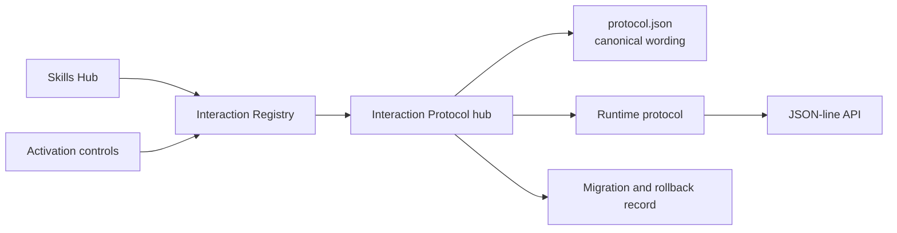
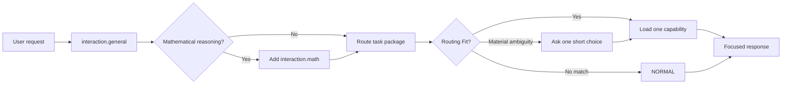
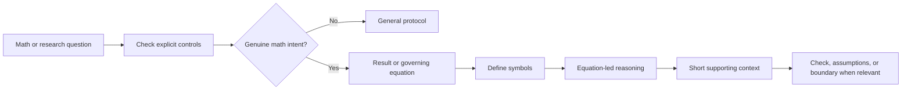

# Interaction Protocol

Back to [[docs/00_SKILLS_HUB|Skills Hub]] · Controls:
[[registry/activation|Activation]] · Registry:
[[registry/interaction|Interaction Registry]] · Runtime:
[[runtime/PROTOCOL|Runtime Protocol]] · API:
[[runtime/API_CONTRACT|API Contract]] · Migration:
[[docs/INTERACTION_PROTOCOL_MIGRATION|Migration Record]]

This is one public interaction skill package and its visible Obsidian hub. The canonical
machine-readable wording lives in [protocol.json](protocol.json). The registry
controls whether general and math behavior is active; the runtime decides the
current response mode and independently selects at most one task package
capability. The interaction package consumes no task-package slot.

## Authority map

## General request flow

## Mathematical response flow

## Controls and tests

- `interaction.general`: active or off.
- `interaction.math`: active, manual, or off.
- `#> skill auto`: select at most one relevant active task package capability.
- `#> skill normal` or “do not use any local skill”: use no local task package.
- `#> skill <exact-package> [capability]`: explicitly request one enabled
  package and optional internal capability; required for a manual package.
- `#> skill interaction-protocol general|math`: select this public package's mode.
- `#> interaction math`: explicit math response for the current request.
- `#> interaction general`: explicit general response for the current request.
- `#> format mermaid+summary`: request known output forms.
- `#> depth brief|standard|detailed`: request explanation depth.
- `#> receipt auto|on|off`: show the task/skill/Fit/style/access receipt
  automatically, always, or never.
- Prompt fixtures: [interaction_cases.json](../tests/interaction_cases.json).
- Runtime tests: [test_registry_runtime.py](../tests/test_registry_runtime.py).
- Graph tests: [test_graph_layers.py](../tests/test_graph_layers.py).

The interaction protocol changes response structure only. It grants no file,
network, credential, account, or destructive-action authority.

Fit is route suitability, not factual confidence: `3` is an exact explicit
route, `2` is one clear contextual route, `1` is unresolved equal candidates,
and `0` means no skill. At Fit 1 the host asks one numbered last-resort choice
only when the alternatives materially change the task; otherwise it continues
normally. The router may record prompt-free candidate metadata under ignored
`.runtime/` state for later local analysis, never the prompt or answer.
