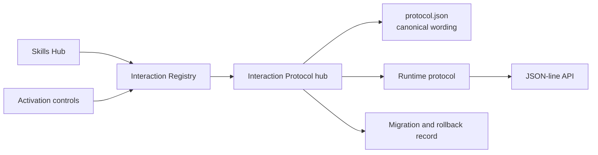
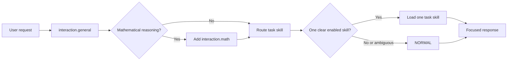
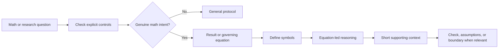

# Interaction Protocol

Back to [[docs/00_SKILLS_HUB|Skills Hub]] · Controls:
[[registry/activation|Activation]] · Registry:
[[registry/interaction|Interaction Registry]] · Runtime:
[[runtime/PROTOCOL|Runtime Protocol]] · API:
[[runtime/API_CONTRACT|API Contract]] · Migration:
[[docs/INTERACTION_PROTOCOL_MIGRATION|Migration Record]]

This is the visible Obsidian hub for the shared response protocol. The canonical
machine-readable wording lives in [protocol.json](protocol.json). The registry
controls whether general and math behavior is active; the runtime decides the
current response mode and independently selects at most one task skill.

## Authority map

## General request flow

## Mathematical response flow

## Controls and tests

- `interaction.general`: active or off.
- `interaction.math`: active, manual, or off.
- `/interaction math`: explicit math response for the current request.
- `/interaction general`: explicit general response for the current request.
- Prompt fixtures: [interaction_cases.json](../tests/interaction_cases.json).
- Runtime tests: [test_registry_runtime.py](../tests/test_registry_runtime.py).
- Graph tests: [test_graph_layers.py](../tests/test_graph_layers.py).

The interaction protocol changes response structure only. It grants no file,
network, credential, account, or destructive-action authority.
