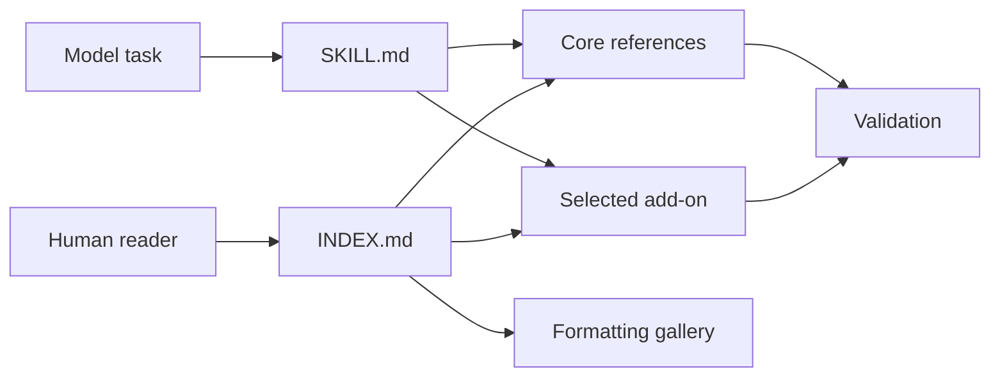

# Markdown Protocol Index

A human-facing map for understanding and maintaining the Markdown Protocol
package. Models performing ordinary Markdown work start from
[SKILL.md](SKILL.md) and load only the reference required for the task.

## Choose a route

| intention | open |
|---|---|
| Understand the governing principles | [Core Protocol](references/core-protocol.md) |
| Plan a Markdown change | [Review Workflow](references/review-workflow.md) |
| Choose a document layout | [Layouts](references/layouts.md) |
| Learn a formatting technique | [Markdown Pattern Gallery](references/markdown-patterns.md) |
| Design a useful visual | [Visual Patterns](references/visual-patterns.md) |
| Validate completed Markdown | [Validation](references/validation.md) |
| Use structured properties or generated inventory | [Structured Inventory](references/structured-inventory.md) |
| Check a collection or generate its inventory | [`scripts/markdown_protocol.py`](scripts/markdown_protocol.py) |
| Choose a use-case add-on | [Add-on Routes](references/addons/routes.md) |
| Design or maintain an add-on | [Add-on Contract](references/addons/add-on-contract.md) |
| Create learning material | [Education Add-on](references/addons/education.md) |
| Document a repository | [Codebase Add-on](references/addons/codebase.md) |
| Structure source-backed research notes | [Research Notes Add-on](references/addons/research-notes.md) |
| Structure a skill package | [Skill Package Add-on](references/addons/skill-package.md) |

## Package map



Text version: `SKILL.md` is the compact machine entry, `INDEX.md` is the human
map, focused references own the detail, and validation checks the result.

## Core references

| file | owns | load when |
|---|---|---|
| [core-protocol.md](references/core-protocol.md) | universal structure, ownership, portability, and footer rules | every Markdown task |
| [review-workflow.md](references/review-workflow.md) | proportional proposal and approval behavior | before a write |
| [layouts.md](references/layouts.md) | adaptive single-file and collection structures | creating or reorganizing files |
| [markdown-patterns.md](references/markdown-patterns.md) | human formatting catalogue | choosing or learning a pattern |
| [visual-patterns.md](references/visual-patterns.md) | diagram selection and fallbacks | when a visual materially helps |
| [validation.md](references/validation.md) | structural and renderer-aware completion checks | before finishing |
| [structured-inventory.md](references/structured-inventory.md) | optional property schema, inventory generation, and checker contract | when a collection opts into tooling |

## Add-ons

| add-on | extends the protocol for |
|---|---|
| [routes.md](references/addons/routes.md) | compact selection of one applicable add-on |
| [add-on-contract.md](references/addons/add-on-contract.md) | shared extension points, declarations, ownership, and boundaries |
| [education.md](references/addons/education.md) | learning, revision, and unfamiliar concepts |
| [codebase.md](references/addons/codebase.md) | codebase orientation, workflows, and change impact |
| [research-notes.md](references/addons/research-notes.md) | source-backed claims, evidence status, and literature maps |
| [decision-records.md](references/addons/decision-records.md) | durable choices, consequences, and supersession history |
| [runbooks.md](references/addons/runbooks.md) | verified operational procedures, stop conditions, and recovery |
| [visual-extras.md](references/addons/visual-extras.md) | optional Markmap, Foam, and editable SVG views |
| [slides.md](references/addons/slides.md) | source-linked Marp teaching and presentation decks |
| [skill-package.md](references/addons/skill-package.md) | machine-efficient and human-navigable skill packages |

Add-ons may specialize presentation and validation. They do not replace the
core invariants or the proportional review gate.

## Formatting examples

The [Markdown Pattern Gallery](references/markdown-patterns.md) owns the
complete ordered list of small examples under `references/formatting-examples/`.
Open only the example needed for the current question.

## Package support

```text
agents/openai.yaml    -> native UI metadata and invocation policy
scripts/markdown_protocol.py -> on-demand bounded check and inventory generator
.obsidian/            -> optional local viewing state; not routing authority
```

## Maintenance boundaries

- `SKILL.md` owns model selection, essential behavior, and selective routing.
- `INDEX.md` owns human package navigation and this internal inventory.
- Each focused reference owns the subject named by its title.
- The pattern gallery owns its example sequence.
- Repository registries own public discovery and activation metadata.
- Generated repository views are replaceable projections, never canonical
  package prose.

---

[⌂ Home](#markdown-protocol-index)
