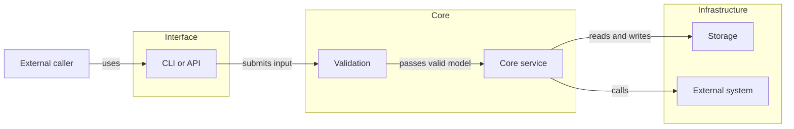
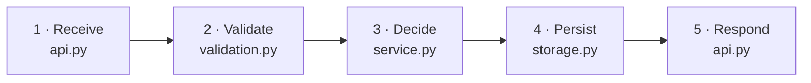

# Codebase Add-on

Use this add-on when Markdown must help a reader understand, navigate, change,
or verify a codebase. Analyze the repository and select the smallest useful
combination of views; do not make the user design the documentation system.

## Outcome

Connect four questions without reproducing the source code:

```text
Where am I?
    -> What happens?
    -> Where is it implemented?
    -> What should I inspect or verify before changing it?
```

The result should give a new reader a reliable route into the code while
remaining compact enough for maintenance and selective model loading.

## Add-on declaration

| field | declaration |
|---|---|
| Trigger | Markdown intended to explain, navigate, change, or verify a codebase; not source-code work that needs no documentation artifact |
| Blocks | System map, numbered workflow, responsibility map, change-impact guide, and selected state or data views |
| Layout variants | README-only, README plus code map, or routed subsystem/workflow notes |
| Generated views | Optional bounded import or where-used maps with declared source, revision, and regeneration |
| Checks | Paths, symbols, workflow order, ownership, test mappings, portability, and generated freshness |
| Composition | Source code, tests, and the code-owning skill remain authoritative for behavior |
| Boundaries | No every-file documentation, complete hand-maintained import graph, mandatory tool, or background indexer |

## Analyze before proposing

Inspect only the repository evidence needed to identify:

- external entry points and user-facing interfaces;
- major runtime components and boundaries;
- one or more important execution paths;
- files or symbols that own each responsibility;
- configuration, persistence, external-service, and generated-code boundaries;
- tests or checks that verify the documented behavior.

Distinguish observed structure from inferred intent. Link claims to actual
paths or symbols when practical. Do not infer runtime behavior from filenames
alone, and do not present an automatically generated dependency graph as a
semantic architecture.

Include the proposed views, files, ownership, and validation in the normal
Markdown Protocol review. A new document or materially different visual system
is structural work and needs agreement before writing.

## Adaptive profiles

Choose by information need rather than repository size alone.

| profile | typical treatment |
|---|---|
| Small | README orientation, one system map, and one main workflow |
| Medium | README orientation plus a focused `CODE_MAP.md` |
| Complex | README orientation, `CODE_MAP.md`, and separate notes for major workflows or subsystems |

These are defaults, not required filenames or quotas. Keep a small project in
one file when splitting it would add navigation without useful depth.

## Core visual grammar

Prefer a progressive zoom. Most repositories need only a system map and one
numbered workflow; deeper views are optional.

| reader question | preferred representation |
|---|---|
| Where does this system sit? | short context statement or context diagram |
| What are the major runtime parts? | component or layer map |
| What happens for this operation? | numbered workflow or sequence diagram |
| Where is each responsibility implemented? | annotated tree or responsibility table |
| What should change with this behavior? | change-impact table or small fan-out diagram |
| How does an object move between states? | state diagram |
| How does data change shape? | data-lineage strip |

Do not require every zoom level. Select a visual only when it communicates the
relationship more clearly than a short paragraph, list, or table.

## System map

Represent responsibilities or runtime components, not every file. Keep the
README version to roughly five to nine meaningful nodes; move larger maps into
a focused code-map or subsystem note.



Name the question before the diagram. Use short labels and relationship verbs.
Place exact paths in node labels only when they remain readable; otherwise put
them in the responsibility map below.

## Numbered workflow journey

Use this as the default detailed visual for an important runtime path. Match
every diagram number with a row in the accompanying table.



| step | file or symbol | responsibility | data or result | verified by |
|---:|---|---|---|---|
| 1 | `api.py` | receive the request | raw input | API test |
| 2 | `validation.py` | validate and normalize | valid model | validation test |
| 3 | `service.py` | apply the main rules | domain result | service test |
| 4 | `storage.py` | persist the result | stored record | integration test |
| 5 | `api.py` | form the response | external output | API test |

Adapt the columns to the repository. Use real paths, symbols, data names, and
verification commands in actual documentation. If a step is inferred rather
than verified, say so.

## Optional interaction and state views

Use a sequence diagram only when order, branching, retries, or communication
between participants is central. Use `autonumber` and ordinary `alt`, `opt`, or
`par` blocks; keep component names consistent with the system map.

Use a state diagram only when valid states and transitions are themselves part
of the behavior. Do not substitute it for a workflow merely because both have
arrows.

Use a short data-lineage strip when the important question is how information
changes form:

```text
external input -> normalized model -> domain result -> stored or returned form
```

## File responsibility map

Prefer an annotated tree or compact table over a repository-wide import graph.
Describe important entry points, core owners, boundaries, generated areas, and
tests; omit routine support files unless they matter to navigation.

```text
src/
├── api.py          -> external entry point
├── validation.py   -> input validation and normalization
├── service.py      -> application decisions
├── domain.py       -> core data and rules
└── storage.py      -> persistence boundary

tests/
├── test_service.py -> core behavior
└── test_api.py     -> end-to-end request flow
```

Use a responsibility card only for an important entry point, core owner, or
boundary:

```markdown
> **`service.py` — core decisions**
>
> Receives validated input, applies the main rules, and coordinates storage.
> Change this when application behavior changes. Verify with the service and
> relevant integration tests.
```

## Change-impact guide

Use a table for direct editing guidance. It is usually more dependable than a
dense dependency diagram.

| intended change | start here | also inspect | verify with |
|---|---|---|---|
| input format | interface or schema owner | validation and serializers | interface tests |
| core behavior | service or domain owner | callers and stored assumptions | unit and integration tests |
| storage format | persistence owner | migrations and serializers | persistence tests |
| configuration | settings owner | deployment and examples | configuration smoke test |

Use a small fan-out diagram only when one change has three or more important
downstream consumers. State whether each connection is verified, generated, or
an analysis aid.

## Portability and reliability

- Give every diagram one named question.
- Keep essential meaning in nearby prose, a table, or an annotated tree.
- Use the same names and numbers across diagrams and text.
- Use ordinary Mermaid flowcharts and sequence diagrams as the portable
  baseline; newer or experimental syntax needs target-renderer verification.
- Avoid color, icons, clickable nodes, or styling required to understand the
  result.
- Split a large graph by workflow or subsystem instead of shrinking it.
- Do not hand-maintain a complete import graph. If generated analysis is useful,
  mark its source, command, scope, revision, and regeneration method.
- Treat Graphviz or other generated graph formats as optional project tooling,
  not a protocol dependency.
- Preserve a text fallback when the renderer does not support diagrams.

Follow the general thresholds and renderer checks in
[visual-patterns.md](../visual-patterns.md).

## Ownership and maintenance

The README owns orientation, not complete implementation detail. A code map
owns cross-cutting navigation. A workflow note owns one execution path. Source
code and tests remain authoritative for behavior; documentation explains the
verified structure and links to those owners.

Update a visual when its owned component names, boundaries, workflow steps, or
linked paths change. Prefer removing stale detail to preserving a diagram that
looks precise but no longer matches the repository.

## Validation

- Each selected view answers a real reader question.
- Paths, symbols, component names, workflow order, and test mappings match the
  inspected repository state.
- The README remains an overview rather than a second implementation manual.
- Diagrams stay within a readable visual budget or are decomposed.
- Diagram and table names, numbers, and relationships agree.
- Important meaning survives without Mermaid or another renderer.
- Generated maps are visibly marked and reproducible.
- No mandatory tool, documentation site, background indexer, or every-file
  documentation burden has been introduced.

---

[⌂ Home](../../INDEX.md)
