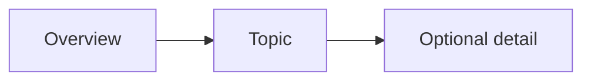

# Mermaid Diagrams

**Purpose:** Express a small relationship or sequence as editable text.

**Portability:** Render-dependent.

## Source

````markdown

````

## Result

Supporting renderers display a three-node flow. The source remains readable if
the renderer is unavailable.


## Reliability

- State the question the graph answers.
- Keep labels short.
- Split large graphs.
- Add a textual explanation.
- Render-check the exact target application.

## Fallback

```text
Overview -> Topic -> Optional detail
```

---

[← Previous](11-images-and-alt-text.md) · [⌂ Home](../markdown-patterns.md) · [Next →](13-mathematical-expressions.md)
