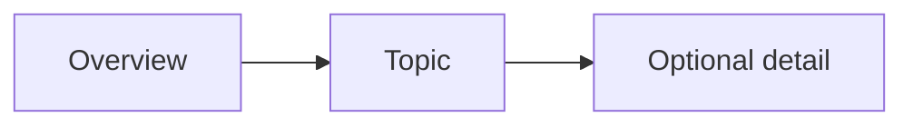

# Mermaid Diagrams

**Purpose:** Express a small relationship or sequence as editable text.

**Portability:** Render-dependent.

**Verification:** Documented for VS Code 1.141 built-in preview and GitHub; the
local built-in renderer is present, but the VS Code visual pass remains pending.
See the [renderer matrix](../markdown-patterns.md#renderer-matrix).

## Source

````markdown

````

## Result

Supporting renderers display a three-node flow. The source remains readable if
the renderer is unavailable.


## Reliability

- State the question the graph answers.
- Keep labels short.
- Compute the review signal `P = max(N / 12, E / 12, L / 8)` and inspect when
  `P > 1`; split only when the exact view is not clear.
- Prefer `TD` when an `LR` graph is too wide.
- Add a textual explanation.
- Render-check the exact target application.

In VS Code, larger diagrams support pan and zoom. On macOS, hold Option while
dragging to pan and use scroll or pinch to zoom. Hover or focus the diagram to
show its controls. Reset the view before judging whether the default layout is
acceptable.

If a graph appears partially visible, inspect the Mermaid preview settings
before changing the graph: an explicit `markdown-mermaid.maxHeight` can create
a bounded viewport, `markdown-mermaid.resizable` controls manual resizing, and
`markdown-mermaid.controls.show` controls when navigation buttons appear.

## Fallback

```text
Overview -> Topic -> Optional detail
```

---

[← Previous](11-images-and-alt-text.md) · [⌂ Home](../markdown-patterns.md) · [Next →](13-mathematical-expressions.md)
