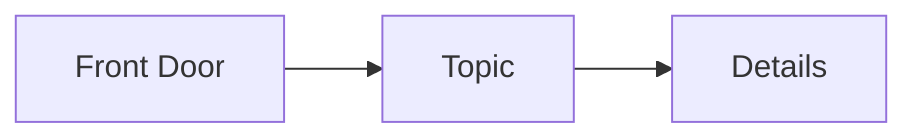
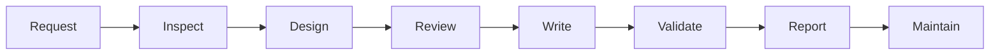
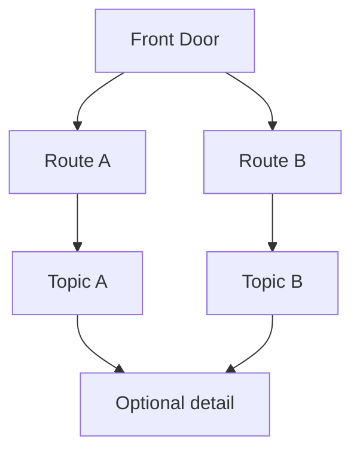

# Renderer Verification Fixture

**Purpose:** Recheck renderer-dependent patterns after a VS Code, GitHub, KaTeX,
MathJax, or Mermaid upgrade.

**Portability:** Mixed test fixture; not a content template.

Record the target, version, date, and observation in the
[renderer matrix](../markdown-patterns.md#renderer-matrix). A screenshot or
official documentation alone does not replace checking this exact source.

## Small Mermaid

Text fallback: Front Door leads to Topic; Topic leads to Details.

## Wide Mermaid

Text fallback: request → inspect → design → review → write → validate → report
→ maintain. This reaches the eight-node left-to-right review threshold.

## Tall Mermaid

Text fallback: the Front Door selects one of two routes; both may reach the
optional detail.

## Mathematics

Inline energy relation: $E = mc^2$.

Display power rule:

$$
\frac{d}{dx}x^n = n x^{n-1}
$$

Aligned derivation:

$$
\begin{aligned}
f(x) &= x^2, \\
f'(x) &= 2x.
\end{aligned}
$$

Text fallback: energy equals mass times the speed of light squared; the
derivative of `x^n` is `n x^(n-1)`; the derivative of `x^2` is `2x`.

## Progressive and platform-specific patterns

Expand the observed details fixture

The details body contains **bold text**, a [local link](12-mermaid-diagrams.md),
and inline code `rendered`.

> [!WARNING]
> The warning remains explicit even when special alert styling is unavailable.

- [x] Small Mermaid checked.
- [x] Display mathematics checked.
- [ ] Recheck after the next renderer upgrade.

## Inspection record

| target | version | observed checks | date |
|---|---|---|---|
| VS Code built-in preview | 1.141 | built-in Mermaid and KaTeX confirmed; visual observation blocked by computer-use permission | 2026-10-08 |
| GitHub Markdown | current hosted renderer | official documentation checked; hosted render/API observation pending | 2026-10-08 |
| Obsidian | untested | not in baseline | — |

---

[← Previous](19-editable-svg-diagrams.md) · [⌂ Home](../markdown-patterns.md)
