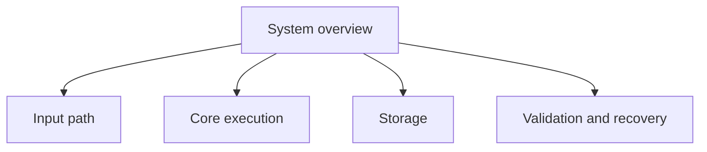

# Visual Patterns

## In brief

Use a visual only when it makes a relationship, sequence, hierarchy, comparison,
or state change materially easier to understand. Preserve the essential meaning
as text or a compact mapping.

## Select by reader question

| question | useful form |
|---|---|
| What happens next? | flowchart or numbered sequence |
| Who communicates? | sequence diagram or interaction table |
| What depends on what? | dependency graph |
| What states can occur? | state diagram |
| How are items grouped? | tree or component map |
| How do alternatives compare? | table |

For a nontrivial multi-file Front Door, provide one orientation view, but let a
route list, table, file tree, or text flow replace a diagram when clearer.

Treat 12 nodes, 12 edges, or 8 left-to-right nodes as review thresholds, not
failure limits. Renderer, label length, and crossings matter more than counts.
Every renderer-dependent visual needs an exact render check and textual fallback.

## Details

### Large-graph decomposition



Each child may link to a smaller diagram. Do not create one graph containing
every repository file or concept.

### Mermaid rules

- State one principal question before the diagram.
- Use short labels and ordinary shapes first.
- Label non-obvious edges.
- Keep normal Markdown links underneath interactive nodes.
- Avoid styling required to understand the meaning.
- Preserve Mermaid source when exporting a static asset.

See the [Mermaid example](formatting-examples/12-mermaid-diagrams.md).

### Fit-pressure heuristic

Let `N` be the number of nodes, `E` the number of edges, and `L` the number of
nodes on the longest left-to-right route. Use

```text
P = max(N / 12, E / 12, L / 8)
```

as a review signal. `P <= 1` is normally comfortable; `P > 1` means inspect the
exact preview and consider shorter labels, top-to-bottom orientation, or an
overview plus focused diagrams. This is not a validity score: crossings,
long labels, sequence-diagram padding, and a narrow pane can make a smaller
graph harder to read.

For the rendered result, let `A = width / height`. If a diagram has `A > 2` in
the normal side-by-side preview, first try `TD`; if that obscures the logic,
split the graph. Do not shrink text merely to force a fit.

### VS Code inspection loop

1. Open preview to the side and check the diagram at normal zoom.
2. Check a narrow editor group and both light and dark themes.
3. For large diagrams, use the built-in controls: Option-drag to pan, scroll or
   pinch to zoom, and reset before judging the default view.
4. If the viewport clips the graph, inspect `markdown-mermaid.maxHeight`,
   `markdown-mermaid.resizable`, and `markdown-mermaid.controls.show` before
   rewriting the source. VS Code 1.141 defaults to no maximum height, resizing
   enabled, and controls on hover or focus.
5. Confirm that no label is clipped and the text fallback states the same
   relationships.
6. Record target, version, source, result, fallback, and date in the renderer
   matrix.

### Textual fallback

After a diagram, provide a short explanation, relationship list, or table with
the essential meaning. A visual cannot become the only copy of a constraint,
warning, or conclusion.

### Mathematics

Equation syntax is renderer-dependent. Test inline and display forms in the
actual target before selecting a house style. Until then, keep copyable LaTeX
in a fenced block and state its meaning in text. See
[Mathematical expressions](formatting-examples/13-mathematical-expressions.md).

---

[← Previous](markdown-patterns.md) · [⌂ Home](../INDEX.md) · [Next →](validation.md)
