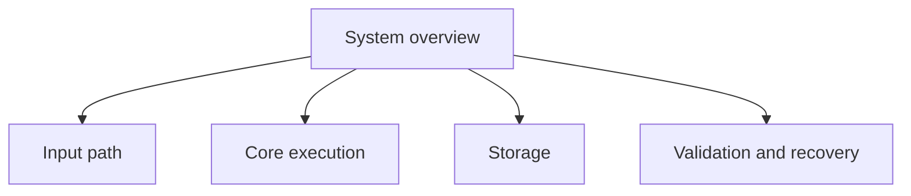

# Visual Patterns

## In brief

Use a visual only when it makes a relationship, sequence, hierarchy, or state
change materially easier to understand. Every important visual needs a textual
description or mapping.

## Select by reader question

| question | useful form |
|---|---|
| What happens next? | flowchart |
| Who communicates with whom? | sequence diagram |
| What depends on what? | dependency graph |
| What states can occur? | state diagram |
| How are items grouped? | tree or component diagram |
| How do concepts build on one another? | prerequisite graph |
| How do alternatives compare? | table |

Prefer a table or short list when it communicates the relationship more
directly than a diagram.

## Reliability budget

Treat 12 nodes, 12 edges, or 8 left-to-right nodes as a review threshold, not
a universal failure limit. Above the threshold, ask whether an overview plus
focused diagrams would be clearer. Renderer, label length, and edge crossings
matter more than raw counts.

## Large-graph decomposition

Each child can link to a smaller diagram. Do not create one graph containing
every repository file or concept.

## Mermaid rules

- State one principal question before the diagram.
- Use short node labels and ordinary shapes first.
- Label edges when the relationship is not obvious.
- Keep normal Markdown links underneath interactive nodes.
- Avoid styling that is required to understand the meaning.
- Render-check the exact source in every claimed target environment.
- Preserve the Mermaid source if a static SVG or image is generated.

See the small [Mermaid example](formatting-examples/12-mermaid-diagrams.md).

## Textual fallback

After a diagram, provide either a short explanation, a relationship list, or a
table containing the essential meaning. A diagram may summarize the text; it
must not become the only copy of a constraint, warning, or conclusion.

## Mathematics

Equation syntax is renderer-dependent. The protocol must test inline and
display forms in the actual renderer before selecting a house style. Until
that test is complete, keep LaTeX source in a fenced block and state the
equation's meaning in text. See [Mathematical expressions](formatting-examples/13-mathematical-expressions.md).
