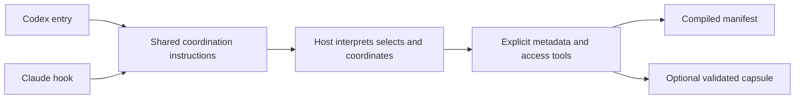

# Shared model-led runtime

The Skills Orchestrator is the host model following [[orchestrator/runtime/skills-orchestrator/SKILL|its core instructions]]. It owns semantic selection, modes, composition, methods, conflict handling and evidence judgment; it is not counted as a skill.

| need | read |
|---|---|
| instructions: controls, loading, composition, recovery, management | [[orchestrator/runtime/skills-orchestrator/INDEX]] |
| commands, flags and response shapes | [[orchestrator/runtime/API_CONTRACT]] |
| which layer owns what: shared Python, Codex, Claude | [[orchestrator/runtime/PROTOCOL]] |
| actual phase and host acceptance status | [[orchestrator/runtime/skills-orchestrator/BUILD]] |
| interaction package | [[skills/interaction-protocol/README]] |

Metadata flows from registry sources through `compile_registry.py` into the manifest. `orchestrate.py discover` exposes bounded pages without candidate bodies. The host chooses an exact capability and loads it explicitly, then reads required support. The smallest sufficient compatible set may include multiple capabilities.

`orchestrator/runtime/SKILL.md` is only the Codex install header, not the entry: the installer renders it together with the complete core (`core_text` in `model_context.py` removes the core's front matter and Home footer) and the source identity. Claude delivers the same core at session lifecycle events and only changed sections on continuation. `orchestrate.py context` assembles the core and bounded metadata without receiving prompts, and no background service or copied skill bodies are required. Generated repository entries (`AGENTS.md`, `CLAUDE.md`) keep the maintenance and search rules and point to the core.

`model_context.py` handles metadata and exact reads; `orchestration_state.py` handles explicit, artifact-bound checkpoints. Existing project-context and ticket tools remain separate bounded services. Stored commands and receipts confer no authority. Unit tests and byte identities do not establish semantic or scientific certification.

## Details



Codex owns Codex invocation and session cleanup. Claude owns hook input, timeouts,
child-process cleanup, installation and Claude live acceptance. Skills AI packages are
not installed as native Claude skills: a copy under `~/.claude/skills/` would be loaded by
Claude Code itself and skip the orchestrator, so the Claude installer check reports it,
standalone package clones included. Neither platform duplicates package triggers,
capability selection, project context validation or interaction rules. The adapters
deliver the shared entry and bounded metadata; the host interprets management requests,
selects task capabilities and loads their complete entries through the explicit access
tools. Settings, permissions and transport remain each host's responsibility, and shared
runtime checks and platform lifecycle checks establish different parts of that behavior.

```bash
python3 orchestrator/tools/orchestrate.py context --format json --project-root /absolute/project
python3 orchestrator/tools/orchestrate.py discover --format text
python3 orchestrator/tools/orchestrate.py load --capability theory-reference
```

Context assembly receives no task prose. It reads the fixed core and registry metadata,
and may inspect only the exact project capsule. The delivered core is the entry without
its front matter and Home footer; the Claude hook, the Codex installer and the size
measurement all use the same extraction. Discovery reads no candidate bodies; loading
returns complete explicitly selected entries and content identities. Invalid access
returns a structured error, and optional hook failures do not erase required obligations.
Both hosts interpret the same use/mode controls and render the same bullet task receipt;
if equivalent native fields are already visible, add only the missing ones. The hook
supplies instructions and does not construct a semantic receipt from the prompt.

Generated `AGENTS.md` and `CLAUDE.md` come from one shared source plus one small platform
overlay. Repository context is resolved on demand with bounded native file search, and
generated entries do not preserve externally appended tool blocks. Generated references
come from the documentation model, the registry and the repository contract; all are
projections of current declared sources, not canonical edit targets, and deleted files
and archived workspaces do not become available capabilities.

The project capsule `.skills-ai/project.json` lives inside the project being worked on and
stores approved stable context. Repository `.runtime/` holds ignored local diagnostic and
recovery data and is never selection authority. Neither is a skill source.
