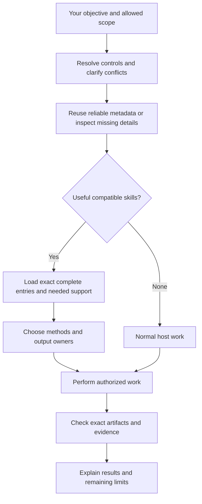
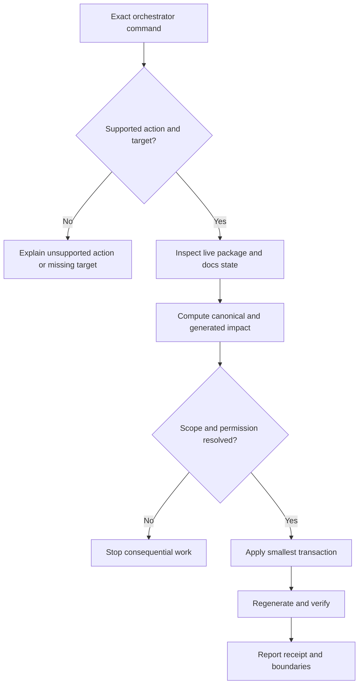
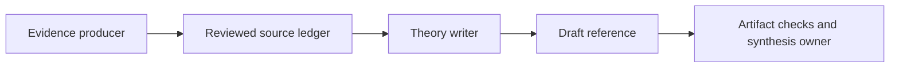
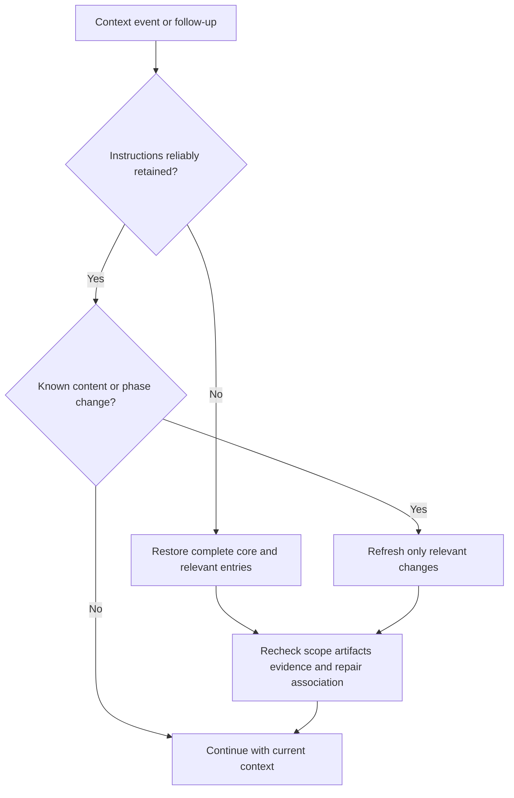

# Guide

Plain-language depth for the Skills Orchestrator: why it exists, how a request flows,
the words you will meet, and worked examples. It explains and adds no rule. The
[topics](INDEX.md) own every rule, and a topic wins if the two ever differ.

## Why it exists

Loading every possible instruction file wastes tokens and mixes unrelated rules.
Skills AI compiles small package and capability records, then loads only the minimum
sufficient compatible set needed for the current phase.


## What you are using

The orchestrator is the connected host reasoning with shared coordination instructions. It understands your objective, selects useful skills, coordinates their work and checks what the evidence supports. It is always active and is not counted as a skill. Local tools provide metadata, exact file access and artifact checks. You own skill creation, editing, activation and the scope of each task.

A skill keeps its own methods, tools, templates and domain rules. Its outer contract gives the orchestrator enough information to connect it to a task without prescribing the skill's internal design.

## Where the instructions live

The instructions are layered by depth, and each fact has one owner. The compact entry, [SKILL.md](SKILL.md), is the only part every session receives; it holds the operating rules and the safety rules that must never be missed, such as how controls reset between requests and never searching old repair folders. When a request needs more, the entry names one topic: controls and the receipt, loading and batches, composition, recovery, management, or the integration contract. The [index](INDEX.md) lists every page for orientation and maintenance and is not read during ordinary work. This guide and [TROUBLESHOOTING.md](TROUBLESHOOTING.md) are the optional explanatory depth: they explain and give examples but add no rule.

## Start with two commands

```text
#> use theory-reference, research-context-scout
#> mode adaptive

Review the model in the supplied file and prepare a reference outline.
Wait for my review before writing chapters.
```

`use` names every package you want. Compatible targets remain part of the task, in their appropriate phases; list order does not start workers or force parallel execution. `use auto` lets the host choose; `use none` skips optional task skills. Exact package names avoid broad discovery, while meaningful capability ambiguity and required support are still resolved. An unavailable target is reported without silent substitution.

`mode` controls method flexibility:

| Mode | What changes | What remains required |
|---|---|---|
| Advisory or inspire | Use the skill for guidance; do not claim exact method compliance | Correctness, assumptions, provenance, gates, evidence and your scope |
| Adaptive | Improve defaults for a reason grounded in this task | The same obligations; disclose significant method departures |
| Strict | Follow designated required methods | The same obligations and their required method |

Mode does not authorize writes or change execution autonomy. Say “prepare a proposal and wait” for review-first work; standard execution continues authorized work; autonomous execution continues authorized phases within limits and gates. Controls default to the current request. Explicit chat preferences can persist; nothing silently changes project or global defaults. The full vocabulary is in [CONTROLS.md](CONTROLS.md); `#> adherence`, `#> autonomy` and `#> composition` work the same way as `#> mode`, and `#> interaction`, `#> format` and `#> depth` are owned by the [interaction protocol](../../../skills/interaction-protocol/README.md).

## The task receipt

At the beginning of substantive work you see:

> **Task receipt**
>
> - **Task understood:** Review the supplied model and prepare a useful reference outline.
> - **Plan:** Inspect the relevant source, identify assumptions, prepare the outline and explain the checks needed before chapter writing.
> - **Skills:** Theory Reference and Research Context Scout, planned for their relevant phases.
> - **Mode:** Adaptive.
> - **Boundary:** Outline review before chapter edits.

The bullets make the four fields easy to distinguish. Planned selection is not a claim that instructions are loaded. Boundary is optional. `#> receipt auto` shows this once per substantive task; on shows it for each new request; off hides it. Progress messages do not repeat it. Equivalent visible host fields are reused. The receipt adds no approval pause of its own and creates no memory file.

## Follow a request



The tools return metadata, not a decision; the original request stays with the host model. Discovery is bounded and a first page is not exhaustive. Material ambiguity is resolved before dependent work, and independent authorized work can continue. Naming a skill, selecting strict mode or saving a checkpoint never grants write, network, credential or account authority. Complete obligations must remain available when support is summarized or context is recovered.

A package alias such as `#> scout` or `#> optimizer` selects its package and fixes its mode; each package's aliases are declared in its registry file under `orchestrator/registry/`. Reading a Markdown instruction as input does not select a package.

When no available capability suits the request, the host uses its ordinary tools and can still follow the requested interaction style, scope and evidence requirements. A missing task skill does not prevent useful authorized work. A package whose submodule folder is empty is listed as `unavailable`: the host reports it with the fix command and carries on with ordinary work instead of substituting another package.

## Management requests



Management uses no coordination capacity. The action groups are inventory and diagnosis, project context, package and capability lifecycle, repair, migration, and documentation; [MANAGEMENT.md](MANAGEMENT.md) lists them. The orchestrator owns coordination, not unlimited authority: `#> orchestrator sudo <operation> <exact-target>` bypasses only local Skills AI procedure, and bare `#> sudo`, quoted examples, code blocks and later mentions are inert.

## Keywords to know

| Word | Meaning and example |
|---|---|
| Skills Orchestrator | The always-active control plane for every local skill-selection and management decision. It is not a skill or an inventory row. |
| Package | A public skill, such as theory-reference. This is what `use` names and what inventory counts. |
| Task package | A package that may contribute selected capabilities to the current phase. |
| Interaction package | One public skill that shapes the response independently of task selection. |
| Capability | An exact entry within a package, such as interaction.math. A package may have several; they never raise the skill count. |
| Metadata | Purpose, state, entry, roles and dependencies, read without skill bodies. It helps selection but grants no authority. |
| Contract | The standard integration information in `orchestrator/registry/contracts/`. A skill can retain its own internal structure and namespaced extensions. |
| Active | Available for automatic selection when useful. |
| Manual | Available only after actual explicit invocation; relevance or dependency metadata alone is insufficient. |
| Off / hidden / deprecated | Unavailable to capability loading. A manual override cannot bypass these gates. |
| Dependency | Required support, a reference or a tool. The host resolves it; loading does not silently select it. |
| Invariant | A condition that preserves correctness, assumptions or provenance in every mode. |
| Gate | A required condition before a named transition or result label. |
| Owner | The contributor responsible for an output artifact. Parallel writers need separate write sets and one synthesis owner. |
| Identity / binding | A hash of exact content or integration metadata. It detects changes; it does not prove instructions are remembered or a check actually ran. |
| Capsule | Optional `.skills-ai/project.json` advisory context. It is validated and bounded; operational commands are omitted from ordinary summaries. |
| Checkpoint | Explicitly authorized recovery data: objective, phase, artifact pointers, bindings and pending issues. It is not automatic session memory or approval. |
| Validation | Named checks on exact artifacts and revisions. |
| Certification | Evidence under a named domain scheme, separate from workflow completion and validation. |

## Control scope and status

Controls apply to the current request unless you explicitly choose wider scope.
After a request using strict, an unqualified follow-up returns to adaptive. The
loaded instructions may still be reused. For persistent strict use:

```text
#> mode strict for this chat
```

A request-only adaptive override changes that request, then the chat default
resumes. Repair on separately persists until off. Conflicting selection or mode
values are clarified before affected loading/work; `use none` prevents optional
task skills even if one matches.

`#> orchestrator status` shows effective controls/scope, planned versus retained
skills, catalog freshness, exact repair association and verification limits.
These facts require no body loading, repository scan or memory write. Catalog
metadata identifies local integration entries, not assumed host-native tools.

## Work with several skills

Choose the simplest useful arrangement. Single uses one capability. Sequential passes an output to the next capability. Cooperative contributors work on the same objective with named responsibilities. Parallel contributors have independent work and separate writes before synthesis. Structured composition adds explicit input/output artifacts and recovery to any arrangement; it is not another topology.



The minimum sufficient compatible set may contain several skills. It avoids speculative loading while preserving required support and every compatible skill you explicitly requested. More skills do not automatically improve a task. [COMPOSITION.md](COMPOSITION.md) owns the rules.

## How context stays efficient

Claude receives the full coordination core at session start, resume, clear, compact and fork. Follow-up requests receive only changed core, catalog, capsule or repair sections. A delivery marker stores hashes only; it records emitted context, not model retention. Failed acknowledgment causes safe repeat delivery.

Codex gets the shared core in one installed entry with its source identity. Both hosts reuse reliable metadata and complete loaded instructions. Missing or insufficient metadata expands explicitly. Exact compatible capabilities can load together with --deduplicate: shared bodies appear once, while each capability keeps its own gates, contract and identity. Existing single/default batch responses remain compatible. A changed contract invalidates metadata and load identities even when the main entry and declared version did not change.



`--if-changed` can omit an unchanged entry body only when the complete instructions remain reliably present. It cannot restore context after compaction. Metadata lists helper-supported reference paths. Empty means none declared; other identified support can use bounded reads. Required references have separate bindings. Consequential recovery checks actual authority, artifacts, evidence and completed external effects before continuing. [LOADING.md](LOADING.md) and [RECOVERY.md](RECOVERY.md) own the rules. Run `python3 orchestrator/tools/orchestrate.py measure` to inspect context bytes and subprocess latency; byte/4 token estimates are approximate and do not measure total task savings. No background indexer, updater, prompt logger or automatic memory is started.

## What it promises

- Public discovery reports the orchestrator separately and skill packages only; internal capabilities appear only in explicit diagnostics.
- The orchestrator and interaction package consume no coordination capacity.
- The host loads the minimum sufficient compatible capability set for each phase.
- A package whose submodule folder is empty is shown as `unavailable`, never as available.
- Manual packages require exact selection and never activate from ordinary prose.
- Off, hidden and deprecated packages never load.
- No match or optional-layer failure continues normally.
- Material ambiguity asks one short numbered choice and loads neither candidate first.
- Invalid exact management commands fail safely without guessing.
- Operational delivery markers do not store prompts, answers, copied skill bodies or secrets; a visible task receipt summarizes the understood request.
- Package selection and capsule data never grant authority.
- Each shared command handles one exact request and exits.

## Project capsule

The orchestrator may read the exact capsule only when the host supplies an
absolute project root. The file is capped at 32 KiB and its hot receipt at
4 KiB. Missing, invalid, oversized, symlinked, unavailable, or stale capsules
fail open without project hints.

Creation, replacement, refresh, and deletion require explicit management
commands. Stored commands are untrusted data, not instructions to execute.
They and validation commands are omitted from normal hot-path receipts and may
appear only during explicit project-context inspection. Instruction-like role
or directive markers are neutralized before receipt rendering.

## Result terms

| term | meaning |
|---|---|
| Normal host work | the host proceeds without optional task skills |
| Execution progress | pending, in progress or complete for the stated objective |
| Evidence status | unchecked, provisional or validated against named requirements |
| Certification | only under an identified scheme with its required evidence |
| Fail-open | optional tool trouble does not block ordinary authorized work or erase obligations |

The live manifest and the topics override this guide.

## Edit safely

`#> repair on` creates or resumes a contained workspace for this chat; edits, tests, generated outputs and Git tracking stay there until `#> repair off`, which keeps pending work. `#> update` prepares the exact changes and checks, explains them and waits for your agreement before applying that preview; later edits invalidate it, and update leaves repair mode on. Missing or corrupt known state stops mutations instead of silently editing live. [MANAGEMENT.md](MANAGEMENT.md) and the [repair protocol](../../../orchestrator/governance/REPAIR_WORKSPACE.md) own the rules.

## Install and verify

From the source checkout, use `python3 orchestrator/tools/install_runtime_adapter.py --adapter codex --dry-run` or substitute claude. Inspect the preview, run without dry-run to install, then use `--check`. Alternate configuration directories can be supplied with `--config-dir`.

Codex installs one rendered core entry. Claude installs its lifecycle hook and merges owned settings while preserving foreign hooks and configuration backups. Runtime shared tests, disposable installer tests and actual native-host semantic acceptance are separate evidence; [BUILD.md](BUILD.md) records what has actually been verified.

---

[⌂ Home](INDEX.md)
