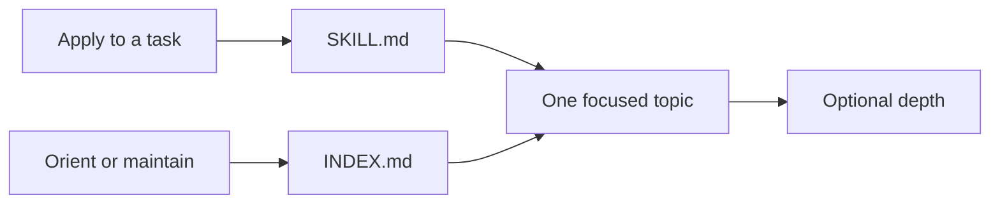

# Skills Orchestrator Index

A route map for understanding and maintaining the Skills Orchestrator's
instructions. Ordinary task work starts and usually ends at
[SKILL.md](SKILL.md), the compact operational entry every session receives; open a
topic only when the entry names it.

## Choose a route

| intention | open |
|---|---|
| Apply the orchestrator to a task | [SKILL.md](SKILL.md) |
| Look up a control, its scope, a conflict rule or the task receipt | [CONTROLS.md](CONTROLS.md) |
| Discover, select, load or reuse skill instructions | [LOADING.md](LOADING.md) |
| Combine several capabilities in one phase | [COMPOSITION.md](COMPOSITION.md) |
| Recover after compaction, resume or a changed revision | [RECOVERY.md](RECOVERY.md) |
| Check status, use repair and update, handle tickets, capsules or the terminal facade | [MANAGEMENT.md](MANAGEMENT.md) |
| Settle responsibilities, rule strengths, result labels or portability | [CONTRACT.md](CONTRACT.md) |
| Build, verify or document a skill package | [BUILD.md](BUILD.md) |
| Find a command or response shape | [API contract](../API_CONTRACT.md) |
| Change any repository file | [Change control](../../../docs/06_CHANGE_CONTROL.md) |
| Commit, tag, push, move a submodule pointer or roll back | [Git governance](../../../orchestrator/governance/GIT_GOVERNANCE.md) |
| Learn the architecture step by step, with examples | [GUIDE.md](GUIDE.md) |
| Diagnose slowness, a stale file or an odd error | [TROUBLESHOOTING.md](TROUBLESHOOTING.md) |

## Orientation

Text version: `SKILL.md` is the compact operational entry, `INDEX.md` is the
navigation map, each topic owns one subject, and [GUIDE.md](GUIDE.md),
[TROUBLESHOOTING.md](TROUBLESHOOTING.md) and the `## Details` blocks are optional
depth that never add a rule.

## Topics

| file | owns | load when |
|---|---|---|
| [SKILL.md](SKILL.md) | authority, operating rules, selection and loading principles, receipt format, topic routes | every session (delivered) |
| [CONTROLS.md](CONTROLS.md) | control vocabulary, defaults, scope and reset, conflicts, aliases, override and sudo, the receipt | an exact control or receipt question |
| [LOADING.md](LOADING.md) | catalog reuse, selection, loading flags, batches, references, retention | loading several skills, references or retention doubts |
| [COMPOSITION.md](COMPOSITION.md) | topologies, artifact owners, handoffs, conflicts | more than one capability in a phase |
| [RECOVERY.md](RECOVERY.md) | recovery order, checkpoints, completed effects | compaction, resume, host transfer or a changed revision |
| [MANAGEMENT.md](MANAGEMENT.md) | management operations, status, repair and update lifecycle, terminal interface | maintenance requests |
| [CONTRACT.md](CONTRACT.md) | responsibilities, package boundary, rule strengths, result labels, portability | integrating a package or settling a rule's force |
| [BUILD.md](BUILD.md) | build phases, verification, package documentation rule, replacement and restoration | building, documenting or verifying |
| [GUIDE.md](GUIDE.md) | depth: why it exists, request flow, vocabulary, examples, promises, capsule, result terms | learning the system; never needed for a rule |
| [TROUBLESHOOTING.md](TROUBLESHOOTING.md) | depth: hot-path loading, measurement, bounds, quick diagnosis | something is slow, stale or failing |

## Maintenance boundaries

- `SKILL.md` is delivered to every session and is held to a byte budget; keep detail
  in the topics.
- Each topic owns the subject named by its title; state a rule in its owner and link
  to it elsewhere.
- Wire formats and flags belong to the [API contract](../API_CONTRACT.md); repository
  procedure belongs to [change control](../../../docs/06_CHANGE_CONTROL.md) and its
  cards.
- The orchestrator is not a skill and is never counted as one. Registry state, graph
  nodes and generated references are projections of these files and never routing
  or permission authority.

---

[⌂ Home](#skills-orchestrator-index)
