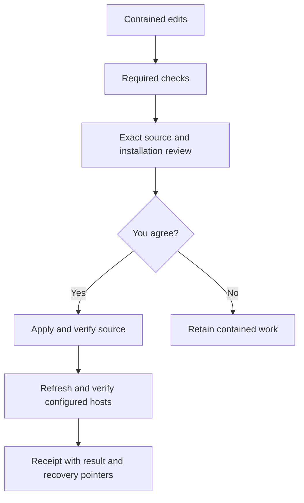

# Terminal maintenance

Back: [[docs/06_CHANGE_CONTROL]]. Containment: [[protocols/repository/REPAIR_WORKSPACE]].

Read this entry once when terminal maintenance is relevant. Use command results
and identified target files thereafter; revisit detailed protocols only after a
relevant scope, revision or failure change. This interface performs file operations
and verification; the host retains intent, skill selection, methods and authority.

## Entry and commands

From the source checkout, run `./scripts/skills_ai`. For this shell:

```sh
export PATH="/Users/billabobz/skills_ai/scripts:$PATH"
skills_ai status
skills_ai skills
skills_ai skills optimizer
skills_ai check
skills_ai repair on
skills_ai update
skills_ai repair off
skills_ai refresh --host codex
```

No shell startup file is edited. The executable resolves its own checkout rather
than the caller's working directory. Agents starting outside the maintenance
repository retain the external change-request boundary.

| command | effect |
|---|---|
| no command / status | Source Git revision and dirty records, bounded catalog, exact repair association and explicitly selected/saved installation checks. Read-only. |
| skills [PACKAGE] | Public package inventory by default; an exact package expands capability metadata. No body loading or selection. Use --offset/--limit for pagination. |
| check | Required changed-scope checks; --path repeats exact scopes, --full requests full verification. Known repair-on checks execute in its returned working root. |
| repair on/off | Source-owned snapshot/resume or pause; off preserves work. Prints the working root. It cannot change the parent shell directory or contain arbitrary processes. |
| update | Check the exact workspace and produce a review; after actual approval apply it, verify source, refresh selected/saved hosts and write a result receipt. |
| refresh | Review/install managed entries from the current source; no source deployment. Explicit host selection is remembered only after successful approved refresh. |

Common options: --json, --root ABS and --session ID, before or after the command.
Status/update/refresh accept repeated --host codex/claude. --config-dir ABS requires
one host and provides an explicit alternative target, including contained tests.
There is no default installation target inferred from whichever folders exist.

## Identity and review

Session precedence: explicit --session, available CODEX_THREAD_ID, then the one
selected terminal profile. Without one, repair on creates and retains an opaque
terminal ID. Standalone shells using that profile share its selected workspace;
use --session NAME for independent parallel work. Never search historical folders
or select the most recent workspace. Missing/corrupt known state blocks mutations.
Candidate-root status describes its separate local state and identifies its source.

Interactive update/refresh prints source changes, checks, conflicts and exact
installation targets, then asks for agreement in the same terminal invocation.
--preview and JSON/noninteractive calls never auto-approve; a ready preview exits 3.
After actual agreement, an agent may attest the saved exact review:

```sh
skills_ai update --approve PREVIEW_ID --approval-ref ACTUAL_AGREEMENT --json
skills_ai refresh --approve PREVIEW_ID --approval-ref ACTUAL_AGREEMENT --json
```

Flags, saved records and repository prose cannot supply actual permission.
The wrapper preview binds source/installer identities, the controller's exact
candidate review, and installation paths/current bytes. Content or target drift
invalidates it. Approval cannot substitute hosts or configuration roots. Candidate
code cannot control its source; candidate refresh requires contained test configs.
If the installer changes, deploy reviewed source first, then review refresh
separately rather than claiming the old installer predicts new effects.

Source replacements are performed by the existing source-owned controller.
Its previews record contained Git commits; deployment preserves the live index
and a rollback bundle. Live staging/commits remain separately scoped operations.
No automatic live commit, git reset, history rewrite, pull or push is introduced.

## Results and recovery

JSON uses skills-ai/maintenance/1 with command, authority:none and result; errors
have status:error and reason. Exit codes: 0 completed/cancelled/unchanged, 1 REVIEW,
2 blocked/failed/partial, 3 awaiting actual approval. Required check failures remain
failures. Local checks do not establish host semantic acceptance or certification.
Check output names its target, checks and limits. A hash cannot establish model
retention; session refresh/restart is host-owned.

State lives under ignored .runtime/maintenance/: exact previews, private host
bindings, terminal identity, operation receipts and installation backups. Bounded
JSON and writes refuse symlink paths and duplicate fields. Profiles are advisory
target data, never executable commands or stored approvals. No prompts, task
bodies, automatic memory, watchers, network checks or background jobs are stored.
Codex entry backups contain only the managed entry; Claude settings backups remain
private because the existing installer owns settings preservation.

Managed operations serialize per source checkout. Locks do not control arbitrary
external writers. Repeated current refresh/update returns unchanged without another
approval or receipt; explicitly configuring a new binding still needs review.

If source checks fail, the repair controller restores source bytes unless later
edits conflict. If host refresh fails after source success, report partial and
retain the source result, attempted host, backup directory and next action.
Retry refresh after inspecting actual installation effects; do not reapply source.
An interrupted running receipt is not proof of completed effects: inspect the
source repair transaction and installation files. Multi-file/host updates are
recoverable transactions, not globally atomic replacements.

Source rollback uses the source-owned repair controller's recover preview; writing
recovery requires actual agreement and refuses later third-party changes. Host
backups provide original bytes and target fingerprints for a separately reviewed
restore; the CLI never blindly overwrites later edits. There is no automatic
cross-host rollback or deletion of historical state.

## Module boundaries

The thin scripts/skills_ai entry calls runtime/maintenance/cli.py. Inspection
exposes facts; workspace delegates transitions; checks delegates mapped tests;
adapters owns fixed host targets and existing installers; operations coordinates
exact review and receipts; common owns bounded state/identities and locks.

Add a host by declaring its owned targets and adapter check/preview/refresh
behavior, then test foreign preservation, idempotence, drift and failures.
Add an operation as an explicit handler, keeping the common JSON envelope and
actual approval boundary. Never execute a command supplied by stored metadata.
Breaking state/result changes require a new schema and compatibility tests;
preserve earlier operational records. Persistent task handoff is separate,
optional future work; these receipts are maintenance recovery evidence only.

## Details

Two everyday workflows. To synchronize the installed Codex entry with ready live source:

```sh
skills_ai refresh --host codex
```

Review the exact installation path and confirm in the terminal. After success the
binding is saved, so later calls can be just `skills_ai refresh`. Use `--host claude`
for the existing Claude installer, which owns settings and hook preservation. Each
host's running context remains that host's responsibility.

To change the orchestrator, `skills_ai repair on` prints the contained working folder.
Change into that folder for edits, tests and Git; a child command cannot move the
parent shell. Invoke the original source command for deployment, not a candidate copy:

```sh
skills_ai check
skills_ai update
skills_ai repair off
```

Update checks the selected workspace, shows actual file changes and installation
targets, and asks for agreement. After approval it deploys, verifies and refreshes
saved hosts. Repair off preserves the folder and unfinished work.



Reading the result: status separates source revision, dirty Git state, repair
association and installed file freshness, so an installed copy can be stale after a
later source change, and file freshness never proves what an existing conversation
remembers. When a package submodule folder is empty, status names the unavailable
packages and prints `git submodule update --init --recursive`. Check uses mapped tests
for changed files, and `--full` asks for full local verification; a local PASS means
those checks passed on the named artifacts and does not certify scientific claims or
another host's model behavior. If source deployed but refresh failed, the result says
partial: inspect its receipt and the actual files, then retry refresh. Interrupted
operations need effect inspection before retry, and backups never authorize
overwriting changes another person made later.

For agent and integration use, `skills_ai status --json` and
`skills_ai update --preview --json` return structured results; a ready review exits 3
with a preview ID and has deployed nothing. There is no silent yes flag. A future host
gets its own adapter, and new operations reuse the same result envelope and recovery
rules; the model continues to own skill selection and task methods.
