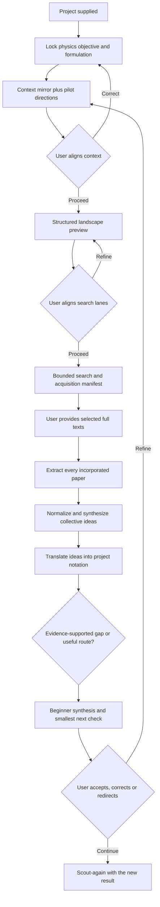
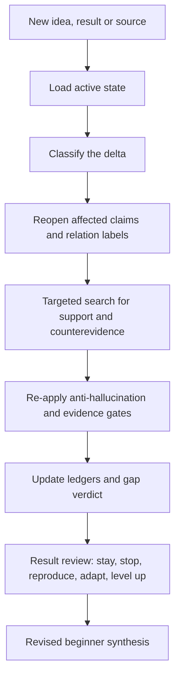
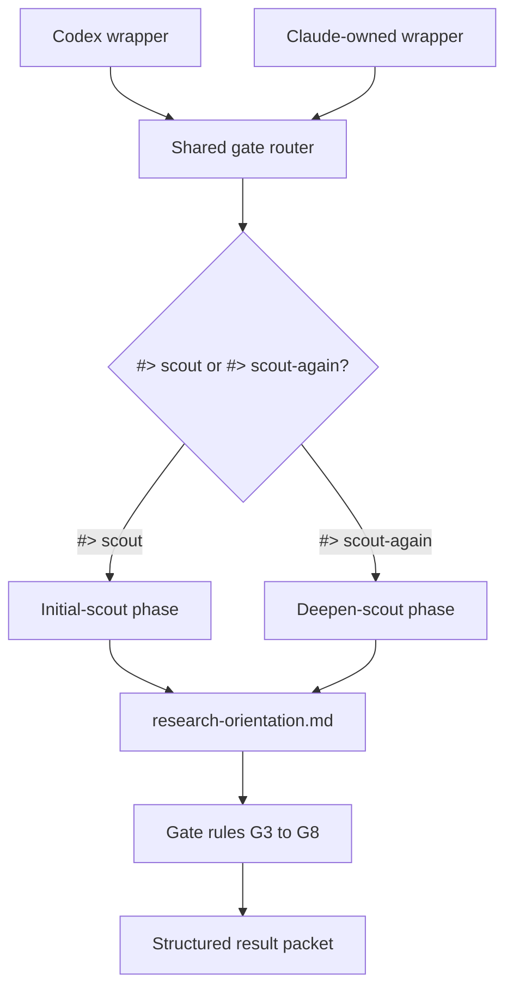
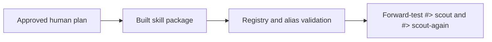

# Research Context Scout — Human Guide

## Status and Document Lifecycle

This plan has been promoted into a routable skill and retained as its
human-facing guide. It explains the design but does not control routing,
permissions or execution.

Runtime files:

- [skill entry](SKILL.md);
- [shared workflow](shared/SKILL.md);
- [gate order and rule loading](shared/gates.md);
- [initial phase](shared/phases/initial-scout.md);
- [deepening phase](shared/phases/deepen-scout.md);
- [math-method lens](shared/phases/math-method-lens.md);
- [record and brief contract](shared/rules/record-and-brief.md);
- [alignment checkpoints](shared/rules/alignment-checkpoints.md);
- [literature acquisition and corpus rule](shared/rules/literature-corpus.md);
- [collective synthesis and report rule](shared/rules/collective-synthesis.md);
- [mode resolution](shared/rules/mode-resolution.md);
- [source status](shared/rules/source-status.md);
- [anti-hallucination rule](shared/rules/anti-hallucination.md);
- [relation taxonomy](shared/rules/relation-taxonomy.md);
- [evidence gate](shared/rules/evidence-gate.md);
- [journal thresholds](shared/rules/journal-thresholds.md);
- [journal level-up tests](shared/rules/journal-level-up.md);
- [record template](shared/templates/research-orientation.md);
- [Codex wrapper](codex/SKILL.md) and
  [Codex record/tool rules](codex/CODEX.md); and
- [Claude integration boundary](claude/CLAUDE.md).

The human page explains the skill. The LLM-facing files execute it. Human prose
never becomes routing or permission authority.

## Details

## Purpose

Behave like an experienced supervisor at the start of a research project, and
answer the question the project actually needs answered first: **is this already
done, and if not, what exactly is left?**

Scout should:

- reconstruct the supplied work and its present evidence;
- lock the physics objective before any method discussion;
- search for work that already achieves that objective;
- show its structured understanding and pilot directions for user alignment
  before broad search;
- present a structured search preview before bounded closure and paper
  acquisition;
- use only locally available, successfully extracted full text in synthesis;
- normalize achievements, models, mechanisms, terminology and equations before
  declaring sources related;
- combine useful ideas across papers and translate them into project notation;
- label each comparison as same/different physics against same/different math;
- keep what is already known strictly separate from what is proposed;
- refuse to call anything a gap until a read source says so;
- set a minimum journal threshold instead of naming an ambitious venue; and
- name the next test most likely to change the decision; and
- render a concise beginner-facing research synthesis without pretending to
  replace the user's expert judgment.

The initial phase is orientation and direction selection. It is not a complete
literature review, proof, simulation campaign, paper draft or research database.

## Core Principle

**Fail closed.** No claim may be stronger than its inspected evidence. If a
source has not been read, a derivation has not been checked, or a search
returned nothing, the claim stays `candidate`, `unknown` or `hypothesis` — it
does not become a research direction.

Two consequences worth stating plainly:

- **Absence of results is not a gap.** "Nothing found" records an
  `existing-work verdict: unknown` together with the lanes searched and not
  searched. It never promotes a direction.
- **Abstracts do not settle anything.** Titles, snippets and abstracts nominate
  candidates. Only a read source supports a claim about what that source
  achieves.

User-owned intent is asked for and recorded. Literature, applications and
comparisons are discovered by the skill, not requested from the user. Missing
technical values may receive clearly labelled defaults when different choices do
not change the research direction.

There is no required paper count, suggestion count or fixed search depth.

## Commands

### Start a new project

```text
#> scout <project-path> [focus]
```

Examples:

```text
#> scout /path/to/project
#> scout /path/to/project theory
#> scout /path/to/project applications
#> scout /path/to/project "focus on controllability and paper value"
```

The optional focus may be `theory`, `numerics`, `physical`, `applications`,
`paper` or free-form text. Without a focus, use a balanced assessment.

### Continue after new information

```text
#> scout-again <project-or-record-path> [new-information-paths...] [focus]
```

Examples:

```text
#> scout-again /path/to/project
#> scout-again /path/to/project new_derivation.tex
#> scout-again /path/to/project results.md figure2.pdf
#> scout-again /path/to/project "investigate the new entropy-transfer idea"
```

In deepening mode, the supplied focus narrows lane selection and the checks
applied to the new information. When the first path is
`research-orientation.md`, its parent directory is the project root.

Both commands operate on the same project-owned interaction record. The
commands may create or update only that declared record as part of the named
workflow. Research drafts, code, calculations, results and figures remain
read-only unless the user separately authorizes changes.

The routed receipt states this as
`access=write-scoped:research-orientation.md` and uses a supervisor-brief output
shape. It does not make all Scout work use the global math interaction mode;
the evidence gate requests equations or other formal checks only when the
claim needs them.

The orchestrator catalog lists these aliases with their modes: `#> scout` means
`initial` and `#> scout-again` means `deepen`. Presentation controls such as
`#> depth detailed` or `#> interaction math` may precede them. Directive
keywords are case-insensitive and require at least one space after `#>`. A
first alias argument beginning with `-` is rejected as malformed, so
`#> scout -again ...` cannot silently become an initial run. Quoted examples,
code blocks, later prose mentions and words such as “scouting” do not activate
the skill.

`#> use research-context-scout` or an exact request to use this skill also
invokes it; without an alias, `shared/rules/mode-resolution.md` picks the mode
from record presence. In every form, record completeness wins over invocation
intent: when the user answers exist but the physics objective,
existing-understanding ledger, relation map or gap verdict is empty, the
workflow runs initial Cycle B before delta-based deepening.

`#> use none` opts out of task skills. `#> override <instruction>` keeps its
higher-priority local-protocol override and does not activate this skill.

## Overall Workflow



## The Gate Ladder

The shared workflow runs eleven gates in order and stops at the first one whose
missing information would change the decision.

| Gate | Output |
|---|---|
| G0 | input lock — exact problem, target path, focus, assumptions |
| G1 | physics objective — system, operation, observable, success metric |
| G2 | math formulation — state, controls/variables, constraints, objective |
| G2A | context alignment — context mirror, pilot directions and user state |
| G3 | landscape preview — structured clusters, recent synthesis and candidates |
| G3A | bounded closure — search boundary, acquisition manifest and corpus plan |
| G4 | corpus extraction — every incorporated paper extracted, decisive sources deep-read |
| G5 | relation map — normalized achievement/model/mechanism plus physics-math relation |
| G6 | existing vs new ledger — known results separated from proposals |
| G6A | collective synthesis — useful ideas translated into project notation |
| G7 | gap predicate — real gap, why it matters, falsifier |
| G8 | journal ladder — minimum target and level-up conditions |
| G9 | next test — smallest derivation, source check, benchmark or simulation |
| G10 | result review — stay, stop, reproduce, adapt, or level up |

Each gate also carries a **stop if** condition. Pending context or search
alignment stops further research; missing or failed full text stops synthesis;
and `same-physics-same-math` stops the new-direction branch without preventing
the user from receiving a clear evidence-backed report.

The record stores the tier and search budget, which lanes were searched and which
were not, the source reads used, the highest gate reached, and the gate and
reason whenever a cycle stops early. Gate IDs appear beside the matching steps in
the phase files, so an interrupted run can be resumed at the right place.

## 1. Begin With the Project

Inspect the supplied material before searching broadly. Inputs may include TeX
or Markdown drafts, equations and derivations, code and numerical results,
figures or experimental observations, research notes, PDFs, or a verbal problem
statement.

Identify:

- the central problem and intended achievement;
- existing derivations, implementations, simulations or results;
- important assumptions and constraints;
- model, notation or consistency errors;
- limitations, missing evidence and unresolved questions; and
- the decision presently blocking useful progress.

Do not begin with a broad paper search before understanding the project. Do not
edit supplied research artifacts during orientation.

## 2. Lock the Physics Objective Before the Method

This is the change that separates orientation from restating what is already in
the folder. Before any discussion of technique, record:

- the operation or phenomenon;
- the physical system and regime;
- the measurable success criterion; and
- the target consumer, or the reason the result matters.

Only then extract the mathematical formulation, and only as far as needed to
compare assumptions: state, controls or variables, objective, constraints and
evidence.

Method families may be recorded, but a familiar method is not a research
direction and does not establish direction quality.

## 3. Use Recorded Alignment Cycles

When the project workflow authorizes its declared record, create or update
exactly one file in the project root:

```text
research-orientation.md
```

The record contains:

```markdown
# Research Orientation

## Active project state
## Input lock
## Literature search boundary
## Paper acquisition and corpus coverage
## Existing understanding ledger
## Physics-math relation map
## Terminology and symbol mappings
## New direction ledger
## Claim and evidence ledger
## Collective mathematical ideas
## Project-notation translations
## Paper directions
## Beginner research synthesis
## Optional math method lens
## Superseded conclusions

## Interaction cycle N

### Agent questions
### User responses
### Agent interpretation
### Work performed
### Evidence and uncertainties
### Next questions or decision
```

Rules:

- preserve user-written answers exactly;
- append cycle `N` as one more than the highest existing cycle number and add a
  fresh protected response-marker pair when another answer is required;
- ask only one to three questions per cycle;
- ask only when different answers would materially change the investigation;
- do not ask the user to supply applications or literature the skill can find;
- record reasonable defaults when the user does not care about technical
  choices;
- update the compact active state instead of duplicating earlier analysis;
- consult older cycles only when a changed assumption requires them; and
- stop cycling once the objective, orientation, strongest direction and next
  validation are clear.

Four alignment states make the interaction visible: context, search, corpus
readiness and interpretation. A packet shows what Scout understands, inspected
evidence, pilot findings, assumptions, what may change and the proposed next
action. The user may confirm, correct, add, remove, prioritize or defer. A
correction reopens every dependent search lane, mapping and conclusion.

## 4. Classify the State of the Work

| State | Meaning |
|---|---|
| established | demonstrated by supplied or independently verified evidence |
| supported | evidence exists, but verification remains incomplete |
| claimed | stated without enough evidence |
| proposed | formal hypothesis or future direction |
| contradicted | conflicts with a derivation, result or reliable source |
| unknown | cannot yet be determined |

Also record provenance as `supplied`, `derived`, `literature`, `user answer`,
`assumed` or `unknown`.

## 5. Align, Then Search for What Already Achieves the Objective

After G2, the cheapest pilot query exposes plausible vocabulary, achievements
and search lanes. Scout places those provisional findings beside the context
mirror and waits for user alignment. It then returns a structured landscape
preview and waits again before bounded closure. Pilot findings remain
`search-candidate`; they do not settle the project.

Only if that does not settle it do the other lanes open, in this order and within
the tier budget:

1. the same enabling mechanism;
2. the same mathematical structure;
3. nearby realizations;
4. downstream applications; and
5. bounds and no-go results.

The aligned search then uses the same objective, mechanism, mathematical
structure, realization, application and bound/no-go lanes. The tier is set at
G1 and caps pilot, preview and closure together:

| Tier | Problem | Query lanes | Source reads |
|---|---|---|---|
| T1 | known technique applied to a standard setting | 1 | 3 |
| T2 | extension of a published result | 3 | 8 |
| T3 | open or contested question | 5 | 15 plus citation closure |

If the budget runs out before the orientation is clear, the record says
`existing-work verdict: unknown` and names the lanes that were not searched. **An
exhausted budget is a search state, never a gap** — the same rule that makes an
empty search safe.

Do not search only by the project's own vocabulary. Prefer primary sources and
current work together with canonical results. Start from the newest credible
review, update it with primary results after its cutoff, and retain seminal work
when it is the actual source of a theorem, model or mechanism. Age alone does
not prove obsolescence. Label preprints, analogies and transferred methods
accurately.

## 6. Label the Relation: Physics vs Math

Every serious source gets one primary label. The label, not the wording of the
abstract, decides what happens next.

| Label | Meaning | Default action |
|---|---|---|
| `same-physics-same-math` | same objective and essentially the same formulation | existing result: reproduce, benchmark, cite, or stop |
| `same-physics-different-math` | same objective, different method or proof route | possible new route; test whether it improves something measurable |
| `different-physics-same-math` | similar equations, different objective or system | transfer candidate only; prove the physical mapping |
| `different-physics-different-math` | neither is close | background only |

Secondary labels refine a primary one: `same-mechanism`, `same-application`,
`loose-analogy`, `stronger-assumptions`, `weaker-assumptions` and
`no-go-or-bound`.

Same mathematics does not prove the same physics. Same physics with different
math is often the useful case — but only if it improves a measurable quantity or
clarifies a real limitation.

Before choosing a label, normalize the project's and source's achievement,
model and mechanism. An equivalence under a coordinate, frame, limit or
assumption change needs that explicit map. Different terminology may hide the
same achievement; shared vocabulary may hide incompatible physics.

## 7. Keep Two Ledgers

The **existing understanding ledger** records, per source: the physics already
achieved, the method and assumptions, the result strength and limits, and which
project claim it already settles.

The **new direction ledger** records: the proposed difference from existing
work, why that difference is not already settled, its physical importance, the
required evidence, the first falsifier and the next test.

A source result cannot enter the new direction ledger until the existing
understanding ledger states what that source already achieved. This is what
stops a known result from being re-presented as novelty.

## 8. Source Status Before Evidence

Every literature-derived statement carries one status, and the status caps what
the statement may be used for.

| Status | Meaning | Allowed use |
|---|---|---|
| `search-candidate` | title, snippet or metadata only | candidate list only |
| `abstract-only` | abstract inspected, no methods or results check | weak context only |
| `source-read` | paper, PDF or full text inspected | evidence for a stated claim |
| `equation-checked` | relevant equations and assumptions compared | math relation evidence |
| `result-verified` | derivation, benchmark or numerical claim independently checked | strong project evidence |

Novelty, feasibility, optimality and journal suitability are never inferred from
metadata, citation count, search rank or shared terminology.

## 8A. Acquire And Extract the Corpus

Scout records a bounded search: query families, sources searched, cutoff,
backward/forward citation closure, inclusion and exclusion rules, inaccessible
sources, unsearched regions and stopping condition. It does not claim to find
all papers globally.

The acquisition manifest gives each selected paper a canonical identity and
version, source role, relation hypothesis, stable landing page, full-text
availability, priority and local state. Scout checks the reference library
first, then presents the manifest once; record-only authority does not allow
automatic downloads, so acquisition waits for a single confirmation covering the
whole manifest. A library that answers "not held" means the paper is absent and
should be acquired. A library that does not answer at all is unreachable — an
infrastructure failure Scout reports rather than mistaking for a missing paper.

Every paper used in synthesis must be locally available as full text and
successfully extracted. Reading happens in two passes. Pass 1 runs a mechanical
extractor over every incorporated paper without loading its full text, recording
the achievement, system, dynamics, controls/resources, mechanism, observable,
mathematical idea, result, assumptions, limitations and source anchors; a
pass-1-only paper can support context and relation candidates but never an
equation-level claim. Pass 2 spends the source-read budget on full text for the
decisive same-objective, contradictory, no-go and equivalence-critical papers.
Failed or unread papers keep corpus readiness pending until the user confirms
exclusion or replacement; excluded papers cannot influence the result.

## 8B. Build A Collective Mathematical Synthesis

Individual paper cards remain evidence. The visible report groups sources by
useful mathematical idea or physical mechanism, states the supporting extracted
sources, assumptions and limitations, then translates the idea into project
notation. The chain is:

\[
\text{extracted sources}\rightarrow\text{collective idea}\rightarrow
\text{project notation}\rightarrow\text{candidate re-derivation}\rightarrow
\text{smallest check}.
\]

Scout tags material statements as source-established, mapped, Scout-derived,
independently verified, proposed inspiration or unknown. It organizes evidence
and possible routes; the user retains the final expert judgment.

## 9. The Gap Predicate

Before any direction is recommended, all four questions must be answered:

1. What existing work already achieves the same or nearby physics objective?
2. What does that work not achieve under the project's assumptions?
3. Why does the remaining difference matter physically?
4. What test would falsify the proposed gap?

An answer counts only if it names an inspected artifact. Questions 1 and 2
require at least one source at `source-read` or stronger. "Nothing found" is not
an answer to question 1. If any answer is missing, the direction is downgraded
to a candidate, or reproduction and benchmarking are recommended instead.

## 10. Evidence Gate

Represent a direction as

\[
\mathcal D=(C,M,A,E,T,F,U,P),
\]

with claim \(C\), model \(M\), assumptions \(A\), evidence \(E\), next test
\(T\), falsifier \(F\), use \(U\) and possible paper contribution \(P\).

| Level | Meaning | Allowed treatment |
|---|---|---|
| E0 | verbal analogy only | do not recommend |
| E1 | formal claim and falsifiable test, but untested | open candidate |
| E2 | derivation, bound, mapped theorem or verified numerical check | recommend provisionally |
| E3 | several consistent evidence types plus relevant literature | strong direction |
| E4 | independently verified and physically or experimentally credible | candidate central result |

Theoretical recommendations normally require E2. A missing source, inaccessible
PDF, unchecked derivation or unmatched physical assumption lowers the claim
state; it never licenses a stronger recommendation.

The proof-of-plausibility must match the claim. A mathematical claim needs a
derivation, mapped theorem, bound, symmetry argument, constructive example or
counterexample. A numerical claim needs an objective and admissible set, a
baseline, an error metric, a convergence test and a reproducible pass/fail
condition. A physical claim needs a realizable interaction and parameter regime,
control limits, bandwidth, loss and decoherence, overhead and a measurable
benefit. Mathematical possibility, numerical reachability and physical
realizability stay separate claim states.

Applications use

\[
\mathcal A=(\text{consumer},\text{required result},\text{mapping},
\text{benefit},\text{assumption},\text{evidence}).
\]

Shared terminology alone is E0.

## 11. Journal Threshold Ladder

Used only after a real gap predicate exists. Journal ambition never creates a
gap, and the threshold is a working target, not a prediction of acceptance.

| Level | Working target | Required evidence |
|---|---|---|
| J0 | not paper-ready | no verified physics contribution or no clear gap |
| J1 | specialist Physical Review journal for the subfield (PRA, PRB, PRD, PRE, PRApplied) | high-quality, specific physics contribution with proper context |
| J2 | PRResearch style | significant physics-connected development beyond a narrow technical note |
| J3 | PRL style | concise result with impact, innovation, broad interest, and a claim statable in one sentence a non-specialist physicist can evaluate |
| J4 | PRX style | breakthrough, paradigm shift, major cross-field connection, or long-term field-level impact |

Start at J1 when a real but narrow gap exists, and pick the J1 journal from the
subfield rather than from habit. Move up only after a new result survives the
next decisive test and strengthens the physical importance. A
`same-physics-same-math` relation forces J0 regardless of result quality.

Each threshold decision records the current target, why it is realistic, why the
next one is not yet justified, the evidence needed to level up, and the evidence
that would force a downgrade.

## 12. Optional Math-Method Lens

Available only on explicit request — mathematical tricks, control techniques,
derivation intuition or method comparison — and only after the physics objective
and existing-work verdict are locked.

The lens explains methods. It does not decide novelty, journal level, physical
feasibility or the existence of a gap. It never presents a familiar method
family as a new research direction, never treats mathematical elegance as
physical importance, and never claims unrestricted optimality from a restricted
calculation or physical realizability from mathematical reachability.

## 13. Deepening With `#> scout-again`

The continuation command revises the existing state rather than repeating the
initial scan:

\[
S_{k+1}=\operatorname{revise}(S_k,\Delta_k),
\]

where \(S_k\) is the active project state and \(\Delta_k\) is a new answer,
idea, derivation, result, constraint or source.

| Delta | Required action |
|---|---|
| new user idea | convert it into a testable claim |
| new derivation | verify its assumptions, steps, limits and counterexamples |
| new numerical result | check objective, baseline, residuals and convergence |
| new physical constraint | reassess feasibility and application mappings |
| new source | map its problem, method, assumptions, result and difference |
| corrected assumption | reopen every dependent conclusion |
| negative result | determine whether it rejects, bounds or redirects the claim |



The deeper pass stops when it can state which idea survived, which failed or
remains speculative, what evidence changed, whether the delta moved a claim
between the two ledgers, whether the paper threshold strengthened, and which
next test has the highest information value.

## 14. Compact Beginner-Facing Output

The shared workflow first produces a compact structured packet for the active
platform agent, which then renders a beginner-facing synthesis. It starts with
the current problem, what the extracted literature collectively suggests, the
useful mathematical ideas, their translation into project notation, candidate
reformulations, evidence boundaries, the smallest next check and the user
decision. It is a bounded orientation, not an authoritative expert verdict.

The main report does not show one card per paper. Paper-level evidence and long
derivations are expanded only when the user requests them.

The single `research-orientation.md` is the only persistent project artifact. Do
not copy full papers, source files or search output into it.

## Initial Restrictions

Do not initially produce:

- an exhaustive literature review;
- a large unexplained bibliography;
- definitive novelty or research-gap claims;
- recommendations supported only by wording;
- a gap inferred from an empty or abstract-only search;
- many weakly differentiated suggestions;
- a complete mathematical solution;
- an unnecessary simulation campaign;
- a tool-specific context pack or research database;
- edits to supplied research artifacts; or
- implementation before the project is understood.

The authorized `research-orientation.md` interaction record is the only
exception to the initial no-write rule.

## Skill Architecture

The human guide is separated from token-efficient shared execution:

```text
research-context-scout/
├── README.md                  # this human-facing guide
├── SKILL.md                   # compact runtime and platform dispatcher
├── agents/
│   └── openai.yaml            # Codex UI metadata
├── shared/
│   ├── SKILL.md              # gate order and shared mode router
│   ├── phases/
│   │   ├── initial-scout.md
│   │   ├── deepen-scout.md
│   │   └── math-method-lens.md
│   ├── rules/
│   │   ├── record-and-brief.md   # record protocol + packet + brief, one home
│   │   ├── alignment-checkpoints.md # user-alignment states and packets
│   │   ├── literature-corpus.md  # search, acquisition and extraction
│   │   ├── collective-synthesis.md # normalization, translation and report
│   │   ├── mode-resolution.md    # modes for non-alias invocations
│   │   ├── source-status.md      # G3-G4
│   │   ├── anti-hallucination.md # G6-G7
│   │   ├── relation-taxonomy.md  # G5
│   │   ├── evidence-gate.md      # G7-G9
│   │   └── journal-thresholds.md # G8
│   └── templates/
│       └── research-orientation.md
├── codex/
│   ├── SKILL.md
│   └── CODEX.md
└── claude/
    └── CLAUDE.md              # Claude-owned integration
```

Rules are sized to gates and loaded only when their gate opens. A run that
settles before a gap never loads the G7–G9 rules. The math-method lens is
loaded beside the selected phase, never instead of one.

The record protocol, the packet keys and the brief contract live in exactly one
file, `shared/rules/record-and-brief.md`. Neither wrapper restates them, and a
test fails if one starts to — that duplication is what previously let the Claude
wrapper drift out of sync with the shared workflow.

The shared core owns research behavior. Codex and Claude wrappers contain only
platform-specific entry and lifecycle behavior: tool names and host lifecycle,
nothing else. Claude creates or certifies its own integration unless the user
explicitly requests otherwise.



## Build and Validation Gate



The implementation must continue to verify:

- triggers and non-trigger cases;
- alias routing or its approved fallback;
- source and write boundaries;
- Markdown interaction-state preservation;
- gap-predicate behavior, including empty and abstract-only searches;
- mandatory context, search and corpus-readiness checkpoints;
- recent-review/primary/seminal source selection and bounded search closure;
- acquisition manifests, full-text readiness and extraction failures;
- collective rather than paper-by-paper visible synthesis;
- terminology normalization and explicit equation/assumption mappings;
- project-notation translation and provenance labels;
- concise beginner-facing output without an authoritative-expert posture;
- a single source-status vocabulary across every file;
- relation labels present in both the taxonomy and the record template;
- the platform packet and brief contract on Codex and Claude alike;
- evidence-gate and journal-threshold behavior;
- initial versus deepening depth;
- compact token loading, per file and across the whole initial path;
- shared/Codex/Claude ownership;
- portable human-guide links;
- failure behavior for missing, ambiguous or cross-project paths; and
- realistic forward tests using raw project artifacts.

---

[⌂ Home](README.md)
