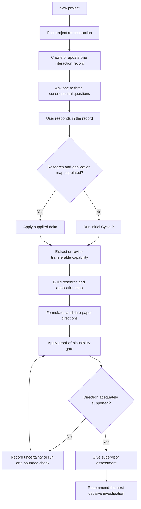
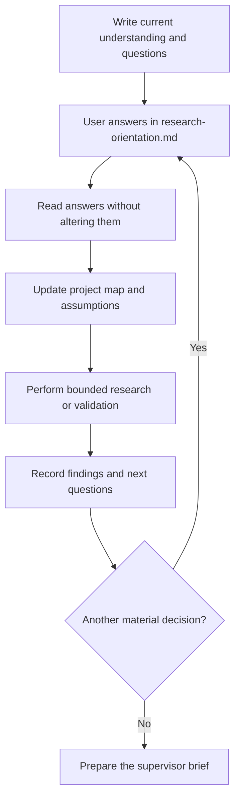
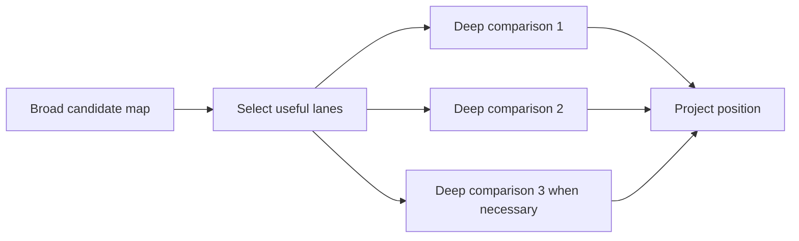
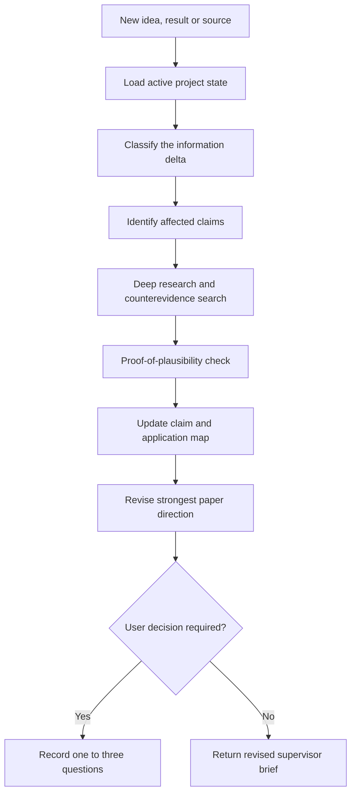
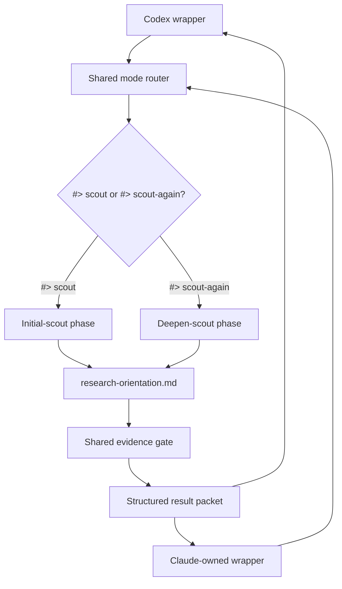
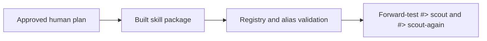

# Research Context Scout — Human Guide

## Status and Document Lifecycle

This plan has been promoted into a routable skill and retained as its
human-facing guide. It explains the design but does not control routing,
permissions or execution.

Back to the [[docs/00_SKILLS_HUB|Skills Hub]]. Runtime files:

- [[research-context-scout/SKILL|skill entry]];
- [[research-context-scout/shared/SKILL|shared workflow]];
- [[research-context-scout/shared/phases/initial-scout|initial phase]];
- [[research-context-scout/shared/phases/deepen-scout|deepening phase]];
- [[research-context-scout/shared/rules/evidence-gate|evidence gate]];
- [[research-context-scout/codex/SKILL|Codex wrapper]]; and
- [[research-context-scout/claude/CLAUDE|Claude integration boundary]].

The human page explains the skill. The LLM-facing files execute it. Human prose
never becomes routing or permission authority.

## Purpose

Plan a research-start assistant that behaves like an experienced supervisor
during the initial phase of a project. It should:

- reconstruct the supplied work and its present evidence;
- interact with the user through a compact recorded Markdown cycle;
- independently discover current research, applications and importance;
- distinguish attractive language from technically supported directions;
- test recommendations for mathematical, numerical or physical plausibility;
- identify the strongest evidence-backed route toward a meaningful paper; and
- preserve enough shared context for the user, Codex and Claude to continue the
  work efficiently.

The initial phase is orientation and direction selection. It is not a complete
literature review, proof, simulation campaign, paper draft or permanent
research database.

## Core Principle

**Understand the project, interact until the central intent is clear, discover
why the result matters, and recommend only directions supported by a formal
claim and a proof-of-plausibility.**

User-owned intent should be requested and recorded. Research applications,
related literature and useful comparisons should be discovered by the skill.
Missing technical values may receive clearly labelled, defensible defaults
when different choices do not change the research direction.

There is no required paper count, suggestion count or fixed search depth.

## Commands

### Start a new project

```text
#> scout <project-path> [focus]
```

Examples:

```text
#> scout /path/to/project
#> scout /path/to/project theory
#> scout /path/to/project applications
#> scout /path/to/project "focus on controllability and paper value"
```

The optional focus may be `theory`, `numerics`, `physical`, `applications`,
`paper` or free-form text. Without a focus, use a balanced assessment.

### Continue after new information

```text
#> scout-again <project-or-record-path> [new-information-paths...] [focus]
```

Examples:

```text
#> scout-again /path/to/project
#> scout-again /path/to/project new_derivation.tex
#> scout-again /path/to/project results.md figure2.pdf
#> scout-again /path/to/project "investigate the new entropy-transfer idea"
```

In deepening mode, the supplied focus narrows lane selection and the checks
applied to the new information. When the first path is
`research-orientation.md`, its parent directory is the project root.

Both commands operate on the same project-owned interaction record. The
commands may create or update only that declared record as part of the named
workflow. Research drafts, code, calculations, results and figures remain
read-only unless the user separately authorizes changes.

The routed receipt states this as
`access=write-scoped:research-orientation.md` and uses a supervisor-brief output
shape. It does not make all Scout work use the global math interaction mode;
the evidence gate requests equations or other formal checks only when the
claim needs them.

The Skills AI runtime recognizes these aliases as the first task directive;
presentation controls such as `#> depth detailed` or `#> interaction math` may
precede them. Directive keywords are case-insensitive and require at least one
space after `#>`. A first alias argument beginning with `-` is rejected as
malformed, so `#> scout -again ...` cannot silently become an initial run.
Quoted examples, code blocks, later prose mentions and words such as “scouting”
do not activate the skill. The canonical form is:

```text
#> skill research-context-scout initial <project-path>
#> skill research-context-scout deepen <project-path> <new-paths>
```

Alias and canonical forms inject `mode=initial|deepen`; the canonical form
requires one of those two modes and rejects a missing or unknown value. In
either form, record completeness wins over invocation intent: when the user
answers exist but the Research and application map is empty, the workflow runs
initial Cycle B before delta-based deepening.

`#> skill normal` remains an explicit opt-out. `#> override <instruction>` retains its
higher-priority local-protocol override and does not activate this skill.

## Overall Workflow



## 1. Begin With the Project

Inspect the supplied material before searching broadly. Inputs may include:

- TeX or Markdown drafts;
- equations and derivations;
- code and numerical results;
- figures or experimental observations;
- research notes;
- PDFs; or
- a verbal problem statement or early idea.

Identify:

- the central problem and intended achievement;
- the result or capability the project may produce;
- existing derivations, implementations, simulations or results;
- important assumptions and constraints;
- model, notation or consistency errors;
- limitations, missing evidence and unresolved questions; and
- the decision presently blocking useful progress.

Do not begin with a broad paper search before understanding the project. Do not
edit supplied research artifacts during orientation.

## 2. Use One Recorded Interaction Cycle

When the project workflow authorizes its declared record, create or update
exactly one file in the project root:

```text
research-orientation.md
```

The record should contain:

```markdown
# Research Orientation

## Active project state
## Current central claim
## Current evidence level
## Strongest application or importance
## Strongest paper direction
## Current blocking question

## Superseded conclusions

## Interaction cycle N

### Agent questions
### User responses
### Agent interpretation
### Work performed
### Evidence and uncertainties
### Next questions or decision
```

Rules:

- preserve user-written answers exactly;
- append cycle `N` as one more than the highest existing cycle number and add a
  fresh protected response-marker pair when another answer is required;
- ask only one to three questions per cycle;
- ask only when different answers would materially change the investigation;
- do not ask the user to supply applications or literature the skill can find;
- record reasonable defaults when the user does not care about technical
  choices;
- update the compact active state instead of duplicating earlier analysis;
- consult older cycles only when a changed assumption requires them; and
- stop cycling once the project, importance, strongest direction and next
  validation are clear.



## 3. Classify the State of the Work

| State | Meaning |
|---|---|
| established | demonstrated by supplied or independently verified evidence |
| supported | evidence exists, but verification remains incomplete |
| claimed | stated without enough evidence |
| proposed | formal hypothesis or future direction |
| contradicted | conflicts with a derivation, result or reliable source |
| unknown | cannot yet be determined |

Also record provenance as `supplied`, `derived`, `literature`, `user answer`,
`assumed` or `unknown`.

## 4. Extract the Transferable Capability

Do not search only by the project's wording. First ask:

> What operation, theorem, mechanism, bound, resource or design principle could
> this project provide?

Use that capability to find related work and downstream uses even when they use
different terminology.

## 5. Build a Current Research and Application Map

Inspect relevant lanes broadly before selecting the most useful ones:

1. the same objective;
2. the same physical mechanism;
3. the same mathematical structure;
4. the same method or algorithm;
5. known bounds and no-go results;
6. experimental realizations;
7. downstream scientific or technological applications; and
8. transferable ideas from adjacent fields.

Use breadth before depth:



Prefer primary sources. Use current research together with canonical results.
Search results, titles and snippets may identify candidates but cannot support
strong claims. Label preprints, analogies and transferred methods accurately.
Do not claim confirmed novelty or a confirmed research gap during the initial
phase.

### Application and Importance Contract

Represent each serious application as

\[
\mathcal A=(\text{consumer},\text{required result},\text{mapping},
\text{benefit},\text{assumption},\text{evidence}).
\]

Explain:

- who or what could use the result;
- which project result is required;
- how the project maps to that use;
- which measurable quantity could improve;
- which assumption could break the connection; and
- which source or project evidence supports the application.

Reject applications supported only by shared vocabulary.

### Research Stop Rule

Stop the initial research map when it can explain:

- what the project has established;
- which capability it may produce;
- why that capability may matter;
- which approaches, bounds and applications are most instructive;
- which uncertainty matters most; and
- which investigation would most improve the paper direction.

Do not stop merely because several papers were found. Do not continue after the
decision is already clear.

## 6. Apply an Evidence Gate to Recommendations

Never recommend a direction using wording alone. Before endorsement, provide
project-specific evidence that its mechanism is possible, useful or at least
technically plausible.

Represent a direction as

\[
\mathcal D=(C,M,A,E,T,F,U,P),
\]

where:

- \(C\): precise candidate claim;
- \(M\): mathematical or physical model;
- \(A\): assumptions;
- \(E\): current supporting evidence;
- \(T\): project-specific test or derivation;
- \(F\): falsification condition;
- \(U\): scientific use or importance; and
- \(P\): possible paper contribution.

### Evidence Levels

| Level | Meaning | Allowed treatment |
|---|---|---|
| E0 | verbal analogy only | do not recommend |
| E1 | formal claim and falsifiable test, but untested | present as an open candidate |
| E2 | project-specific derivation, bound, numerical check or mapped theorem | recommend provisionally |
| E3 | several consistent evidence types plus relevant literature | strong research direction |
| E4 | independently verified and physically or experimentally credible | candidate central paper result |

For a mathematical or theoretical direction, recommendation normally requires
at least E2.

### Mathematical Support

When recommending a mathematical direction, provide at least one relevant
proof-of-plausibility:

- a short derivation;
- a symmetry or conservation-law argument;
- a reachable-set or controllability calculation;
- an analytical bound;
- a constructive example;
- a counterexample that removes a naive alternative; or
- a published theorem with assumptions mapped explicitly to the project.

A complete proof is not required during orientation, but unsupported confidence
is not allowed.

### Numerical Support

A numerical recommendation requires, as relevant:

- a well-posed objective and constraints;
- a meaningful baseline;
- discretization or truncation convergence;
- multiple initializations for non-convex optimization;
- residuals or error metrics;
- comparison with analytical bounds; and
- reproducible success and failure criteria.

### Physical Support

A physical recommendation requires, as relevant:

- a realistic parameter regime;
- an available control or interaction;
- amplitude, slew-rate and bandwidth constraints;
- decoherence, loss and preparation requirements;
- reset or resource overhead; and
- a measurable physical benefit.

If an appropriate supporting check cannot yet be performed, keep the idea at
E1, state its first falsification test and do not recommend it as the main
direction.

## 7. Shape a Strong Paper Opportunity

Assess publication potential without promising a venue. A promising paper
direction should contain

\[
\mathcal P=(Q,C,N,E,G,A,F),
\]

where:

- \(Q\): precise research question;
- \(C\): central claim;
- \(N\): novelty hypothesis relative to inspected research;
- \(E\): required evidence package;
- \(G\): generality beyond one example;
- \(A\): scientific or practical importance; and
- \(F\): result that would falsify or weaken the claim.

Use the following contribution ladder:

| Level | Contribution |
|---|---|
| 1 | solution for one parameter set |
| 2 | verified method across a parameter family |
| 3 | mathematical mechanism or bound explaining the result |
| 4 | transferable principle connecting several systems |
| 5 | broadly important capability with realistic application |

Strong publication positioning should come from soundness, novelty, generality,
importance and evidence—not from naming a high-impact journal.

## 8. Recommend Directions Without Filler

Return:

- one strongest supported direction;
- zero to two credible alternatives; and
- no additional ideas merely to reach a number.

For each direction, state its formal claim, assumptions, current evidence
level, proof-of-plausibility, falsification condition, application and paper
value.

## 9. Use `#> scout-again` for Iterative Deepening

The continuation command must revise the existing state rather than repeat the
initial scan:

\[
S_{k+1}=\operatorname{revise}(S_k,\Delta_k),
\]

where \(S_k\) is the active project state and \(\Delta_k\) is a new answer,
idea, derivation, result, constraint or source.

Classify each delta before searching:

| Delta | Required action |
|---|---|
| new user idea | convert it into a testable claim |
| new derivation | verify its assumptions and steps |
| new numerical result | check objective, baseline and convergence |
| new physical constraint | reassess feasibility and applications |
| new source | map its problem, method, assumptions and result |
| corrected assumption | reopen every dependent conclusion |
| negative result | determine whether it rejects or redirects the claim |

`#> scout-again` should then:

- read the active state and new information;
- reopen only affected claims and applications;
- translate user ideas into formal hypotheses;
- inspect the most relevant primary sources more deeply;
- search for support, counterevidence and no-go results;
- perform the relevant mathematical, numerical or physical check;
- reassess novelty, importance and paper potential;
- update the interaction record; and
- ask another bounded question cycle only if a material decision remains.



Stop the deeper pass when it can state which idea survived, which failed or
remains speculative, what evidence changed, how the application map changed,
whether the paper direction became stronger and which investigation would most
increase confidence next.

## 10. Compact Shared Output

The active assessment should contain six adaptive sections:

1. project reconstruction;
2. interaction-derived understanding;
3. claim and evidence ledger;
4. current research, applications and importance;
5. supported paper directions; and
6. next decisive investigation.

The shared workflow should first produce a compact structured packet for the
active platform agent. Codex or Claude then converts it into a clean,
supervisor-style response for the user.

The single `research-orientation.md` is the only initial persistent project
artifact. Do not copy full papers, source files or search output into it.

## Initial Restrictions

Do not initially produce:

- an exhaustive literature review;
- a large unexplained bibliography;
- definitive novelty or research-gap claims;
- recommendations supported only by wording;
- many weakly differentiated suggestions;
- a complete mathematical solution;
- an unnecessary simulation campaign;
- an Obsidian context pack or research database;
- edits to supplied research artifacts; or
- implementation before the project is understood.

The authorized `research-orientation.md` interaction record is the only
exception to the initial no-write rule.

## Skill Architecture

The human guide is separated from token-efficient shared execution:

```text
research-context-scout/
├── README.md                  # this human-facing guide
├── SKILL.md                   # compact runtime and platform dispatcher
├── agents/
│   └── openai.yaml            # Codex UI metadata
├── shared/
│   ├── SKILL.md              # compact shared mode router
│   ├── phases/
│   │   ├── initial-scout.md
│   │   └── deepen-scout.md
│   ├── rules/
│   │   └── evidence-gate.md
│   └── templates/
│       └── research-orientation.md
├── codex/
│   ├── SKILL.md
│   └── CODEX.md
└── claude/
    └── CLAUDE.md              # Claude-owned integration
```

This page links to the real files above and to the main Obsidian Skills AI hub.
The shared core owns research behavior. Codex and Claude wrappers contain only
platform-specific entry and lifecycle behavior. Claude creates or certifies its
own integration unless the user explicitly requests otherwise.



Version one should contain no database and no helper script unless repeated
forward testing proves that a deterministic operation is necessary.

## Build and Validation Gate



The implementation must continue to verify:

- triggers and non-trigger cases;
- alias routing or its approved fallback;
- source and write boundaries;
- Markdown interaction-state preservation;
- evidence-gate behavior;
- initial versus deepening depth;
- compact token loading;
- shared/Codex/Claude ownership;
- Obsidian and human-guide links;
- failure behavior for missing, ambiguous or cross-project paths; and
- realistic forward tests using raw project artifacts.
