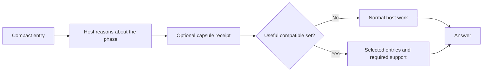
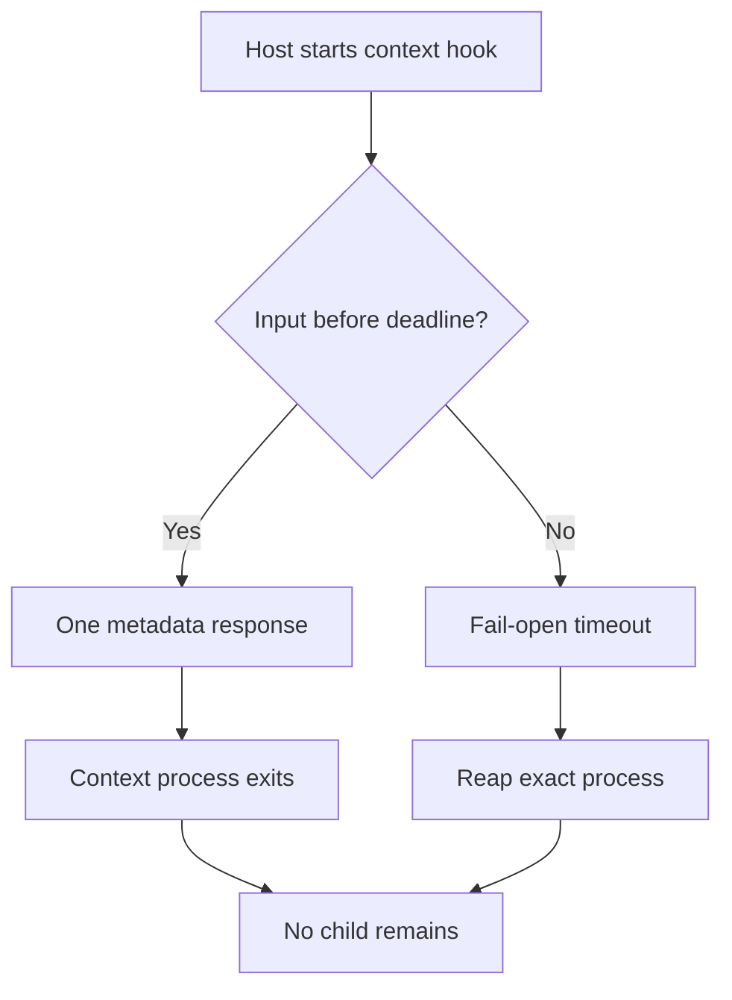

# Troubleshooting

Depth for [SKILL.md](SKILL.md): how little the hot path loads, how to measure it, the
bounds that keep it small, and what to check when something looks wrong. It explains
and adds no rule; [LOADING.md](LOADING.md), [RECOVERY.md](RECOVERY.md) and the other
[topics](INDEX.md) own the rules.

## Hot-path loading



The shared tools read compiled metadata, not the whole skill library. The selected
entry's token estimate does not include all references the skill may require;
measure the complete loading path before claiming savings.

Manual command aliases such as `#> optimizer` enter the explicitly named primary package;
they do not load every package or turn operation tokens into additional capabilities.

Repository discovery follows the same cold-path principle. If a path is known,
the agent reads only that path or a bounded line range. Otherwise it narrows
with `rg --files`, searches a literal identifier with `rg -n`, and inspects
exact references, diffs, and mapped tests. No background index, file watcher,
telemetry process, or network update checker is part of ordinary work.

A package `INDEX.md` is a navigation surface, not a hot-path instruction source.
Ordinary execution starts from the compact `SKILL.md` and loads only the focused
references required for the task.

## Measure context and latency

Measure metadata delivery, selected instructions, required references and repeated
loads separately. Record actual tokenizer or host usage when available. A
`ceil(bytes/4)` estimate is only an approximation; it is not a fixed token bound
or a measure of answer quality.

Tool latency measures transport and file access. Semantic quality needs task
scenarios with inspected decisions and artifacts. Keep those two measurements
separate when diagnosing slow or unsuitable work.

```bash
python3 scripts/measure_context.py --json
```

This command measures context delivery; complete-task measurements also include
host reasoning, selected references and verification. The reference delivery budgets
are 5.5 KiB for the core and 8 KiB for the bootstrap, separate from transport limits.
The bootstrap figure excludes the checkout path, so a clone or repair workspace in a
longer folder measures the same as the live one. The core figure counts the delivered
entry only; the focused topics are read on demand and count toward neither budget.
Startup catalog text is capped at 3 KiB with explicit expansion for a larger skill
collection. Zero additional bytes on unchanged turns measures delivery, not total
model usage.

## Capsule bounds

- file: `.skills-ai/project.json`, maximum 32 KiB;
- hot receipt: maximum 4 KiB;
- exact project root supplied by the host and never echoed;
- no project scan to create missing context;
- no symlink, absolute personal path, path escape, secret-like value, or permission grant;
- stored commands and validation commands omitted from normal hot receipts;
- missing, invalid, unavailable, oversized, or stale means continue without hints;
- truncated receipt means inspect the full validated capsule before consequential work.

## Timeout and cleanup



Claude spends one timeout budget across input, Python context delivery, shared core
read, and output. The child runs in its own process group and receives the same
deadline. Codex owns its own session cleanup. Neither host certifies the other.

## Quick diagnosis

| symptom | check |
|---|---|
| public list contains capability entries | regenerate the package-first catalog; public rows must equal Activation packages |
| unsupported management action | use one supported exact action and include a target when required |
| bare `#> sudo` has no effect | use the full `#> orchestrator sudo <operation> <exact-target>` form |
| `CAPSULE_MISSING` | normal fail-open status; initialize only when explicitly wanted |
| `MANIFEST_HASH_MISMATCH` | capsule is stale; inspect, then explicitly refresh |
| capsule receipt is truncated | inspect the full validated capsule before writes or other consequential work |
| `SYMLINK_REJECTED` or `CAPSULE_TOO_LARGE` | replace with a regular bounded file through the explicit context CLI |
| unsuitable capability | inspect discovery metadata and the host decision; add a task scenario with a justified expected decision |
| repeated ambiguity | analyze prompt-free candidate metadata; never inspect stored prompts because none are written |
| maintenance selects a task package | let the host interpret exact management scope; the transport never scores tasks |
| `MANIFEST_UNAVAILABLE` | compile and validate; the original task should continue normally |
| installed adapter is stale | dry-run, inspect, then reinstall with platform-owner approval |
| Claude check names a native skill that shadows a package | Claude Code would load that copy with its own Skill tool and skip the orchestrator; move it out of `~/.claude/skills/` |
| generated root entry or generated reference is stale | edit the canonical source and rerun `compile_repository_views.py` |
| an agent opens `runtime/SKILL.md` expecting the instructions | that file is only the Codex install header; the instructions are in [SKILL.md](SKILL.md) and this [index](INDEX.md), which `AGENTS.md` and `CLAUDE.md` point to |
| a rule is not in the compact entry | open the topic the entry names; the [index](INDEX.md) lists every page and what it owns |
| a package is listed `unavailable`, or loading it returns `PACKAGE_NOT_INITIALIZED` | its submodule folder is empty; run `git submodule update --init --recursive`. The catalog, `skills_ai status` and the adapter `--check` all say so, and nothing is substituted. Any other missing entry still returns `FILE_UNAVAILABLE` |
| laptop heats during repository lookup | verify no external indexer or watcher is installed; Skills AI requires none |

Package, pin and push situations are in the
[Git governance card](../../protocols/repository/GIT_GOVERNANCE.md). Maintenance scans
and generated-view compilation are cold-path operations: they add no reads or token
cost to ordinary work.

---

[⌂ Home](INDEX.md)
