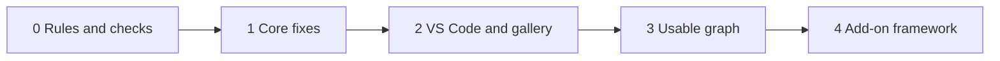

# Markdown Protocol v2 — Codex handoff

Status: implementation handoff dated 2026-10-08. Phase 1 is implemented.
Phase 2 has its matrix, guardrails, and gallery additions; exact VS Code visual
observation and the GitHub hosted-render pass remain pending because native
computer-use permission and external fixture transmission were unavailable.
Phase 3 G1 typed connections and graph inspection and G2 controlled tag
validation/filtering are implemented.
Phase 4 A0 add-on contract and A1 learning add-on are implemented as design
guidance. No review-deck generator was built.
Codex implements only the ticked items under repository change control.

Next iteration of [`markdown-protocol`](../../markdown-protocol/SKILL.md):
make compactness checkable for models, set up the VS Code workflow, make
graphs usable, and define how add-ons plug in.

## In brief

- **User:** tick or untick items by editing `[x]` and `[ ]` in the source,
  then give this file to Codex.
- **Codex:** implement the ticked items phase by phase, in the order below,
  and report after each phase.
- **Tick meaning:** Phases 1–3 = implement. Phase 4 = write the design only
  (contract or add-on stub), no build. New suggestions = adopt, and flag any
  that need their own task.
- Everything Codex must follow sits above `## Details`. Below it is the
  reasoning, for the user.



Order: rules and checks → core fixes → VS Code and gallery → usable graph →
add-on framework (design only).

## Settled decisions (do not reopen)

- **Layered core:** one structure, with a compact outer layer for models and
  explanatory depth for humans.
- **Links:** portable relative Markdown links; no wikilinks in collections
  this protocol governs.
- **Viewers:** VS Code (built-in preview plus the recommended extensions) and
  GitHub are the tested targets. Obsidian stays compatible through portable
  links but is neither tested nor recommended.
- **Name and trigger:** package `markdown-protocol`, manual alias
  `#> md_protocol`, selected by default for Markdown work.
- **Consult first:** announce, propose in proportion to the change, wait for
  agreement, continue inside the agreed design, and preserve the user's edits.
- **Add-ons:** designed now, built later.
- **Dogfooding:** the skill's own files follow the protocol.
- **Keep from v1:** the proportional review workflow, usefulness-based
  splitting, the intention-based Map, portability levels, verify-before-claim
  for renderers, and generated-file banners.

## Phase 0 — Rules and checks

1. Follow [`AGENTS.md`](../../AGENTS.md): run `scripts/scan_consistency.py
   classify` on target paths, read
   [`docs/06_CHANGE_CONTROL.md`](../../docs/06_CHANGE_CONTROL.md) and the one
   matching card under `protocols/repository/`, run `plan` before editing,
   `changed` after, and `staged` before any commit.
2. The v1 integration is uncommitted (30 modified files and 4 untracked paths
   on 2026-10-08). Bring it through `changed` cleanly before building on it,
   and preserve it.
3. Commit only when the user asks. Install no extensions or plugins, add no
   documentation site, and start no watcher or background indexer.
4. Leave `interaction-protocol/` and `theory-reference/` untouched, and do not
   rewrite unrelated documentation.
5. Extend
   [`tests/test_markdown_protocol.py`](../../tests/test_markdown_protocol.py)
   for every new rule and keep the full suite passing.
6. After each phase, report the items done, files changed, checks run, and
   anything skipped or unverified.

Files named below, all under `markdown-protocol/`:
[`SKILL.md`](../../markdown-protocol/SKILL.md) ·
[`core-protocol.md`](../../markdown-protocol/references/core-protocol.md) ·
[`layouts.md`](../../markdown-protocol/references/layouts.md) ·
[`review-workflow.md`](../../markdown-protocol/references/review-workflow.md) ·
[`validation.md`](../../markdown-protocol/references/validation.md) ·
[`visual-patterns.md`](../../markdown-protocol/references/visual-patterns.md) ·
[`markdown-patterns.md`](../../markdown-protocol/references/markdown-patterns.md) ·
[`education.md`](../../markdown-protocol/references/addons/education.md) ·
[example 14](../../markdown-protocol/references/formatting-examples/14-yaml-properties-and-tags.md)

## Phase 1 — Core fixes

- [x] **C1 Stopping point.** Make `## Details` the standard boundary: a model
  reads a file down to the first `## Details` heading and stops unless it
  needs the reasoning.
  - Files: `core-protocol.md`, `layouts.md` templates, `SKILL.md`. Done when:
    every template shows the boundary and `validation.md` checks it.
- [x] **C2 Authority rule.** New invariant: anything a reader must obey or
  rely on sits above `## Details`. Details sections and deep notes explain it
  but never add or change a rule.
  - Files: `core-protocol.md`, `validation.md`. Done when: the invariant is
    listed and checked.
- [x] **C3 Size thresholds.** About 30 lines for "In brief" plus "Core" in a
  topic, and about 60 lines above `## Details` in a Front Door. These trigger
  a review, like the diagram threshold; they are not hard limits.
  - Files: `layouts.md`, `validation.md`.
- [x] **C4 Properties.** From the Standard profile up, each file starts with
  `type` (front-door, topic, deep, generated), `parent`, `summary`,
  `read_when`, and optional `tags`. Single documents and compact collections
  may skip them.
  - Files: `core-protocol.md`, `layouts.md`, example 14.
- [x] **C5 Generated index.** `INDEX.md` gives every file one line (path,
  summary, read-when), built from the C4 properties, with deep notes grouped
  under an "Optional" heading.
  - Files: `layouts.md` Index template. Done when: C6 generates it with a
    generated-file banner.
- [x] **C6 On-demand tool.** A Python script using only the standard library,
  with `index` (builds C5) and `check` (links, anchors, orphan files,
  generated banners, C3 thresholds, C4 presence, index freshness). It runs
  only when called.
  - Files: a new script, inside the package if repository convention allows
    so it travels with the skill, plus tests with a small fixture collection.
    Done when: `check` passes on the fixture and fails on seeded errors.
- [x] **C7 Trigger wording.** Replace "primary artifact" with "any task that
  creates or edits Markdown, including a Markdown edit inside another task".
  Keep the exclusion for reading Markdown as instructions. Rename or define
  the alias mode `review` so it does not read as "review only".
  - Files: `SKILL.md`, `registry/markdown.md`, `registry/activation.md`,
    `agents/openai.yaml`, tests.
- [x] **C8 Lean loading.** Apply C1–C3 to the skill's own references and
  change `SKILL.md` so a small edit loads only the reference heads. Target:
  about 100 lines for a local edit, down from about 300.
  - Files: all `references/*.md`, `SKILL.md`. Done when: measured line counts
    are reported.
- [x] **C9 Front Door diagram.** One small overview diagram with a text
  version becomes the default from the Compact profile up.
  - Files: `layouts.md`, `visual-patterns.md`.
- [x] **C10 Teaching hook.** The proposal template gains a "Patterns used"
  line that links the gallery example for each non-core pattern.
  - Files: `review-workflow.md`.

## Phase 2 — VS Code workflow and gallery

- [x] **V1 Renderer matrix.** Test every gallery pattern in VS Code's
  built-in preview (with the recommended extensions) and on GitHub, and
  record the results in `markdown-patterns.md`. Run the pending math test.
  Record that GitHub-style alerts (`> [!NOTE]`) need an extension in VS Code.
  Mark Obsidian-only examples as untested.
  - Files: `markdown-patterns.md` and the affected examples.
- [ ] **V2 Extension recommendations.** `.vscode/extensions.json` listing the
  recommended extensions. It only prompts; it installs nothing.
- [ ] **V3 Workspace settings.** `.vscode/settings.json` with
  `"markdown.validate.enabled": true` and
  `"markdown.updateLinksOnFileMove.enabled": "prompt"`.
- [ ] **V4 Snippets.** `.vscode/markdown-protocol.code-snippets` for the
  topic, deep note, details block, recall card, connections block, and
  generated banner.
- [ ] **V5 Lint rules.** A `.markdownlint.jsonc` that encodes the protocol's
  formatting rules, with inline HTML limited to `details` and `summary`.
  Report the warning count on existing docs before enabling it.
- [x] **V6 Gallery additions.** New examples for editor folding (headings and
  `<!-- #region -->` markers), the Markmap view, editable SVG diagrams
  (Excalidraw, draw.io), and task lists.
  - Files: new `formatting-examples/16-*.md` onward, `markdown-patterns.md`.

## Phase 3 — Usable graph

- [x] **G1 Typed connections.** Fix the `Connections` labels as parent,
  prerequisite, related, next, and deeper. The C6 tool reads them to answer
  what must be read before a topic, produce a learning order, and list orphan
  files.
  - Files: `layouts.md` Topic template, the C6 tool.
- [x] **G2 Tag vocabulary.** Two tag prefixes: `domain/` and `use/`, matching
  example 14. Tags filter; they never replace links, which keeps v1's
  failure-pattern rule.
  - Files: `core-protocol.md`, example 14.

## Phase 4 — Add-on framework (design only)

- [x] **A0 Add-on contract.** An add-on may add blocks, layout variants,
  generated views, and checks. It may not change the core invariants or the
  review gate. Each add-on is one reference file that declares its trigger,
  blocks, generated views, and checks.
  - Files: a new add-on overview under `references/addons/`, `SKILL.md`
    routing.
- [x] **A1 Learning.** Refit `education.md` under A0 and add a recall card
  (question visible, answer inside `<details>`), a review deck generated from
  the recall cards, a learning path built from G1 prerequisite links, and a
  glossary block.
- [x] **A2 Code docs.** Generated import maps (Python first), one diagram per
  package within the diagram threshold plus a table version, entry points,
  and where-used lists.
  - Implemented as design guidance in `references/addons/codebase.md`; no
    generator or mandatory project tooling was added.
- [ ] **A3 Research notes.** A paper-note template with citation keys (Zotero
  with Better BibTeX), evidence status, and a literature map. It composes with
  `research-context-scout`, which owns evidence.
- [ ] **A4 Decision records.** Short records (context, decision,
  consequences) linked from the topic they affect.
- [ ] **A5 Runbooks.** Step-by-step checklists with a verification line for
  each operational procedure.
- [ ] **A6 Visual extras.** Guidance for Markmap and Foam, and editable SVG
  files for diagrams too large for Mermaid.
- [ ] **A7 Slides.** Present a topic as slides with Marp, for teaching.

## New suggestions

- [ ] **N1 Named commands.** `#> md_deepen <term>` writes a plain-language
  deep note and adds its link to the parent's `deeper` connection.
  `#> md_check` runs the C6 tool. This follows the existing alias pattern of
  `#> scout` and `#> scout-again`.
- [ ] **N2 Freshness.** Optional `status` and `reviewed` properties, so
  `check` lists topics not reviewed since a chosen date.
- [ ] **N3 Pilot.** Apply v2 to one small real collection chosen by the user,
  as a separate, approved task.
- [ ] **N4 Skill explanations.** Decide whether each skill's human
  explanation lives inside its package as deep notes (below `## Details`, not
  loaded by default) instead of in `docs/human/`. This is a repository-wide
  decision; Codex prepares the options only.

## Done when

- [ ] Every ticked item is implemented and reported per phase.
- [ ] `tests/test_markdown_protocol.py` covers the new rules and the full
  suite passes.
- [ ] `scripts/scan_consistency.py changed` passes, and `staged` passes
  before any commit.
- [ ] The skill's own files pass the C6 `check` and respect C1–C3.
- [ ] The V1 renderer matrix is filled for VS Code and GitHub.

## Connections

- Parent: [`markdown-protocol` entry](../../markdown-protocol/SKILL.md)
- Related: [registry entry](../../registry/markdown.md) ·
  [change control](../../docs/06_CHANGE_CONTROL.md)

## Details

### Why these items

<details>
<summary>C1–C3: a fixed stopping point and size thresholds</summary>

v1 orders content well but never marks where the compact part ends, so
compactness depends on each writer. A standard `## Details` heading lets a
model read only the top part. The authority rule makes stopping there safe,
because nothing a reader must know can hide below it. The thresholds trigger
a review, in the same spirit as v1's 12-node diagram threshold.

</details>

<details>
<summary>C4–C6: properties, a generated index, and a tool</summary>

Four small properties let a script build the index instead of a person. The
index is the "directory" from the original idea: one line per file saying
what it holds and when to read it, which doubles as the model's routing
table. Today validation is a manual checklist, and the tests check only the
skill's own wording. v1 names generated views but has nothing that generates
them.

</details>

<details>
<summary>C7: trigger wording</summary>

"Primary artifact" would skip a README edited during a code task. The user
wants the protocol for all Markdown work, and the proportional gate keeps
such edits to a one-line preview. The alias's only mode is called `review`,
which reads as "review only, don't write".

</details>

<details>
<summary>C8: what the skill loads today</summary>

| task | files the skill tells the model to read | lines |
|---|---|---|
| read-only review | `SKILL.md`, `core-protocol.md` | about 160 |
| local edit | plus `review-workflow.md`, `validation.md` | about 300 |
| restructure | plus `layouts.md` | about 480 |
| learning restructure | plus `education.md` | about 630 |

</details>

<details>
<summary>C9, C10, V1, V6: the user's original requests</summary>

The user asked for a flow diagram in the main file (v1 made it optional), for
formatting to be explained while work happens, and for a gallery of the
available techniques. V1 replaces "verify first" placeholders with recorded
results for the two tested viewers.

</details>

<details>
<summary>G1, G2: a usable graph rather than a pretty one</summary>

A graph is usable when it answers questions. Fixed connection labels let the
tool answer "what do I read before this?", produce a learning order, and
list orphan files. Tags only filter; links carry the relationships.

</details>

<details>
<summary>A0–A7: add-ons</summary>

The contract keeps the core stable while use cases grow. A recall card is
the portable form of a flashcard: the question stays visible and the answer
sits in a collapsed block. Any review deck is generated from the cards and
never copied by hand.

</details>

### VS Code setup (reference)

| extension | ID | use |
|---|---|---|
| Markdown All in One | `yzhang.markdown-all-in-one` | shortcuts, table of contents, list and table editing |
| Markdown Preview Mermaid Support | `bierner.markdown-mermaid` | Mermaid in the built-in preview, with zoom and pan |
| markdownlint | `DavidAnson.vscode-markdownlint` | formatting mistakes underlined while typing |
| Markmap | `gera2ld.markmap-vscode` | any file's headings as a foldable mind map |
| Foam | `foam.foam-vscode` | graph view and backlinks; wikilink-first, also handles normal links |

Optional: Markdown Preview Enhanced (`shd101wyy.markdown-preview-enhanced`)
as an alternative preview with math, PDF export, and slides; Excalidraw
(`pomdtr.excalidraw-editor`) and Draw.io (`hediet.vscode-drawio`) for
editable SVG diagrams; Code Spell Checker
(`streetsidesoftware.code-spell-checker`).

Built-in settings:

```jsonc
{
  "markdown.validate.enabled": true,
  "markdown.updateLinksOnFileMove.enabled": "prompt",
  "editor.stickyScroll.enabled": true
}
```

Shortcuts on macOS: `Cmd+K Cmd+0` folds a file down to its headings,
`Cmd+K Cmd+J` unfolds it, and `Cmd+K V` opens the preview beside the editor.

Other apps: Typora (paid, renders a single file as you type) and Zettlr
(free, academic notes with Zotero citations and math).

### Sources

- [Foam knowledge base tools](https://docsearch.algolia.com/mcp/docs/repo/foambubble/foam)
- [Foam link reference definitions](https://github.com/foambubble/foam-template/blob/master/docs/features/link-reference-definitions.md)
- [Markdown Preview Mermaid Support](https://docsearch.algolia.com/mcp/docs/repo/mjbvz/vscode-markdown-mermaid)
- [Markdown in VS Code overview](https://macmdviewer.com/blog/markdown-in-vscode)
- [Markdown Guide: VS Code](https://markdownguide.org/tools/vscode/)
- [GitHub Markdown Preview pack](https://mynixos.com/nixpkgs/package/vscode-extensions.bierner.github-markdown-preview)
